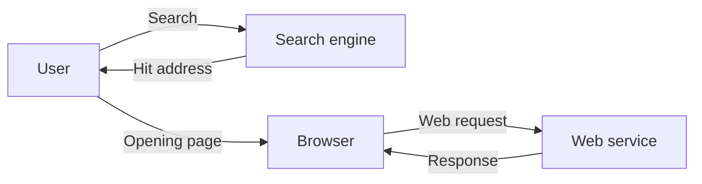

# The main actors of the web: browser, server, search engine, and content provider

The web is not merely the direct connection of two actors – browser and server. Multiple interdependent actors participate in the creation, storage, distribution, discovery, and use of content.

When opening a seemingly simple news page, the user only types in an address, but a chain of actors works together in the background. The browser requests name resolution, establishes a connection with a server, downloads images perhaps from another geographical location, the search engine might have previously crawled the page, and the provider might also use external measurement or advertising systems. Web systems are therefore worth examining not in isolation, but as an ecosystem.

## User and browser

The user interacts with the web service through the browser. The browser doesn't simply display pages: it sends network requests, checks security certificates, processes documents, stores certain data, and restricts the capabilities of web pages according to its own security rules.

Examples of browsers: Chrome, Firefox, Safari, Edge. Although they support common standards, their behavior and support details may differ. This is why web interoperability is important.

## Web server and application server

The **web server** receives HTTP requests arriving from the browser and sends responses. In a simple case, it returns a file – for example, an HTML page or image. In a more complex service, the request reaches an application, which can retrieve data, check permissions, and generate the response based on the result.

It is not necessary to sharply separate the web server and the application server in every web system, but understanding the roles is important:

- the web server receives and can forward web traffic;
- the application implements the business logic of the service;
- the data storage system preserves and makes the data queryable.

## Content provider

The content provider is the organization or person responsible for the information or service available on the web. It can be a university, news portal, company, private individual, or public institution. They don't necessarily operate the server themselves: hosting, delivery, or security infrastructure can also be provided by an external service provider.

This difference is especially important in questions of liability. The provider is generally responsible for the content, data management, and terms of service, while the infrastructure might be partly operated by other organizations.

## Search engines

Search engines help in discovering web content. Automated programs – often called robots or crawlers – traverse publicly available pages, crawl links, and then build an index. When the user searches, the search engine selects and ranks hits from this index.

The search engine is not the web itself, and does not guarantee that it knows every web page. Searchability can depend on the structure of the content, access rules, links, and the search engine's own ranking principles.

The search engine helps find the content; when using the found page, the browser already turns directly to the web service:

## Intermediary and supporting actors

Additional actors may also participate in the operation of a web service:

- **ISP (Internet Service Provider):** provides a network connection;
- **domain registrar:** manages domain name registration;
- **DNS provider:** assigns an IP address to the name;
- **CDN:** delivers content from multiple geographical locations;
- **certificate authority:** issues certificates for HTTPS;
- **external login provider:** for example, a central authentication system;
- **advertising, analytics, or payment provider:** provides a separate function for the web page.

Because of these, when opening a single page, we can come into contact with multiple organizations and technical systems.

## Example: actors of a webshop

| Actor | Task |
| --- | --- |
| Customer and browser | Searching for products, using cart, placing order |
| Webshop application | Managing catalog, order, permissions, and business processes |
| Database | Storing products, inventory, orders, and user data |
| Payment provider | Processing online payment |
| Courier service | Managing shipping information |
| Search engine | Discovering product and category pages |

## Common misunderstandings

| Statement | Clarification |
| --- | --- |
| "The server is a single physical computer." | The server can be a software role, a virtual machine, or a combination of multiple systems. |
| "The search engine creates the web pages." | The search engine finds and ranks content published by others. |
| "The hosting provider is responsible for everything on the page." | Content, data management, and service rules are typically the responsibilities of the content provider. |

## Concepts introduced

- **Client:** A program requesting a service or resource in communication. In a web situation, this is often the browser, but can be another application as well.
- **Web server:** Software or system receiving and responding to HTTP requests. It can serve files or forward requests to an application.
- **Content provider:** A person or organization responsible for content or a service available on the web. Not necessarily identical with the operator of the infrastructure.
- **Search engine:** A service providing crawling, indexing, and searchability of web content. Its hits come from its own index, so they do not necessarily cover the entire web.
- **CDN (Content Delivery Network):** A geographically distributed network of servers that delivers content from a location close or suitable to the user. Its goal can be reducing latency and distributing load.
