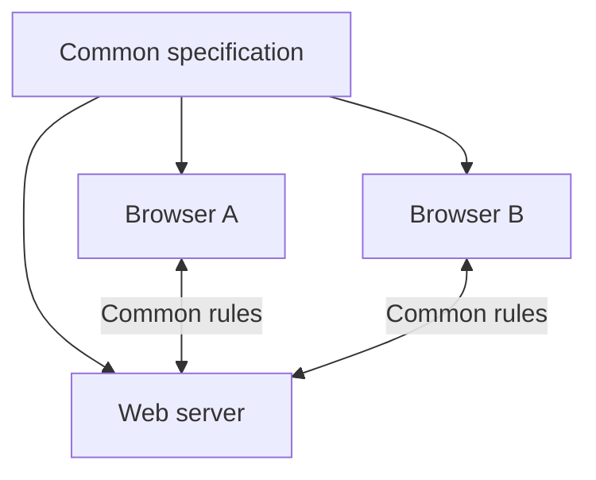

# Web standards and interoperability

The web can operate worldwide on different devices and products of different manufacturers because it is built on common, publicly available standards. Interoperability is not an incidental convenience feature, but one of the fundamental values of the web.

Think about what expectation we have when we send a university link to someone: the address must work on a phone, laptop, another operating system, and preferably in another browser as well. Not because every device is identical, but because the participants follow common rules. Standards make this tacit promise technically feasible.

## No common web without common rules

The creator of a web page cannot know in advance what computer, phone, operating system, or browser the visitor uses. The web can work in such a variety of environments if the participants follow common rules.

Such a rule is, for example, what an HTML heading means, how an HTTP request is structured, or how a URL should be interpreted. The standard does not prescribe the specific program code, but what observable behavior the different implementations must provide.

## Standard, specification, and implementation

- A **standard** is a commonly accepted technical rule system.
- A **specification** is the detailed, written description of this.
- An **implementation** is the realization of a specific browser, server, or developer tool, which tries to follow the specification.

For example, the HTML standard defines the meaning and processing of an element. Chrome, Firefox, and Safari are different programs, but they must display the same HTML document as similarly as possible.

Multiple independent implementations can be made from the common description:

## Important standardizing communities

| Organization or community | Main role | Examples |
| --- | --- | --- |
| W3C | Developing web recommendations and guidelines | accessibility guidelines, web technologies |
| WHATWG | Maintaining several living standards of the web platform used by browsers | HTML, DOM, URL standards |
| IETF | Standardizing internet protocols | HTTP, TLS, DNS, IP-related standards |

These organizations do not "control the internet" from a single center. Rather, they provide open collaborative processes in which manufacturers, developers, researchers, and other interested parties can negotiate common solutions.

## Interoperability

Interoperability means that different systems are able to work together. On the web this is important on several levels:

- the same page is usable in multiple browsers;
- a server can communicate with various clients;
- an API can be accessed by applications written in different programming languages;
- the user is not forced into the complete ecosystem of a single manufacturer.

Interoperability is not perfect. Cross-browser differences, features with different levels of support, and limitations inherited from older systems can occur. The goal of standards and compatibility tests is precisely to reduce these.

## Open standards and dependencies

The documentation of an open standard is accessible, and the standard can in principle be implemented by multiple independent actors. This supports competition, freedom of choice, and long-term accessibility.

In contrast, a solution built exclusively on a single manufacturer's proprietary technology can cause vendor lock-in. In such cases, it is more difficult for the user or developer to switch to another device, service provider, or platform.

## Example: "This page only works in this browser"

If a service is usable only in a single browser, the cause might be a faulty or incomplete implementation, the use of non-standard technology, or missing compatibility testing. For a critical service – such as public administration or a university system – this is particularly problematic because it restricts access.

## Common misunderstandings

| Statement | Clarification |
| --- | --- |
| "A standard prevents innovation." | Building on common foundations makes it easier to create new, widely usable solutions. |
| "If a feature works in Chrome, it works everywhere." | Browser support and bugs can differ. |
| "The W3C is an authority that makes mandatory laws." | The W3C develops recommendations and standards; legal obligation may originate from other sources. |

## Concepts introduced

- **Standard:** A commonly accepted technical rule system. Defines what behavior systems can expect from each other.
- **Specification:** A detailed written description of how a technology works. A reference for implementers for compatible operation.
- **Interoperability:** The ability of different implementations to cooperate. On the web, common standards enable different browsers and servers to communicate.
- **Open standard:** A publicly accessible technical rule system that can be implemented by multiple actors. It aids verifiability and can reduce dependence on a single manufacturer.
- **Vendor lock-in:** A dependency in which leaving a provider or technology involves significant cost or risk of data loss. Unique, non-interoperable formats and interfaces can strengthen it.
