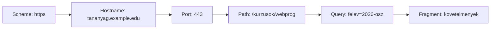

# Web addresses and resources

A web address is not simply a "link", but a multi-part guide for the browser. It specifies what web access method to use, which service to turn to, and within that, which resource to request. Distinguishing the parts helps even when we examine the operation or error of an address.

## The address of a course page

Imagine that a student opens the following address, used for illustration:

```text
https://tananyag.example.edu:443/kurzusok/webprog?felev=2026-osz#kovetelmenyek
```

From left to right, the address identifies the target increasingly precisely. The `https` scheme indicates the method of web access. `tananyag.example.edu` is the hostname: it names the service the browser turns to. The port `443` was only written out here to be visible; for HTTPS this is the default port, so it is mostly missing from everyday addresses. The path `/kurzusok/webprog` is interpreted by the given web service. The query part `?felev=2026-osz` provides additional data for the request. The fragment `#kovetelmenyek` usually refers to a part of the displayed document and is handled by the browser.



The diagram shows the order of the parts of the address, not that the browser would visit these as separate network stations.

## Hostname, domain, and port

The domain name is a name memorable for a human. It is not the server itself, and doesn't necessarily denote a single machine: multiple servers can stand behind a name. The connection between the hostname and the IP address can be found using DNS; its operation is the topic of the fourth week. Now we just need to know that the name is not identical to the network address.

The port helps indicate which network service we turn to within an endpoint. For HTTP the known default is 80, for HTTPS 443, but another port can also be used. During development, for example, `http://localhost:3000/` is common: here `localhost` refers to the local machine, and `3000` is the port of a service running locally. The port is not the serial number of the web page and not part of the path.

## Path, query, and fragment

The path denotes a resource within the service. It doesn't have to correspond to a real file or folder. Behind an address `/kurzusok/webprog` can be application code that generates the response from a database. The query part – for example `?felev=2026-osz` – can modify the selection or filtering. The server can interpret the requested path and the query parameters together.

The fragment is introduced by `#`. `#kovetelmenyek` typically means that the browser jumps to the appropriate part on the already received page. The fragment is usually not part of the goal of the HTTP request sent to the server. However, this does not mean it is secret: a person seeing the full address, the browser, and the recipient of a shared link can also see it.

> [!warning] Keep secrets out of URLs
> The query data in the URL cannot be considered confidential either. Addresses can appear in history, logs, or when sharing. It is therefore incorrect to write a password or other secret purely into a URL parameter.

## URL and resource

The URL is an identifier and access guide to a resource, not the resource itself. The same address can give a different response at different times: for example, on a course page, the number of applicants can change. The resource can be an HTML document, an image, data, or the result of an application operation. A single visible page can also be assembled from parts requested from multiple URLs.

URI is a broader identifier concept, URL is its form frequently used on the web that also expresses the access method. In everyday web work, we mostly say URL; the detailed standard theory of the difference is not necessary in this lesson.

## Common misunderstandings

| Statement | Clarification |
| --- | --- |
| "The domain name is the server itself." | The name identifies a service; it can lead to multiple network endpoints. |
| "The path is definitely a folder on the server." | The application can interpret it as any logical resource. |
| "The fragment is secret because it doesn't reach the server." | It is still visible in the address and shareable. |
| "The port only exists during local development." | A network connection also has a port for a live service. |

## Concepts introduced

- **Resource:** On the web, an identifiable content or application target. Can be a document, image, structured data, or an address related to an operation.
- **URL:** An address describing access to a resource. Can contain a scheme, hostname, port, path, query part, and fragment.
- **Scheme:** The notation at the beginning of the URL that determines the access method. In web examples, `http` and `https` are common.
- **Hostname:** The name identifier of the service in the URL. Not identical to a physical server or an IP address.
- **Port:** A numbered network endpoint to access a service. The default port is often not explicitly stated in the URL.
- **Path:** The URL part denoting a resource within the service. Its interpretation depends on the application.
- **Query part:** The URL part following the `?`, often consisting of name-value pairs. Can provide additional information for selection or filtering.
- **Fragment:** The URL part after the `#`, which is usually handled by the browser in web navigation. Typically it is not included in the target of the HTTP request.
