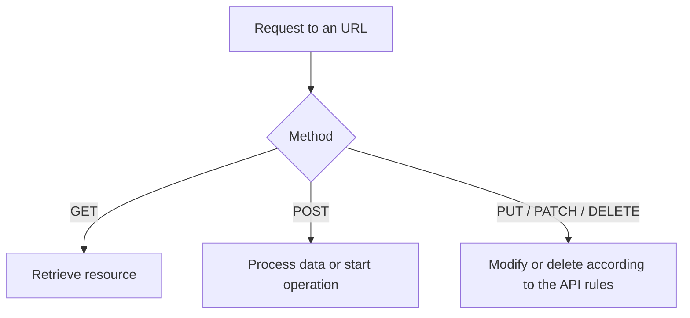

# HTTP Methods and the Intent of the Request

The URL indicates which resource we are turning to the server for. The HTTP method indicates the intent with which we do this. Therefore, the same address can be the target of multiple types of operations. Choosing the correct method is not just decoration: it can also influence the behavior of the client, the server, and the intermediaries.

## Same Address, Different Operation

For example, we can request the address of a course list, while we can send a new application to the collection of applications:

```http
GET /courses/webprog HTTP/1.1
Host: course-material.example.edu
```

```http
POST /applications HTTP/1.1
Host: course-material.example.edu
Content-Type: application/json

{"course":"webprog"}
```

The purpose of the first request is to get to know a resource. The second sends data for processing; based on this, the server can create a new application if the conditions are met. The method itself does not execute the operation: the server must interpret and verify the request.



## GET: Query

GET is used to retrieve a resource. By design, it does not cause a change in business state: opening a course page should not automatically enroll in a course. The server can still log the request or update technical metrics. The point is that the application state requested by the user should not change merely from the retrieval.

A GET address can often be shared or bookmarked, and cached under certain conditions. That is why it is dangerous if, for example, a GET request to the `/delete-application?id=42` address initiates a deletion: a preview generator or search robot can also open it. It is also not advisable to put confidential data in the query part of the URL, because the address can end up in histories and logs.

## POST: Data Sent for Processing

POST can send data to the server, create a new resource, or initiate an operation. In the application example above, the body of the request contains the course identifier. The server checks authorization, the deadline, and the capacity; only after this can it record an application.

> [!warning] POST does not make data secret
> POST is not "safer" simply because the data is in the body. Protecting the connection, checking authorization, and interpreting the input are still necessary. A repeated POST can also initiate two operations if the server does not handle the repetition. Because of this, user interface feedback and server rules are particularly important.

## Role of Additional Methods

| Method | Basic Meaning | Example |
| --- | --- | --- |
| HEAD | A request similar to GET without a body in the response | Checking the characteristics of a resource |
| PUT | Replacing the complete representation of a resource | Full update of profile data in an API |
| PATCH | Partial modification of a resource | Updating a single field |
| DELETE | Intent to delete a resource | Deleting an application if permitted |

These should be recognized by their role this week. The exact server-side meaning also depends on the rules of the API; we will deepen this in a later week of web data and APIs. OPTIONS, for example, can ask about communication possibilities related to a resource; it will also come up in browser security situations.

## Safe and Idempotent are Not the Same

In HTTP, a "safe" method means that the intent of the request is not to change the business state of the server. This does not mean encryption. GET is safe in this sense. Repeating an "idempotent" operation leads to the same result regarding the desired business state of the server as executing it once. Besides GET, PUT and DELETE are also intended to be idempotent; POST is generally not guaranteed to be.

For example, after deleting a resource, a second DELETE request may respond with a different status code, but the targeted resource's state remains deleted. However, executing a POST that creates an application twice can lead to two separate records if the service does not protect against it. The concepts become particularly important in later API design.

## Common Misconceptions

| Statement | Clarification |
| --- | --- |
| "GET cannot change anything on the server." | Technical logging can occur; changing the business state is not the intent of GET. |
| "Because of POST, the data is secret." | The method does not replace HTTPS and authorization checking. |
| "The URL alone tells the operation." | The method is also part of the request's meaning. |
| "Idempotent always gives the same response." | The desired server state can be the same alongside a different response code. |

## Learned Concepts

- **HTTP method:** A standard element indicating the intent of the request. The server interprets it together with the targeted resource.
- **GET:** An HTTP method used for retrieving a resource, which by design does not modify business state. Common in browser navigation.
- **POST:** An HTTP method used for processing data or initiating an operation. Its repetition does not necessarily lead to the same business state.
- **Safe method:** A method whose intent is not to modify the application state of the server. The concept does not refer to the encryption of the connection.
- **Idempotency:** An operational property where repeated execution leads to the same result regarding the desired server state as single execution.
