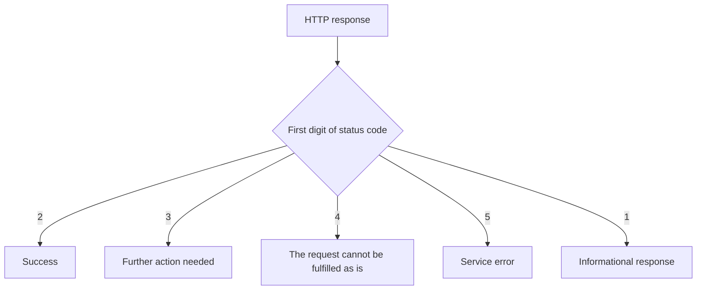

# HTTP Status Codes: What Was the Result of the Request?

The status code of the server's response is a short, machine-readable indication of the HTTP-level result of the request. It is not a full human explanation, but it helps the browser, other clients, and the developer decide what happened and what the next step might be. The code must always be interpreted together with the rest of the request and response.

## A Missing Course Page

Let's assume the student opens a course page that no longer exists from an old link. The server is available and responds, but cannot find the requested resource:

```http
HTTP/1.1 404 Not Found
Content-Type: text/html; charset=utf-8

<h1>The course page cannot be found</h1>
```

The `404` does not mean "no internet". Quite the contrary: the request reached a responding server. The server simply could not serve the targeted resource at the specified address. The browser can use the code as well as the human explanation arriving in the body.

## The Code Families

The first digit of the status code denotes a broad category:

| Family | Basic Meaning | Typical Situation |
| --- | --- | --- |
| 1xx | Informational response | Processing is still ongoing |
| 2xx | Success | The request was fulfilled at the HTTP level |
| 3xx | Further action needed | Using another address or a cached copy |
| 4xx | The request cannot be fulfilled as is | Missing resource, inappropriate authorization |
| 5xx | The service could not fulfill it | Internal error or temporary unavailability |



A 4xx is not a moral judgment on the user, and a 5xx is not necessarily the fault of a single server. The code family is just the first clue.

## Success: 200, 201, and 204

`200 OK` is a common successful response when requesting a page or data. `201 Created` indicates that a new resource has been created, such as a successful application. `204 No Content` indicates a successful operation without a body in the response. It is not advisable to automatically use `200` for every successful situation, because a more precise code can provide important information to the client.

> [!note] HTTP success and business success
> A successful HTTP response does not necessarily mean a successful business operation. If a server gives a `200` response with an HTML page that says "the course is full", the HTTP request succeeded, but the enrollment did not happen. In an API, it is particularly important that the code and the response content do not contradict each other.

## Redirection: 301 and 302

`301 Moved Permanently` can refer to a permanent move, while `302 Found` occurs in general redirection situations. The new address can be included in the `Location` header. The browser can then initiate a new request to the new location. Therefore, when opening a page, multiple consecutive requests may be visible in the Network panel.

The `304 Not Modified` belonging to the 3xx family is of a different nature: in cache checking, it indicates that the previously stored content can still be used. Its detailed operation is a later topic; for now, we just note that not every 3xx code is a simple "go to a new address" instruction.

## The Request Cannot Be Fulfilled: 400, 401, 403, and 404

`400 Bad Request` can refer to the fact that the request is faulty or cannot be interpreted. The name of `401 Unauthorized` is misleading: it typically means missing or inadequate authentication. In the case of `403 Forbidden`, the server rejects the operation, for example, because the logged-in student cannot access an administrator page. `404 Not Found` indicates a missing resource at the specified address.

The difference is also important from the perspective of the user's next step. For 401, logging in might be relevant. For 403, simply logging in again might not help. For 404, the address or the link might be outdated. The human text of the server's response can help communicate this, but it does not replace the status code.

## Service Error: 500 and 503

`500 Internal Server Error` indicates a general internal error. `503 Service Unavailable` can indicate temporary unavailability, such as maintenance or overload. At the peak of a course registration period, the user impact of the two situations can be similar, but their technical meaning differs. The status code alone is not yet a complete diagnosis; timing, the response, and server-side observations also matter.

## Common Misconceptions

| Statement | Clarification |
| --- | --- |
| "404 proves that there is no connection." | The server responded, only the requested resource is missing. |
| "200 is success from every perspective." | It indicates the HTTP-level result, not the fulfillment of the business goal. |
| "401 and 403 are the same." | Lack of authentication and a forbidden operation are distinct cases. |
| "3xx is always an error." | Mostly it indicates a further action or a cache decision. |

## Learned Concepts

- **HTTP status code:** A three-digit result indication included in the server's response. Its first digit defines a broad code family.
- **Successful response:** An HTTP response belonging to the 2xx family, indicating the protocol-level fulfillment of the request. It does not guarantee that all of the user's business goals were achieved.
- **Redirection:** A response that can lead to a further request towards another address. The new address is typically specified by the `Location` header.
- **Authentication:** Verifying who the party initiating the request is. Its absence or error often results in a 401 response.
- **Authorization:** Determining what operation an identified party can perform. In case of prohibition, a 403 response may occur.
- **Service error:** A server-side or background problem due to which the request cannot be fulfilled properly. In HTTP, it is typically indicated by a 5xx code.
