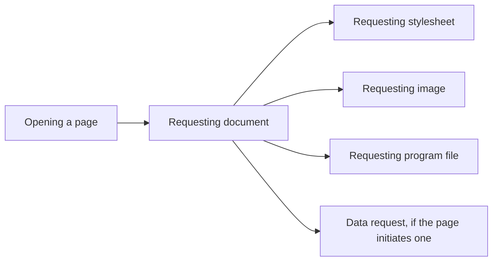
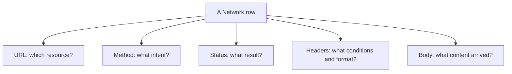

# Observing a Web Request in the Network Panel

The Network panel of the browser's developer tools makes web requests and responses observable. It does not replace the conceptual understanding of HTTP, but it helps connect addresses, methods, status codes, headers, and response content with a real page load. This week, the goal is basic reading, not full network diagnostics.

## What Do We See in the List?

Imagine the student opens a public course page. Multiple rows might appear in the Network panel: besides the request for the document, requests for stylesheets, images, or program files. One row typically belongs to one network request. The browser's user interface differs, but usually the target's name or URL, the method, the status, the content type, and certain time data are visible.

This outline does not mean a mandatory order: the browser can request multiple resources in parallel, and a specific page does not necessarily use all listed types. In the third week, we will see in more detail how the displayed document is built from these resources.

## Interpreting a Row

Let's select the row of the main document. First, it is worth identifying the URL: does it really belong to the entered address, or did we reach another address after redirection? Then let's look at the method. When simply opening a document, we typically see a GET. The status code shows what result the request ended with at the HTTP level. `200` is success, `301` or `302` can direct to a further address, `404` can indicate a missing resource.

Time data is important, but a single large number by itself does not tell why the page was slow. Different phases, server-side processing, and resource loading can also play a role. Detailed performance analysis is a later topic.

## Request and Response Headers

In the details of a row, the request and response headers might be visible separately. In the request, for example, `Accept` can indicate what content the client wants. The response's `Content-Type` header can show whether HTML, JSON, or other content arrived. In redirection, `Location` can provide the new address. If the response is JSON, the browser can also display it structurally in a separate view, but the formatted view still belongs to the same response.

The Network panel often shows headers that we haven't learned yet: cookies, caching-related fields, or security rules. You don't have to decipher all of them during the first observation. It is enough to recognize which part is the request, which is the response, where the status is, and how we identify the type of content received.

## Redirection and Multiple Requests

If the first request responds with a 3xx status code and a `Location` header, the browser can initiate a new request. In this case, the user sees a single page, but the panel contains a redirection chain. Multiple rows are generated differently if the HTML refers to further resources. In the first case, the target of the same navigation changes; in the second, additional contents necessary for display arrive. Distinguishing the two phenomena helps read the panel correctly.

## What Does the Observation Prove?

> [!tip] Interpret the evidence you can see
> The Network panel shows the browser's point of view. We can see what request the client initiated and what response it received. We don't directly see what database query the server ran, or exactly based on what internal rule it decided. An `500` response, for example, indicates a server-side problem, but does not name the cause by itself. The observation is therefore always interpreted within the limits of the visible data.

Sensitive information can also occur in the panel, such as session-related headers or requests containing personal data. In a bug report, it is incorrect to publicly share full headers, cookies, or tokens. For learning purposes, the appropriately selected part of the URL, the method, the status code, a few relevant header names, and the content type are sufficient.

## Common Misconceptions

| Statement | Clarification |
| --- | --- |
| "One row is a complete web page." | One row is typically one request; the page can consist of multiple resources. |
| "The Network panel shows the server's entire internal operation." | It shows the communication visible from the browser. |
| "A 200 status proves that the whole page is flawless." | It only indicates the HTTP-level success of the given request. |
| "Every header can be shared safely." | Some headers can contain sensitive data. |

## Learned Concepts

- **Network panel:** The network view of the browser's developer tools. It supports the observation of requests initiated by the browser and the received responses.
- **Row of a network request:** An entry belonging to a request in the panel's list. The target, the method, the status, and several related data can be identified on it.
- **Request detail:** The URL, method, headers, and possible body belonging to the selected entry. It helps the understanding of the message sent by the client.
- **Response detail:** The status, headers, and possible body received from the server. It helps the observation of the result returned by the server.
- **Redirection chain:** A sequence of consecutive requests when a 3xx response leads the client to a new address. It is not identical to requesting further resources of the document.
