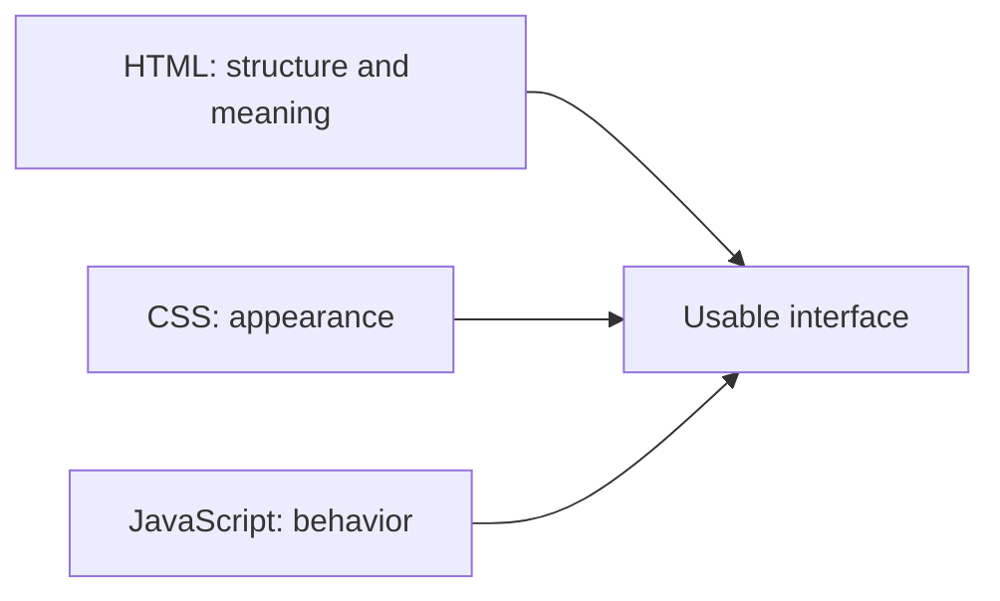

# HTML, CSS, and JavaScript: The Three Roles of the Web Interface

A web page looks like a unified interface, but the browser processes resources with different tasks. HTML describes the structure and meaning of the content, CSS shapes the appearance, and JavaScript can add programmable behavior. Separating the three roles helps create an interface that is understandable, modifiable, and usable in various environments.

## A Course Page from Three Perspectives

The student opens a course page. They see a title, description, and an application link. HTML indicates which part is a title, paragraph, or link. CSS makes the layout readable and usable on different screen sizes. JavaScript can indicate immediately if the student has selected a filter, for example; however, it is not strictly necessary for the basic description of the page.



The diagram shows cooperation, not that all three technologies are mandatory on every page. A simple document can be readable with HTML alone.

## HTML: What Does the Content Mean?

HTML is a descriptive language. It uses elements to mark, for example, the heading, paragraph, list, link, button, and form. The browser builds a document structure from this. HTML does not describe the exact color of letters or the final screen position of an element.

```html
<main>
  <h1>Web Programming I</h1>
  <p>The course discusses the basics of how the web works.</p>
  <a href="/application">Apply</a>
</main>
```

In this short example, `main` marks the main content, `h1` the main heading, `p` a paragraph, and `a` a link. The meaning of headings and elements is useful not only for the sighted reader: the browser, the search engine, and assistive technologies can also rely on it. Semantic structure is detailed in the next chapter.

## CSS: How Should It Appear?

CSS describes appearance with rules: color, font size, spacing, layout, and, among other things, adaptation to different displays. Multiple styles can affect the same HTML document. The browser interprets competing rules according to the appropriate priority and inheritance rules of CSS.

```css
main { max-width: 48rem; margin: auto; }
h1 { color: #17365d; }
```

CSS is not merely decoration. Readable line spacing, adequate contrast, and a layout that works even on a narrow screen all influence whether the information is usable. CSS can change the visible layout without changing the basic meaning of the document.

## JavaScript: How Should the Interface React?

JavaScript is a programming language. The code running in the browser can listen to user events, modify the current state of the document, or request new data from the server. For example, the course search can update the list of results upon filtering without the user having to step to a separate new page.

> [!warning] Validate on the server too
> Client-side validation performed by JavaScript can give comfortable feedback, but it does not replace server-side rules. If applying requires a prerequisite, its final validation must not be entrusted solely to the code running on the user's device. The browser-side program can fail, load late, or be bypassed.

## Gradually Building Interface

An informational page can start with meaningful HTML content. CSS makes it clearer, and JavaScript adds convenience functions if needed. This is the principle of progressive enhancement: important content and basic operations should preferably not depend unnecessarily on a late-arriving or faulty program.

This does not mean that every application can function entirely without JavaScript. A complex browser-based editor has different needs than a course description. The right question is what is needed for which function, and what happens if one of the resources does not arrive. The next chapter shows how the browser turns HTML into a living document model.

## Common Misconceptions

| Statement | Clarification |
| --- | --- |
| "HTML is just the sketch of the layout." | Besides the structure, it also marks the meaning of elements. |
| "CSS is just decoration." | It also determines readability and adaptive layout. |
| "Every modern page needs a lot of JavaScript." | The amount of necessary behavior is determined by the task. |
| "Client-side validation is enough to protect rules." | Important application rules must also be validated by the server. |

## Learned Concepts

- **HTML:** A descriptive language marking the structure and meaning of elements of a web document. The browser builds the processable model of the document from this.
- **CSS:** A rule system determining the appearance of the document. Besides colors, it handles layout, sizing, and adaptation to different environments.
- **JavaScript:** A programming language with which behavior running in the browser can be implemented. It can react to user events and modify the document.
- **Semantics:** The meaning and role of a document element. Proper semantics can aid both machine processing and accessibility.
- **Progressive enhancement:** A design approach that builds more advanced appearance and interaction on a usable foundation. The loss of extra functionality thus threatens the basic task less.
