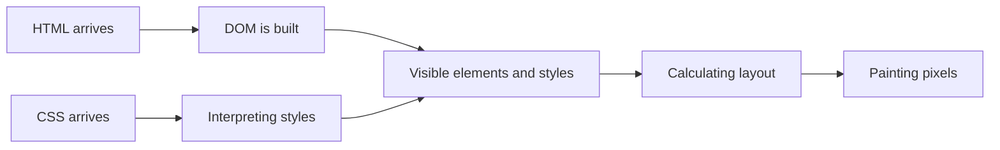

# How Does the Browser Render the Page?

The arrival of the HTTP response does not yet equal a finished, visible page. The browser processes the document, applies styles, calculates dimensions and positions, and then draws the result. These steps build on each other, but meanwhile, the browser can request new resources and refresh the interface multiple times. The simplified model helps understand why a page might appear gradually.

## The Student Sees One Page, the Browser Does Multiple Tasks

The student opens the course page, and the title and text appear first. An image arrives later, the custom font replaces the default one even later. Therefore, the page visible on the screen is not always created in a single moment. The browser discovers the necessary additional resources based on the received HTML, interprets the styles, and gradually shapes the display.

The diagram is an educational simplification. Actual browser engines can work in parallel and in multiple parts; JavaScript and later resources can trigger new changes.

## Processing HTML

The browser builds a DOM tree from HTML. HTML contains not only content, but can also contain links to further resources: a `link` can mark a stylesheet, an `img` an image, a `script` a JavaScript. The browser can initiate further requests for these. It doesn't have to wait for every possible resource to arrive to start interpreting parts of the document.

The correct structure is important because the DOM provides one of the bases for further processing. From incorrectly nested elements, the browser tries to make a usable tree according to its rules, but the result is not necessarily what the author intended. Valid, semantic HTML is therefore not a mere formal requirement.

## Styles and Visible Elements

Selectors and rules in CSS files describe how elements should appear. The browser also processes CSS, and then calculates the styles to be applied to the document's elements. The term CSSOM refers to the processed, object-like representation of CSS. The DOM and style information together help determine which elements get on the screen and how.

Not every DOM element appears directly on the screen. For example, an element with the `display: none` style might be present in the document tree, but does not participate in the visible layout. Other elements can result in pseudo-elements or multiple paint fragments. Therefore, "DOM tree" and "tree visible on the screen" are not the same concept.

## Layout and Painting

During layout, the browser calculates the size and location of the visible elements. During painting, these become pixels; in some cases, assembling additional layers is also necessary. You don't need to learn the detailed browser engine architecture this week. The important difference is that the existence of an element, its style, its geometric location, and its actual painting are separate steps.

If the font arrives later, the size and wrapping of the text might change. If the size of an image is not known in advance, the content below it might shift after loading. From the user's point of view, this can be annoying, especially if they are about to click on a button. Stable rendering is therefore not only an aesthetic goal.

## JavaScript and Repainting

JavaScript can modify the DOM or the styles. For example, after clicking an "Open Details" button, new text might become visible. The browser then has to recalculate or paint certain parts again, depending on the nature of the change. Not every change has the same cost: adding text might require different work than a change that only modifies color.

JavaScript execution can in some situations delay the processing of HTML or the reaction of the interface. Therefore, the amount of code and how it is loaded is a practical quality issue. However, for an interactive application, JavaScript might be necessary. The task is not to avoid it in itself, but to understand its role and consequences.

## What Does It Mean That It "Loaded"?

Page load is not a single perfect moment. The browser might first show usable text while a lower priority image is still arriving. The reverse can also happen: every file has downloaded, but due to a long JavaScript task, the interface does not respond properly yet. Therefore, quality must be evaluated based on the appearance and reaction perceived by the user, not just by the time of the last row in the network list.

The Network panel is good for observing requests and responses, Elements/Inspector for investigating DOM and styles. Neither view replaces the user experience, but together they help understand why the visible page is the way it is.

## Common Misconceptions

| Statement | Clarification |
| --- | --- |
| "The server sends a finished image to the browser." | The browser typically processes a document and resources. |
| "Everything is visible when the HTML response arrives." | Further resources and processing steps might be necessary. |
| "Every element of the DOM is visible on the screen." | Certain elements do not participate in the visible layout. |
| "A fast page is one that has few files." | The time of content and reaction important to the user is what counts. |

## Learned Concepts

- **Rendering:** The process of converting the document and styles into a visible display. It consists of multiple processing steps, and can run again partially upon later changes.
- **CSSOM:** The processed, programmable style model of CSS. The browser uses this in interpreting and applying styles.
- **Layout:** Calculating the size and screen position of visible elements. Can change upon the arrival of new content, style, or resource.
- **Painting:** Converting the calculated visual elements into pixels. The browser creates the image seen by the user with this.
- **Layout shift:** The unexpected or delayed change in the position of visible elements. For example, loading an image without dimensions can shift the surrounding text.
