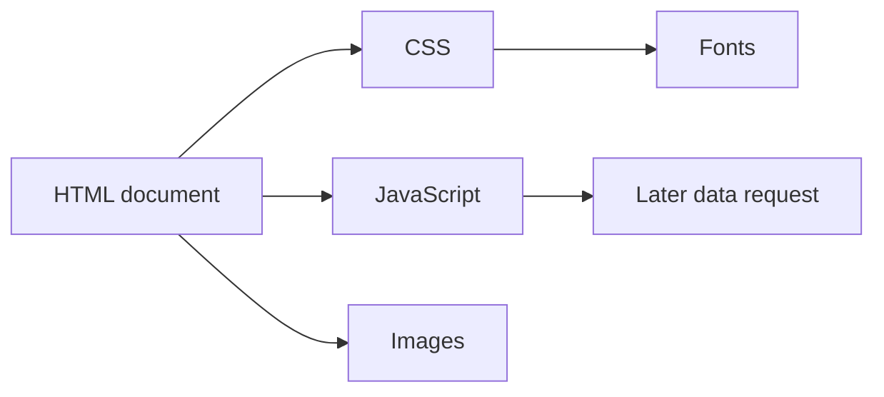

# Loading Web Resources

Opening a page usually consists of multiple HTTP requests. HTML can reference additional images, stylesheets, program files, and fonts. The browser requests these for display or functionality, while weighing which is needed when. The number and order of requests must therefore be connected to the page seen by the user.

## The Main Document is Just the Beginning

The student types the address of a course page. The browser first requests the document. In the HTML, however, there might be a reference to an external stylesheet, logo, instructor's photo, font, and JavaScript file. The browser can initiate further requests for these. The resources can come from the same service or from different places.



The diagram shows dependencies, not strict chronology. The browser can do some of the downloads in parallel; its specific behavior depends on the document, the resources, and the environment.

## References in HTML

A short document can name several resources:

```html
<link rel="stylesheet" href="/assets/site.css">
<script src="/assets/course.js" defer></script>

```

`link` marks a stylesheet, `script` a program file, `img` an image. The paths resolve to separate URLs in the context of the document's address. The `width` and `height` dimensions of the image can help reserve space even before actual loading; `alt` gives a textual alternative to the image. `defer` indicates that the external classic script should not block HTML parsing the same way as a normal, immediately running script. Exact script loading details can be the subject of later technical deepening.

## Critical and Later Needed Resources

Not every file is equally important for the first usable view. Without a required stylesheet, the page might appear unstyled. A large photograph at the bottom of the page can load later without blocking the reading of the starting text. The browser tries to manage this with priorities, but the developer's decisions also matter.

For example, the `loading="lazy"` attribute can indicate that loading an image can be deferred until it gets closer to the viewport. This can be useful for a gallery at the bottom of the page. For an image that is immediately important on the first screen, however, it might be a bad decision if we delay it unnecessarily. The goal of the technique is not to postpone every request, but to prioritize important content.

## Size and Origin of the Resource

A single large image, font, or JavaScript bundle can also slow down the interface. Besides the size of the file, it also matters when the browser discovers it, what other resource it is waiting for, and from which service it arrives. Content loaded from an external service can also mean an operational and privacy dependency. A map module, for example, is convenient, but if the service is unavailable, the page should still communicate the text address of the location.

In the Network panel, resources are visible in separate rows. Compared to the document, it can be identified which request is an image, stylesheet, or program. If a CSS file gets a 404, the HTML might still arrive, but the appearance might differ. If the image is missing, the textual content can still be readable. Partial errors therefore cause different user symptoms.

## Download and Final Rendering

Download and rendering are not the same process. A file can arrive quickly, but its processing gives work to the browser. A late-arriving font can cause a reflow, and JavaScript can request new content later. The browser can therefore change the interface even after downloads have finished.

During planning, a useful question is which resource's absence blocks the basic task. The text of the course description is fundamental, the decorative background image is not. If the apply button only becomes usable after a large, late-arriving program file, that can be a significant delay for the user. Separating necessary and convenience elements helps with correct prioritization.

## Common Misconceptions

| Statement | Clarification |
| --- | --- |
| "A page is a single HTTP request." | The document can reference multiple additional resources. |
| "Fewer requests always mean a faster page." | The size, timing, and processing of the resource also matter. |
| "It's worth delaying every image." | Important images of the first view must be loaded in time. |
| "When all files have downloaded, the interface is ready." | It can continue to change due to browser processing and later data requests. |

## Learned Concepts

- **Web resource:** A document, image, stylesheet, program file, font, or data requested by the browser at a separate address. Multiple resources can make up a page together.
- **Resource dependency:** A relationship in which a document or other resource references further content. A dependency can trigger a new request.
- **Critical resource:** A resource necessary for the first usable or essential rendering. Its delay can directly affect the user experience.
- **Lazy loading:** Deferring the download of certain resources until they are expected to be needed. It only improves the user experience in appropriate situations.
- **Partial error:** A situation where some requests of the page succeed, while others do not. The interface may still remain partially usable.
