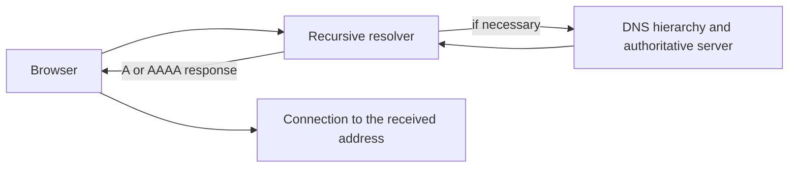

# Domain name, IP address and DNS

The name in the web address is an understandable identifier for both the user and the service, but building the network connection requires a reachable endpoint. DNS helps find the network address usable for establishing the connection from the name. This step connects the previously learned URL to the actual data transfer.

## A name that the network must also interpret

A student opens the address `https://courseware.example.edu/courses`. The host name `courseware.example.edu` names the service, but it is not in itself the network address to which we build the connection. The browser must find one or more IP addresses for the name. The path `/courses` will then be interpreted by the web service; DNS does not look up individual pages or paths.

The IP address is used for network addressing. IPv4 and IPv6 are different address formats. A domain can have multiple addresses, and the response may vary depending on location or time. The IP address does not necessarily identify a single physical server: it can be a proxy or a common entry point for many servers. The reverse is also true, multiple web names can share an address.

## Main actors of name resolution

The Domain Name System, or DNS for short, is a distributed and hierarchical name system. The client typically turns to a configured recursive resolver. The resolver, if it does not have a valid response, looks for the authoritative name server responsible for the given name using the DNS hierarchy. The authoritative name server provides a response about the records of its own zone. From this, the client can receive an `A` or `AAAA` record, which communicate an IPv4 or IPv6 address, respectively.

The diagram shows a possible complete resolution, not a mandatory path for every page load. The browser, the operating system, or the resolver may also store previous results; in this case, some external steps are skipped. It is also possible that the resolver directly has a valid response.

## Cache and varying response

The TTL associated with DNS records is the period for which the response can be stored in the appropriate cache. This can reduce latency and load on name servers. However, if the provider changes the address, some resolvers may still use an earlier but valid response according to the TTL for a while. Therefore, the effect of a DNS change does not necessarily appear for everyone at once.

A large service may use multiple addresses for load balancing or for geographically different entry points. The DNS response is therefore not a constant "one name = one machine" table. What is important for the student is that the domain can be a stable name for the service even if the underlying infrastructure changes.

## What does DNS answer and what does it not?

> [!note] DNS success is only one step
> A successful name resolution shows that we have received usable network information for the name. It does not prove that the server is reachable, the TLS connection will be established, or the requested page exists. If the DNS cannot provide an answer, the browser can get stuck even before the HTTP request. If the DNS response is present, but the page still does not open, the connection, the certificate, or another point of the application could also be faulty.

DNS in itself is not the authentication of the web content. A fake or incorrect DNS response can lead to the wrong address; the subsequent HTTPS certificate check represents a separate layer of protection. The two tasks should not be confused: DNS looks for an address, TLS participates in protecting the connection and authenticating the named service.

## Common misconceptions

| Statement | Clarification |
| --- | --- |
| "DNS finds the web page's file." | It provides network information for the name; the path is interpreted by the web service. |
| "A single, constant IP address belongs to a domain." | Multiple addresses and varying responses are also possible. |
| "A successful DNS response means the page works." | The connection and HTTP request can fail later. |
| "The entire DNS hierarchy must be traversed every time you open a page." | A valid cached response can skip multiple steps. |

## Concepts learned

- **Domain name:** An identifier manageable for humans within a hierarchical namespace. It can be part of a web host name.
- **IP address:** A network address that IP-based communication uses to reach endpoints. Its format can be IPv4 or IPv6.
- **DNS:** A distributed name system that assigns, among other things, network addresses to domain names.
- **Recursive resolver:** A service processing the client's DNS query, which asks additional name servers if necessary.
- **Authoritative name server:** A name server providing authentic records for a DNS zone.
- **TTL:** A value indicating the allowed caching time of the DNS response.
