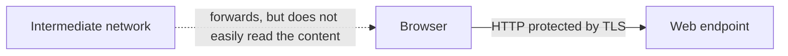

# What does HTTPS protect, and what does it not?

An address starting with `https://` indicates a protected web connection. HTTPS forwards HTTP messages with TLS protection: it serves the confidentiality and integrity of the transferred content, and the verifiable identification of the server. This is essential, but it does not qualify the intent of the website or the truthfulness of the information published on it.

## Protected connection on a public network

A student opens a course page on public Wi-Fi. The intermediate network forwards the traffic, so it is worth asking what it can see or modify. If the browser has built a valid HTTPS connection to the desired domain, the content of the HTTP request and response travels under TLS protection. An outsider on the route cannot simply read or imperceptibly rewrite this content.

The diagram does not promise complete invisibility. The existence, timing, volume of the connection, and some addressing data may still be observable in the network. Exactly what metadata is visible depends on the protocols and environment used. "Encrypted" does not mean that all user activity remains hidden.

## Three protective properties

**Confidentiality** protects against reading the transferred content. **Integrity** helps to verify that the message was not imperceptibly modified along the way. **Server authentication** builds trust between the specified domain and the other endpoint of the connection by verifying the certificate. These three goals are different: encryption alone would not be enough if the browser didn't know who it was talking to.

The certificate supports the connection tied to the domain. If the user arrives at the wrong domain, the browser may still find a valid certificate there. A deceptive page can therefore be technically HTTPS-protected for its own name while being used for phishing. The user must also interpret the name in the URL and the context of the service.

## The limit of protection

> [!warning] HTTPS does not certify the application
> HTTPS is the protection of transport. It does not guarantee that the server-side application is bug-free, that the provider handles data responsibly, or that the communicated information is true. The browser also cannot determine from a certificate whether an application page is legitimate. A password can arrive at a malicious service via a protected path if the user opened its page in the first place.

The resources belonging to the protected main page are also important. If the page requested a subresource over unprotected HTTP, its content could pose a separate risk. Browsers handle such mixed content according to special rules. Conceptually, the lesson is that the HTTPS of the main document in itself does not exempt the entire resource chain of the page from inspection.

## When does the path stop?

If the certificate is not valid for the opened domain or another check fails, the browser may issue a warning before accepting the HTTP response. This is a different type of error than a `404` or `500` status code: the latter are already HTTP responses. The difference helps identify at which point in the process it got stuck.

## Common misconceptions

| Statement | Clarification |
| --- | --- |
| "An HTTPS page is definitely trustworthy." | The protection of the connection does not prove the good intent of the provider. |
| "Encryption hides all network data." | Some metadata of the connection may still be visible. |
| "The certificate guarantees the truthfulness of the content." | It helps in verifying the connection tied to the domain. |
| "A certificate error is HTTP 404." | Certificate verification can stop the process even before the HTTP response. |

## Concepts learned

- **HTTPS:** The use of HTTP protected by TLS, which serves the confidentiality, integrity of the communication, and server authentication.
- **Confidentiality:** A protective property against unauthorized reading of the transferred content.
- **Integrity:** A protective property against imperceptible modification of the message.
- **Server authentication:** Verifying that the connection was established with the appropriate endpoint of the named service.
- **Mixed content:** The case of a subresource requested over unprotected HTTP for a page opened over HTTPS.
