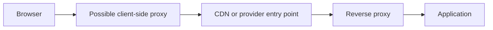

# Proxies, reverse proxies and CDNs

There isn't necessarily just the browser and an application server in the path of a web request. Intermediaries can receive, forward, route, or cache the traffic. A proxy, a reverse proxy, and a CDN can be understood from different perspectives; without knowing their roles, it is easy to think of the whole system as a single, invisible "server".

## The same course page, multiple internal actors

A student opens the course material page. Only a single domain is visible on the interface, but the traffic may be affected by an institutional client-side proxy, a provider-side entry point, and a content delivery network. Not all of them are present in every system. The common principle is that the intermediary stands between the client and the actual content source for some purpose.

The diagram is a possible architecture, not a mandatory sequence for every page. In many cases, the browser connects directly to the provider's entry point. The roles of the CDN and the reverse proxy can also merge: a CDN service can itself receive and forward requests.

## Proxy on the client's side

A **forward proxy**, or simply proxy in everyday language, can communicate with the remote service on behalf of a client or a group of clients. An organizational network can use it for access control, logging, or caching certain content. The browser turns to the proxy, and the proxy forwards the request as needed.

In the case of HTTPS, the intermediary proxy does not automatically read the TLS-protected content. The exact visibility depends on the connection setup and the organizational environment. The mere presence of the proxy therefore does not mean that the content of the protected HTTP message is open to every intermediary.

## Reverse proxy on the provider's side

A **reverse proxy** can be the external entry point of the web provider. It receives the browser's request and then routes it to an internal server. It can handle the TLS connection, distribute the load among multiple application instances, and cache certain responses. Meanwhile, the same public domain remains visible to the browser.

For example, the `/courses` path can go to the course application, and `/documents` to a file service. Such routing is an operational decision. The reverse proxy does not guarantee that the program running behind it is bug-free or secure; it can only help within its own tasks.

## CDN: distributed content delivery

A **CDN** is a geographically distributed server network. It is often used for the fast delivery of images, stylesheets, program files, and other resources that are identical for many users. An entry point closer to the network and a locally stored response can reduce latency and the load on the original server. This is a conditional advantage: it depends on cache hits, location, the resource, and the network path.

> [!warning] Cache public and personal data differently
> Rules determine the freshness of the response given from the cache. A common course logo can be the same for many users; a personalized enrollment status cannot be handled the same way without thinking. Therefore, the role of a CDN should not be simplified to the statement "it provides every response quickly".

## Who actually answered?

An HTTP response can come from the application, a reverse proxy's cache, or a CDN node. The browser sees the content and the status code of the response; the internal path cannot always be determined just from the visible page. When examining the system, we therefore also give a role to the intermediary layers. The next chapter follows the complete path in a single process.

## Common misconceptions

| Statement | Clarification |
| --- | --- |
| "A proxy and a reverse proxy represent the same party." | The former typically stands on the client's side, the latter on the provider's. |
| "With a CDN, the response always comes from the cache." | In the event of a cache miss or non-cacheable content, the original system must be contacted. |
| "There is one server behind a domain." | Intermediaries and multiple application instances can also stand behind it. |
| "A reverse proxy fixes the application's errors." | It only performs its own mediation and operational tasks. |

## Concepts learned

- **Proxy:** A client-side intermediary that can communicate with other services on behalf of a client or client group.
- **Reverse proxy:** A provider entry point that receives requests and routes them to the internal system.
- **CDN:** A geographically distributed content delivery network that can serve certain resources at a point closer to the user.
- **Cache hit:** A request for which a properly usable response is already available in the cache.
- **Origin server:** The primary source of the content behind the delivery or caching layers.
