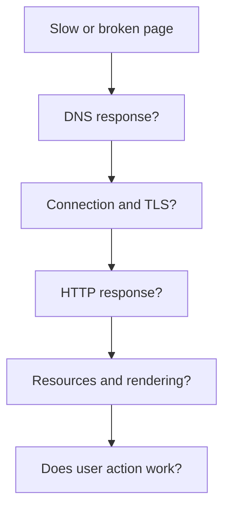

# Latency and failures in the path of the request

When a page is slow or doesn't open, "the internet is bad" is not an accurate enough explanation. Name resolution, connection building, TLS, server response, additional resources, and browser processing can individually cause delay or failure. Knowing the layers of the process allows us to choose the appropriate observation point for the symptom.

## Same symptom, different cause

A student tries to open the course page but sees an empty screen for a long time. It could be that the DNS resolution provides no answer, the network connection is established slowly, the server works for a long time, or the HTML has already arrived but the browser is waiting for an important style or script. The symptom is similar, but the investigation needed for a solution is different.

The diagram is not an automated decision tree. The steps can partially overlap or happen in parallel. The order is useful to separate the problems that arise before HTTP, during the response, and during post-response processing.

## Parts of latency

A DNS query can take time if there is no valid cached response. Connection and the TLS handshake can require multiple message exchanges. On the server side, the application might search for data or wait for another service before sending the response. Network transfer can be longer for large files, and the browser can also perform processing afterward. The total time is therefore not a single cause behind a single number.

The time segments do not simply add up for every page load. Some resources load in parallel; a previous connection or cached response can save steps. At other times, a resource can only be discovered after processing a previous file. This is why the timeline of the specific page must be examined, rather than just reciting a general rule.

## Error before or after HTTP

> [!tip] Separate connection failures from HTTP errors
> If the DNS does not provide a usable answer, the browser cannot build the desired connection. If the TCP or TLS phase fails, it can also happen that no HTTP status code arrives. `404`, on the other hand, is an HTTP response: the request reached an answering web system, but the given resource was not found there. `500` is also an HTTP response, indicating a server-side error class.

Alongside a successful main document, a subresource can fail separately. A missing CSS can be revealed by a 404 row in the Network panel, while the HTML text appears. A late-arriving image can degrade the page's stability, and a large JavaScript task can delay the interface's reaction. Therefore, the error must be interpreted per resource and according to user impact.

## Investigation at the right place

It is worth checking the address and host name first. If the connection is established, the status, timing, and content type of the main document's request in the Network panel give clues. If the response arrived, the Elements view helps check the current document and styles. Finally, testing the user action indicates whether the error actually prevents the goal of the page.

A single measurement does not generalize to every user. The network, location, device, cache state, and server load can also vary. Diagnosis is therefore a conclusion based on observations, where it must be clearly stated for which layer there is evidence and for which there isn't.

## Common misconceptions

| Statement | Clarification |
| --- | --- |
| "Slow page = slow internet." | Server and browser work can also cause delays. |
| "A 404 means there is no network." | A 404 is already an HTTP response from a reached web system. |
| "If HTML is 200, everything is fine." | Additional resources or the user action can fail. |
| "Every delay adds up sequentially, in the same order." | Cache, concurrency, and reused connections can alter the timeline. |

## Concepts learned

- **Latency:** The waiting time associated with a stage of connection, data transfer, or processing.
- **Connection error:** A problem due to which the required connection with the desired endpoint is not established, possibly without an HTTP response.
- **Partial error:** An error in a page's resource chain where other parts can still continue to function.
- **Timeline:** The temporal view of requests, responses, and processing events, which can help find the source of the delay.
