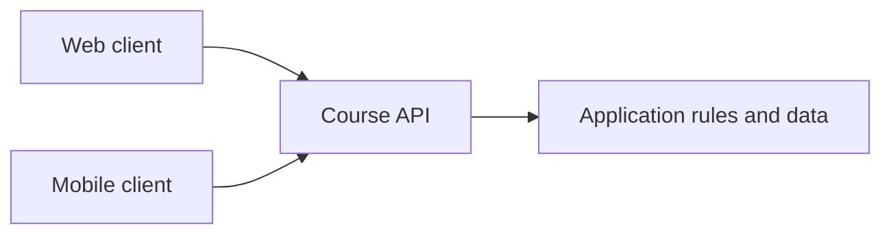

# What is a web API?

A web interface does not necessarily request ready HTML from the server. A program running in the browser, a mobile application, or another server can also request data and operations. A web API is a programmatic connection point available according to specific rules: it tells what requests the service accepts and what responses it can provide. This is worth interpreting as a contract between programs.

## Two consumers of the course list

A university service shows courses on a webpage and in a mobile application as well. The two interfaces differ, but can be built on the same course data. The server returns, for example, a list or details of a course via an API, and the client displays it in a way that suits its own interface. This does not turn the server into a "mere database": behind the API there can be validation, authorization, business rules, and other internal work.

The diagram shows a common connection point. It does not dictate that every client must display the exact same screen, and it does not mean that the API publishes internal database tables without modification.

## What does "contract" mean?

The API's contract can describe operations, paths, HTTP methods, allowed request data, response structure, status codes, and errors. For example, `GET /api/courses/42` might request the data of a specific course; the response could contain a title and instructor in JSON format. The client builds upon this agreement. If the server unexpectedly sends a different field name, the interface can break even if the network connection itself works.

An API contract is not necessarily a formalized machine description, but it is an important part of the documentation. The client needs to know what data is required, what might be missing, how the server indicates errors, and which version it can expect. A precise contract also reduces misunderstandings between teams.

## Separation of data and presentation

If the server sends an HTML page, its presentation is partially already included in the response. A data API, on the other hand, usually provides structured data, from which the client builds the interface or performs further processing. The same HTTP can carry HTML, JSON, an image, or other content; the response's `Content-Type` header indicates the format. The API is therefore not a separate network protocol instead of HTTP.

The separation provides flexibility but also creates new responsibilities. The browser-side program must handle loading states, errors, and missing data. The server must offer a stable, understandable contract. The next chapter examines the format of data, and the subsequent ones examine the organization of operations.

## Public and internal API

> [!warning] An API still needs access control
> An API can be public, intended for partners, or accessible exclusively to an organization's internal systems. "Programmatically accessible" does not mean that anyone is authorized for all its operations. Authentication and authorization are detailed topics for later; this week it is enough to recognize that an API is a boundary interface, to which access rules can also be attached.

## Common misconceptions

| Statement | Clarification |
| --- | --- |
| "An API is a direct internet exposure of a database." | The service provides data and operations according to its own rules. |
| "An API operates instead of HTTP." | A web API often uses HTTP messages. |
| "An API is only needed for mobile apps." | Browser-based, server-side, and other clients can also use it. |
| "If the response is 200, the client will definitely understand it." | The data structure of the response must also comply with the contract. |

## Concepts learned

- **API:** A programmatic connection point between programs that makes specific operations and data formats available.
- **Web API:** An API accessible over a network, typically HTTP, to which client programs send requests.
- **API contract:** A documented agreement on requests, responses, errors, and conditions between the service and its clients.
- **Client:** A program using the API, such as a browser interface, mobile application, or another server.
