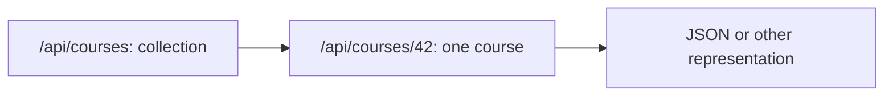

# REST: resources and HTTP operations

REST is an architectural approach that builds on web resources and the regular use of HTTP. It is not equivalent to an API returning JSON, and it is not a simple URL naming fashion. Using the example of the course, we examine how the resource address, the HTTP method, the response, and the client-server responsibility relate to the REST mindset.

## Courses as resources

In the university service, the course collection and a specific course can be separate resources. The `/api/courses` could represent the collection, and `/api/courses/42` the course 42. The specific URLs are design decisions of the service; the point is that the identifiers have a trackable meaning for the client.

The server can provide the same resource in different representations. In the REST approach, the client works with the representation, not by opening a remote database table. The HTTP headers, status codes, and the content of the response together carry the result of the operation.

## The meaning of HTTP methods

`GET` is used to retrieve a resource and should not perform a state-changing operation. `POST` often initiates the creation of a new resource or other server-side processing. `PUT` can be used to completely replace a targeted resource, `PATCH` for its partial modification, and `DELETE` for its removal according to the service contract. The known HTTP semantics of the methods are more important than just their naming.

| Request | Possible goal | Typical result |
| --- | --- | --- |
| `GET /api/courses/42` | Retrieve course data | Representation or `404` |
| `POST /api/courses` | Create new course | Indication of created resource |
| `PATCH /api/courses/42` | Modify one data | Modified result or error |
| `DELETE /api/courses/42` | Delete course | Success or rejection |

The table shows a possible contract, not the real API of the university. Not every user is authorized to create or delete. The method and authorization are separate questions, just like the technical correctness of the request and the fulfillment of business rules.

## Statelessness and responses

One of the important constraints of REST is stateless client-server communication: a request carries the information necessary for its interpretation in itself, and the server does not rely on the application-level conversational state of the client's previous request remaining there. This does not prohibit the server from storing data, and it does not mean that the user cannot have a login. The details of state and identity are topics for a later occasion.

The result of the HTTP response is indicated by a status code. For a non-existent course, for example, `404` might be meaningful, and for a successful creation, `201`. It is also worth providing a consistent response format for errors, so that the client receives not just a number, but a processable reason. Leveraging cacheability and other HTTP rules can also be an advantage of the web resource model.

## What does not follow from REST?

> [!note] JSON alone does not make an API RESTful
> The fact that an endpoint's name is a noun, or that the response is JSON, does not in itself make a system REST-like. REST is a set of several architectural constraints; here we highlight the important elements, rather than performing a complete compliance check. The clear responsibility between client and server, the identifiable resource, the representation, and the consistent use of HTTP meaning together provide the essence of the approach.

Other API styles may also be justified. If the client wants to choose exact fields from a wide variety of interconnected data, or prefers to call remote operations designated by name, the next chapter presents different approaches.

## Common misconceptions

| Statement | Clarification |
| --- | --- |
| "REST = JSON." | JSON is just a possible representation. |
| "Every POST is a creation." | The specific contract can assign other processing to it. |
| "Stateless = the server stores no data." | It's about the conversational state between requests, not the lack of a database. |
| "A noun URL makes every API REST." | HTTP semantics and other architectural constraints also matter. |

## Concepts learned

- **REST:** An architectural style built on resources, representations, and specific client-server constraints.
- **Resource identifier:** The web address naming the resource, to which various HTTP operations can be attached.
- **Stateless request:** A request that carries the information necessary for its interpretation in itself, without a previous application-level conversational state.
- **Representation:** The form of the resource provided to the client, such as a JSON response.
