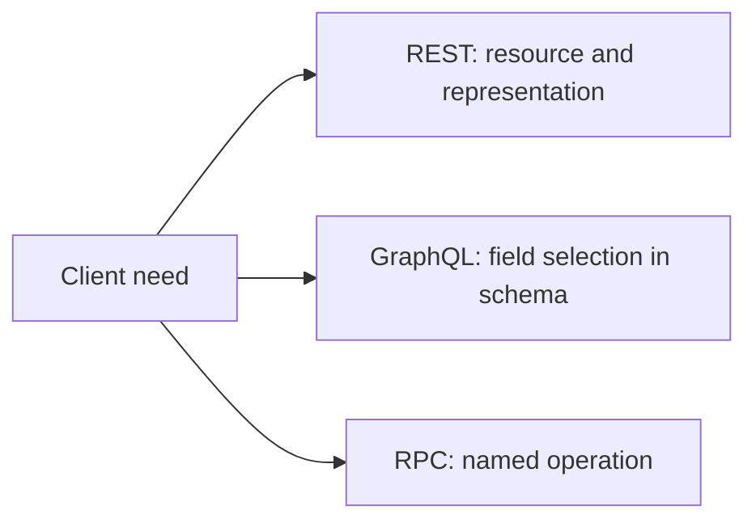

# GraphQL and RPC: two other API approaches

Not all web data exchange is organized around identifiable resources. In GraphQL, the client can request specific fields from data described in a schema; and in the RPC approach, it calls a named remote operation. These are not "more advanced" or "outdated" versions of REST, but connection patterns with different emphases.

## A course interface with multiple data sources

The mobile interface wants to display a course's title, instructor, and related timetable elements all at once. With an API organized around resources, these might come from multiple addresses, or the server might provide a representation that already includes them. In the case of GraphQL, the client specifies which fields it wants in the query. With RPC, it might call a "get course overview" operation. The choice is a matter of the task and the system's contract.



## GraphQL: naming the desired fields

The schema of the GraphQL service describes what types and fields can be requested. The client's query selects the necessary data. For example, conceptually, it can request the course title and the instructor's name like this:

```graphql
query {
  course(id: "42") {
    title
    instructor { name }
  }
}
```

This is an illustrative example, not a real course API. The response data follows the structure of the queried fields. The schema is an important part of the contract; the client can only request the supported fields. GraphQL does not mean that the client executes an arbitrary query directly in the database. The server checks and executes its request, and applies its own rules.

Field selection can help if many different clients work with different data needs. On the other hand, the schema, authorization, performance, and error handling require design. A response coming from a single endpoint is not automatically faster or simpler than any REST resource.

## RPC: operations at the center

**RPC** — remote procedure call — highlights the approach that the client requests a remote, named operation. `startApplication` or `checkTimetableConflict` is conceptually an operation, not just fetching the representation of a resource. RPC can be a web API working over HTTP, but the principle itself is not tied to a single data format or network protocol.

The name of an operation can easily make the application intent clear. At the same time, the API must clarify the input, the output, the possible error, and the consequence of repeating the call here as well. If an application is accidentally started twice, the server must be able to handle the situation. RPC does not exempt you from writing the contract consistently.

## How do we compare them?

With REST, the resource and the HTTP operation, with GraphQL, the schema and field selection, with RPC, the named operation is the natural starting point. Real systems can also apply mixed solutions. A library catalog fits well with a resource model, complex data appearing on various interfaces can be handled well with GraphQL, and a targeted application operation can be clear as an RPC. More important than the name of the technology is that the contract is understandable and fits the client's need.

## Common misconceptions

| Statement | Clarification |
| --- | --- |
| "In GraphQL, the client reads the database directly." | The client requests data through the schema defined by the service. |
| "RPC is just the name of a specific protocol." | It is primarily an operation-centric connection approach. |
| "GraphQL is always a single fast request." | The server's work and the complexity of the data need still matter. |
| "A single style is correct for every API." | The task and the quality of the contract decide. |

## Concepts learned

- **GraphQL:** A schema-based API query language and execution model, in which the client names the desired fields.
- **Schema:** The definition of types, fields, and operations offered by the GraphQL service.
- **Query:** A data request, which in the case of GraphQL also specifies the structure of the desired fields.
- **RPC:** A remote procedure call approach, in which the client initiates a named operation and receives a response.
