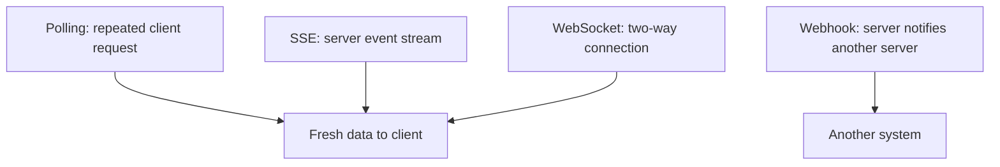

# Changing data: polling, SSE, WebSocket and webhook

For some data it is enough to ask once, others change continuously. Course application spots, live results or the state of a shared edit may require updating. Polling, Server-Sent Events, WebSocket and webhook are communication patterns of different directions and timing. The appropriate solution is determined by who initiates, how often the data changes, and whether there is a need for a two-way exchange of messages.

## A changing number of available spots

The student sees on a course page that there are still three spots left. Meanwhile, others can also apply, so the number can change. If we only request the data once, the interface can quickly become outdated. There are several solutions, but none of them replace the final check by the server: the "there is still space" display is momentary information, not a guaranteed reservation.

The figure shows the direction of the four patterns. The webhook does not solve the same problem as updating the number of available spots visible in the browser: it is typically a notification between services.

## Polling: a new request occasionally

In the case of **polling**, the client requests the data again at specific intervals, for example, the number of available spots every thirty seconds. It is based on simple HTTP requests, so it can be easily connected to an already existing API. Its disadvantage is that it asks even if there has been no change, and a change only appears at the next request. For rarely changing data, this might be acceptable; for per-second updates covering many clients, it can be costly.

The query frequency is not merely a technical constant. The user need, the server load, and the speed of the data change shape it together. If the client receives an error, it is not advisable to resend the same request indefinitely and immediately.

## Server-Sent Events: from server to client

**Server-Sent Events**, or SSE for short, is an HTTP-based event stream in which the server can also send messages to the client later on the opened connection. In the browser, the `EventSource` API can be used to receive events. This can be good, for example, for displaying a live status or feed, when the essential new data typically flows from the server to the client.

SSE is not a general two-way conversation on the same channel. If the client wants to initiate an operation, it can do so with a separate HTTP request. Handling the disconnection and reconnection must also be considered. The advantage of the choice may be the simpler, one-way event model, not that it is "more real-time" than any other solution in every case.

## WebSocket: two-way messages

**WebSocket** enables a persistent, two-way message exchange between the client and the server. It can be justified if both parties initiate frequently: for example, in a shared edit or interactive game. After establishing the connection, it is not necessary to start a separate, complete HTTP request-response cycle for every small message.

The two-way nature also means more state management. The server must handle the open connections, and the client must handle disconnection, reconnection, and missed changes. For a rarely updating course list, WebSocket can be overkill. The choice of technology should start from the communication need, not from the "real-time" label sounding modern.

## Webhook: system notifies system

In the case of a **webhook**, a service sends an HTTP request to a pre-defined address of another service when an event occurs. For example, the application system can notify the statistical system about a new application. The receiving service must verify that the notification really comes from the expected sender, and must handle repeated or failed delivery. Detailed security solutions are topics for later.

> [!note] Webhooks and WebSockets solve different problems
> A webhook is therefore not simply "WebSocket between servers". It is not a persistent, two-way channel, but an event-bound request between services. If the goal is a direct browser update, another path or an additional intermediary step may be needed.

## Common misconceptions

| Statement | Clarification |
| --- | --- |
| "Real-time update always requires WebSocket." | Polling or SSE can also meet the need. |
| "In SSE, both parties send events on the same channel." | SSE is an event stream from server to client. |
| "A webhook is a notification to the browser." | Typically a service sends an HTTP request to another service. |
| "The displayed free spot is a guaranteed reservation." | The server must separately check the state at the moment of application. |

## Concepts learned

- **Polling:** Repeated client-side querying that requests fresh data from the server at intervals.
- **Server-Sent Events (SSE):** HTTP-based event stream flowing from server to client.
- **WebSocket:** A web communication protocol supporting persistent, two-way message exchange.
- **Webhook:** An event-triggered HTTP request from one service to a pre-defined endpoint of another.
