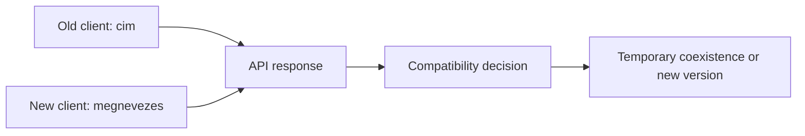
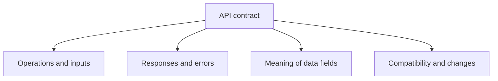

# API versioning, compatibility and documentation

An API can mean a long-term contract for several clients. If the service changes, the old browser or mobile application does not necessarily update at the same moment. The task of versioning, compatibility and documentation is to make the change trackable and manageable for clients.

## A field change for multiple clients

The course API previously sent a field named `cim` (title). The developer of the new server version would rename it to `megnevezes` (designation). The updated web interface would read the new field, but an older mobile application still expects the `cim` field. If the server suddenly only sends the new name from one day to the next, the old client cannot display the course. Even though the network and HTTP work, the API contract is violated.

## Compatible and breaking change

A new, optional response field can often be ignored by the old client. This is often a backward-compatible extension if the meaning and type of the previous fields remain unchanged. However, removing a mandatory field, changing its type, or rewriting its meaning is easily a breaking change. Whether a modification is truly compatible depends on the actual contract and the behavior of the clients.

Error responses are also part of the contract. If the client expected a given status code and error format until now, the change there can also break the operation. A "documentation only" modification is usually of a different nature, but if the previous documentation was incorrect and the clients built on it, the situation must be handled carefully.

## Versioning options

A new version of the API can be distinguished in several ways: it can appear, for example, in the URL path, in a request header, or in the schema of the service. There is no single mandatory format for every service. The goal is for the client to know which contract it is using, and for there to be a transition if the old version is phased out later.

> [!tip] Version numbers need change management
> The version number itself does not replace change management. If every small extension gets a new version, the clients follow an unnecessarily large number of changes. If, on the hand, a breaking modification occurs without notification, the old clients fail surprisingly. Versioning, temporary coexistence and clear phase-out information help together.

## What should the documentation contain?

A usable API description tells what the service is for, where the operations are available, what method and input are needed, which fields are mandatory or optional, what successful and error responses can be expected, and how the contract has changed. Examples help, but they do not replace the description of the rules. A single sample response does not tell you what happens with missing data or an authorization error.

OpenAPI is a standard description format for HTTP APIs that can be processed by both machines and humans. It can help consistently record endpoints, parameters and responses, but good documentation is not merely the result of a file format: the exact meaning of the fields and the conditions of use are also needed. In the case of GraphQL, the schema and field descriptions provide a similarly important connection point.

## Testing the contract

It is worth checking the cooperation of the service provider and the client from the perspective of the old and new client as well. Does the old client get the fields it needs? Does it react understandably to a missing resource? Has the meaning of a field changed while keeping its name? Such questions examine compatibility specifically, not just the presence of a version number.

## Common misconceptions

| Statement | Clarification |
| --- | --- |
| "With a new server version, all clients are updated at once." | Clients can change at different paces. |
| "A new field is always a breaking change." | An optional extension is often manageable for old clients. |
| "The version number itself preserves compatibility." | The actual maintenance of the old contract and the transition also matter. |
| "A sample response is full documentation." | Errors, conditions, and field meanings require separate descriptions. |

## Concepts learned

- **Backward compatibility:** A property of the new API version under which clients building on the previous contract can continue to function.
- **Breaking change:** A modification that can break the operation of clients using the previous contract.
- **API version:** A distinguished version of the service's contract, to which the client and provider associate the same expectation.
- **API documentation:** A trackable description of operations, data, errors, and changes for the creators of clients.
- **OpenAPI:** A standard, machine-processable description format for the capabilities of HTTP APIs.
