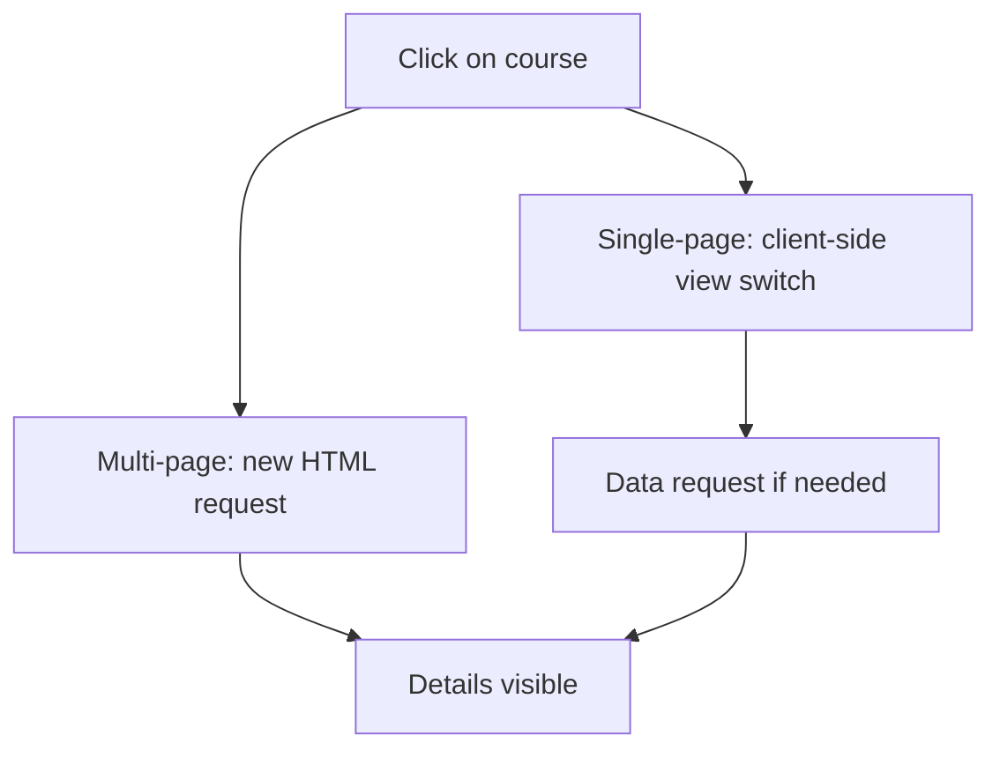

# Multi-page and single-page web applications

Two web interfaces can look similar while their navigation works differently. In a multi-page application, switching between pages usually initiates a new document request. In a single-page application, the already loaded application often requests data, and then transforms the interface in the browser. The difference appears in the user journey and the tasks of the server and the client.

## Two versions of a course catalog

The student opens a course list, then clicks on the details of a course. In the multi-page version, the browser navigates to the details address and receives a new HTML document. In the single-page version, the application's JavaScript can handle the click, fetch data from the API, and replace the visible view in the current document. In both versions, a unique URL can exist for the course, and both can be interactive.

The figure shows typical operation, not a rigid technological rule. A multi-page site can also have a JavaScript update, and a single-page application can also request a full document from the server upon first opening.

## Multi-page application

In the case of **MPA**, a separate document response mostly belongs to the different pages. The server can generate HTML for every navigation, or serve a static file. The browser's known link and history management works naturally. Loading a new document, however, can involve network and rendering work. Reloading the whole page is not automatically slow: the cache, the server, and the size of the page also matter.

A news portal or a simple course catalog can work well in a multi-page model. Addressable content and an independent HTML document can be a distinct advantage. The model does not mean that a full reload is required after every operation: partial validation of a form or a filter can also work here with the help of JavaScript.

## Single-page application

In the case of **SPA**, after the initial load, JavaScript takes over a significant part of the view changes. The client can request data via an API, then modifies the DOM. The switch can feel fast and continuous, but the first load and running the program may require more client-side work. Faulty or slow JavaScript can also block access to content if every view depends on it.

> [!tip] Make deep links and history work
> The SPA must pay special attention to URLs, the Back button, state restoration, and directly opened deep links. If the user copies the address of a course's details, it must lead to a meaningful view on another device or after a refresh as well. The browser's History API can help with this, but updating the URL does not load the corresponding data by itself.

## Not identical to the rendering strategy

The MPA–SPA difference is primarily a question of navigation and application structure. Client-side, server-side, and static rendering describe where and when the HTML or the visible view is generated. These can be combined: the pages of a multi-page site can be pre-generated HTMLs, and the first page of an SPA can arrive with server-side HTML. Mixing the two axes is a common misconception.

## Common misconceptions

| Statement | Clarification |
| --- | --- |
| "MPA cannot be interactive." | A multi-page site can also use JavaScript and APIs. |
| "SPA requests a new HTML document on every click." | It often switches views in the existing document. |
| "SPA is always faster." | Initial load, program execution, and network data request also matter. |
| "MPA or SPA automatically determines rendering." | Navigation model and rendering strategy are separate decisions. |

## Concepts learned

- **Multi-page application (MPA):** A web application model in which different views typically have separate HTML documents.
- **Single-page application (SPA):** A model in which the already loaded client application often switches views within the current document and requests new data.
- **Client-side navigation:** A view switch handled by the program running in the browser without loading a new full document.
- **Deep link:** A URL that directly opens a specific internal view of an application.
