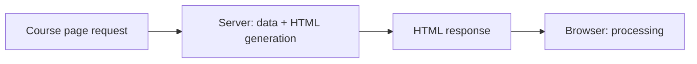

# Server-side rendering

With server-side rendering, the service generates HTML for the request, which already contains the important content of the view. The browser can process this as a document, while JavaScript can add further interaction later. Server-side rendering is not identical to a multi-page application: the first HTML can also be received by an application that later navigates on the client side.

## HTML from fresh course data

The student opens the details of a course. The server can fetch the current data of the course, and then generates an HTML document from these. The browser can already find the title, description, and links in the first response. The HTML is not necessarily a previously stored file; it can also be generated per request.

The browser still has to download styles and other resources. Server-side rendering does not send a "finished image", but a more complete document. If the interactive operation of the page is based on JavaScript, it can become usable after the HTML appears.

## The server's work and the first content

The advantage of SSR can be that the essential content is already present in the first HTML response. We value this on a page where reading and direct URL opening are important. It is not an automatic acceleration. The server must fetch data and generate HTML; if this is slow, the response is also delayed. The client's subsequent JavaScript execution can also burden the device.

> [!warning] Personalized HTML needs careful caching
> If many people request the same public course description, the server-side HTML may also be cacheable under appropriate conditions. If the content is personalized, the cache rules are more careful. SSR does not replace performance planning, it only moves the work of generating the first view to a different place.

## Interactivity and hydration

An HTML page generated by a server can inherently contain working links and forms. If the interface requires more complex client-side interaction, the JavaScript running in the browser can attach event handling and application state to the existing HTML. This is often called **hydration**. The time of appearance of visible text and full interactivity can thus separate.

Hydration also has a cost: the program must be downloaded and run, and the server-side HTML must match the state expected by the client. If the two sides differ, faulty display or unnecessary redrawing can occur. The detailed framework mechanisms are not the goals here; the conceptual lesson is that the finished HTML and the working client-side program are two separate states.

## SSR and navigation

In a multi-page application, every navigation can receive a new, server-side generated HTML. In a single-page application, the very first request can arrive with SSR, and the subsequent view switch can happen on the client side. The navigation model and the rendering strategy can be combined. In making the decision, the user goal, freshness, and interaction matter.

## Common misconceptions

| Statement | Clarification |
| --- | --- |
| "With SSR, the server sends a screenshot." | It generates HTML, which the browser renders. |
| "There is no JavaScript on an SSR page." | An interactive program can also be attached to the HTML later. |
| "The visible HTML makes every button instantly functional." | Operations based on JavaScript may become available later. |
| "SSR only exists in MPA." | It can also be used for the initial page of an SPA. |

## Concepts learned

- **Server-side rendering (SSR):** Generating the important HTML content of the view on the server, while serving the request.
- **Hydration:** Attaching client-side JavaScript state and event handling to an already existing HTML interface.
- **First HTML response:** The HTTP response of the page's main document, which in the case of SSR can also contain the important content.
