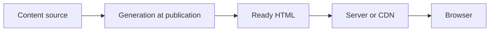

# Static generation and hybrid rendering

Not every page needs to be reassembled on every request. During static generation, the HTML is created before publication and can later be served as a file. This fits well with rarely changing content that is the same for many. Other pages require fresh or personalized data; therefore, an application can combine different rendering methods.

## Course description before publication

The university publishes the official course descriptions for the next semester. If these texts rarely change and are the same for every reader, the HTML can be created in advance. The publishing process prepares the pages from the source, and the server or CDN transmits the ready HTML. This is called static site generation, often SSG.

> [!note] Static HTML can still be interactive
> "Ready in advance" does not mean the page is without interactivity. CSS and JavaScript can also be attached to the HTML. The crucial difference is that the main content of the initial HTML is not generated separately for every user request.

## Speed and freshness

Ready HTML can be served quickly, and in many cases can be easily cached. This can be an advantage for documentation, a news archive, or a rarely modified course description. The disadvantage is managing freshness: if the timetable or the course description changes, the affected page must be regenerated and published. An error in the publishing process can leave old information out.

The live spot count is not good to treat as an unchangeable truth in the HTML generated once at the beginning of the semester. A solution could be that the static page contains the description, and the browser obtains the fresh spot count from a separate API request. This is already a hybrid structure: the freshness needs of different contents are different.

## Three locations for content generation

The same course view can be generated at publication time, on the server during a specific request, or in the browser. The choice is not merely a "which is faster?" question. The first response of a static page can be fast, but publishing new content is a separate step. SSR can provide fresh, personalized HTML, but requires server work. CSR allows dynamic building in the browser, but may require program and data loading.

| Strategy | When is the main view generated? | What do we pay attention to? |
| --- | --- | --- |
| SSG | Before publication | Updating and regeneration |
| SSR | When serving the request | Server work and response time |
| CSR | In the browser | JavaScript and data loading |

The table is simplified. In real applications, the three methods can be mixed. Static documentation can have a client-side search engine, the interactive part of an SSR page can work on the client side, and an SPA can receive initial server-side HTML.

## Hybrid solutions and hydration

In a hybrid solution, individual pages or page elements follow a separate strategy. The course description can be pre-generated, the application status can be updated upon request or from an API, and the search field can filter on the client side. If JavaScript takes over interactive control of HTML generated in advance or on the server side, hydration may occur. The most important thing is not to send and run more programs than what is necessary for the usability of the given task.

## Common misconceptions

| Statement | Clarification |
| --- | --- |
| "A static page never changes." | It can update upon new publication, and can also request client-side data. |
| "SSG = page without JavaScript." | An interactive program can also be attached to the ready HTML. |
| "An application must choose a single rendering strategy." | Pages and elements can follow different needs. |
| "The first fast HTML guarantees fast interaction." | Subsequent program work and data requesting also matter. |

## Concepts learned

- **Static site generation (SSG):** Generating HTML before publication and serving it as a ready document.
- **Hybrid rendering:** The combined use of multiple rendering strategies for different pages or page elements.
- **Publishing process:** The series of steps that create and release servable static files from the content source.
