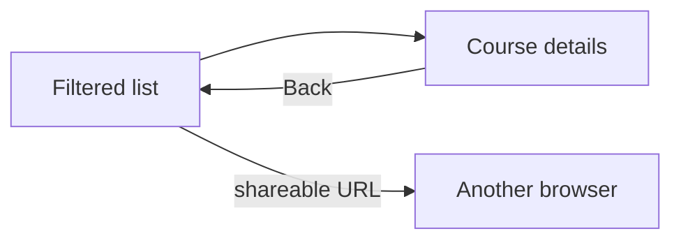
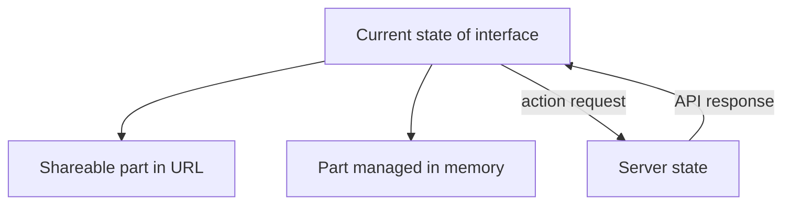

# Navigation, interactivity, and client-side state

A web application doesn't just display pages: it also manages the user's journey and the current state of the interface. In the course search, the filter, the selected course, and some of the open details can live in the browser. These are not the same as the official application data managed by the server. Separating navigation and state helps ensure that the Back button, refresh, and direct URLs work meaningfully.

## The student searches, selects, goes back

The student searches for the word "web" in the course list, selects a course, then wants to return to the filtered list using the Back button. If the program only replaces the elements visible on the screen but ignores the URL and history, the Back button might take them to an unexpected place. If the search is lost when refreshing the page, the student's work is also interrupted. These are not merely graphical errors, but navigation and state management decisions.

## What should be in the URL?

The URL is well-suited for indicating a shareable, reopenable state. The identifier of the selected course can naturally be included in the path, and a search term or filter in the query string. This way, the student can copy the address, refresh the page, and return to the same view later. Not every momentary interface detail belongs in the URL: for example, the state of a currently open, non-essential help panel can remain as local application state.

> [!note] Changing the URL is only part of navigation
> In a single-page application, the History API can help manage the URL and the browser's history. Modifying the URL, however, does not automatically load the corresponding data and render the view; the application must handle this as well. Server-side handling of directly opened internal addresses must also be ensured, otherwise an internal link of an SPA might fail upon refresh.

## Local and server-side state

The current state of the browser could be, for example, the value of the search field, the selected tab, or an ongoing data load. The server-side state could be the actual number of available places in a course or a submitted application. The client can display a copy or a momentary estimate of the server's data, but cannot automatically consider it the official truth. When applying, the server must decide again according to its own rules.

From the IndexedDB chapter of the previous session, we know that certain local data can be stored in the browser for later. This does not mean that all interface states should be written to a database. The storage location should be chosen based on freshness, shareability, and the consequences of loss.

## Interaction and accessibility

A client-side view switch should not only happen visually. The user must understand which view they have reached, what is loading, and what happened in case of an error. The meaning of native links and buttons is important here too. If JavaScript updates the content, managing focus and the predictability of navigation can also be a task. Detailed accessibility practice is the topic of a later session, but semantic HTML is already a good foundation.

## Common misconceptions

| Statement | Clarification |
| --- | --- |
| "The visible view is enough, the URL is secondary." | For sharing, refreshing, and history, the URL can indicate important state. |
| "Client-side state is identical to the server's official data." | The client can also manage a momentary copy or interface state. |
| "The History API automatically renders the page." | The application must build the view corresponding to the URL. |
| "All states must be saved in IndexedDB." | The need for preserving and sharing state differs. |

## Concepts learned

- **Client-side state:** Momentary data managed in the browser, which can determine the displayed view and interaction.
- **Server-side state:** Application data managed by the service, significant for multiple requests or users.
- **Navigation state:** The part that determines which view and URL are current in the browser.
- **History API:** A browser interface for programmatic management of session history, for example, to support client-side navigation.
