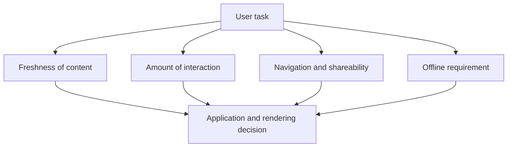

# Choosing an application model and rendering strategy

The multi-page and single-page models, as well as static, server-side, and client-side rendering, are not a predefined ranking. The choice depends on what content needs to be displayed, how often it changes, how much interaction is required, and what should happen on a slow or missing network. The course page, the application interface, and a collaborative editor might justify different choices.

## Three different tasks

The official course description of the university is the same for many, rarely changes, and it's important that it can be read from a direct link. A statically generated, multi-page structure might fit well. The application interface requires fresh available place data and server-side decision-making; here, HTML generated on request, an API update, or a hybrid solution might make sense. A collaborative diagram editor can involve many local interactions and continuous data exchange; it might feel more natural as a client-side application. These are examples, not mandatory technological prescriptions.

## Two separate decision axes

First, let's clarify how view changes happen: do we usually request a new document, or does the client program change the view? This is the MPA–SPA axis. Then, where and when is the initial important content produced: in advance, on request on the server, or in the browser? This is the SSG–SSR–CSR axis. The two decisions are related but do not merge. A multi-page static website, a server-side generated SPA starting view, and a hybrid interface are all possible.

Different parts of the application can also receive different choices. The course description can be static, the number of available places can be updated from an API, and form validation can happen partly in the browser. The actual application must be accepted or rejected by the server. "Hybrid" is not complexity for its own sake: it is justified when the freshness and interaction needs of the parts genuinely differ.

## Aspects of the decision

The first important aspect is the **first usable content**. If a page is for reading, it's good if the essential text appears quickly. The second is **interaction**: frequent view changes and local editing may require more client-side programs. The third is **freshness**: a static description and a momentary number of places require different handling. The fourth is **shareability and navigation**: the URL of a specific course must work even after refreshing and on another device.

Further aspects include device performance, network reliability, and the complexity of operation. If the interface is built on a large amount of JavaScript, it may respond later on a weaker device. If we perform heavy server-side work on every request, the response time can increase. If the publication update is bad alongside static content, old data might remain out there. There is no strategy without compromise.

## Brief comparison

| Situation | Possible starting point | Constraint to watch |
| --- | --- | --- |
| Rarely changing course description | MPA and SSG | Regeneration upon update |
| Personal application status | SSR or view updated with API | Freshness and server-side verification |
| Collaborative diagram editing | SPA and significant CSR | Program size, connection, state recovery |
| Offline readable material | Any model plus service worker | Cache freshness and offline boundary |

These are not final recipes. The table only shows how planning can start from the user task. In a real system, privacy, accessibility, searchability, and team size can also modify the decision; some of these will be examined in more detail in later weeks.

## Common misconceptions

| Statement | Clarification |
| --- | --- |
| "SPA is always modern, MPA is obsolete." | A different navigation model may be appropriate for a different task. |
| "SSG is only good for simple pages without interaction." | Dynamic elements can also work alongside static HTML. |
| "SSR is always faster than CSR." | The combined work of the server, network, and client matters. |
| "A service worker solves all offline problems." | Only planned, storable content and operations can work properly. |

## Concepts learned

- **Application model:** An approach organizing interface navigation and client–server responsibilities, for example, MPA or SPA.
- **Rendering strategy:** Choosing where and when the important content of the interface is produced.
- **Hybrid architecture:** A combination of different navigation, rendering, and data management solutions for different pages or elements.
- **First usable content:** Information appeared on the interface that is necessary and comprehensible for the user's primary goal.
