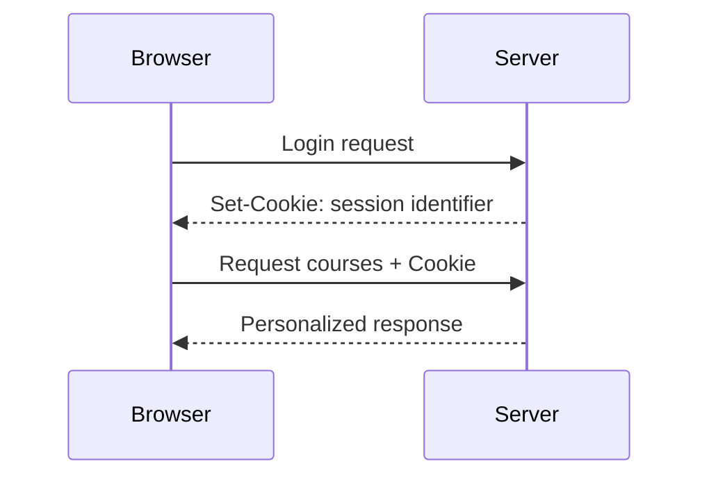

# Cookies and server-side sessions

A cookie is small data that the browser can store according to its rules and attach to subsequent HTTP requests. Its common use is transmitting a session identifier: based on this, the server finds which logged-in user the request belongs to. The cookie, however, is not the entire session itself, and it is not automatically secure just because it is small.

## New request after login

The student logs into the course system. The server verifies the login, creates a session, then can send an identifier to the browser in the `Set-Cookie` header of the response. On a subsequent course list request, the browser forwards the relevant cookie in a `Cookie` request header. The server searches for the session based on the identifier and decides what personal data and operations it can give the student.

This is a possible pattern, not a mandatory solution for all web applications. It's practical to keep only the necessary identifier in the cookie; the server can manage the detailed session state. Specific security settings and threat models belong to next week's web security chapter.

## Difference between cookie and session

The cookie is the means of transmission between the browser and the server. The server-side session is the state managed by the application, which we look up using the identifier. If the server invalidates the session, the old identifier remaining in the browser cannot grant access again. If the browser loses the cookie, the server cannot link the next request with the same identifier.

Cookies can also be used for other purposes, such as remembering a language setting. However, this does not mean that all local application data must be stored in a cookie. Cookies are sent with appropriate requests, so for large or complex local data, browser storage interfaces might be more practical.

## Scope and characteristics of a cookie

Sending a cookie is influenced by several settings, such as the domain, the path, the expiration, and security attributes. `Secure` indicates that the cookie can only be sent over a properly protected connection. `HttpOnly` restricts direct reading from JavaScript. `SameSite` controls sending associated with cross-site requests. These do not shape the meaning of the cookie's content, but the conditions for its management.

The browser does not attach all its cookies to every internet request. Scope and attributes determine which request it matches. The exact rules and the associated attack risks are detailed in the next session; here the basic mechanism necessary for linking the session is what's important.

## Lifecycle and logout

A session cannot last forever unconditionally. It can expire, the user can log out, or the server can terminate it for security reasons. Logging out must therefore not only show the interface as "not logged in," but must also invalidate server-side access. Deletion or expiration of the cookie can be part of this, but the server's verification is crucial.

## Common misconceptions

| Statement | Clarification |
| --- | --- |
| "The cookie is the entire session itself." | It often only carries the identifier; the state is managed by the server. |
| "The browser sends every cookie for every request." | Scope and attributes restrict the transmission. |
| "Logging out is just changing the text of the button." | Server-side access must also be terminated. |
| "All local data must be stored in a cookie." | Browser storage interfaces are more suitable for other purposes. |

## Concepts learned

- **Cookie:** Small data that can be stored by the browser and attached to subsequent HTTP requests according to its rules.
- **Session identifier:** A value by which the service can link a request to the appropriate session.
- **Server-side session:** The user state managed by the service, accessible by an identifier.
- **Cookie attribute:** A setting restricting or describing the management of a cookie, such as `Secure`, `HttpOnly`, or `SameSite`.
