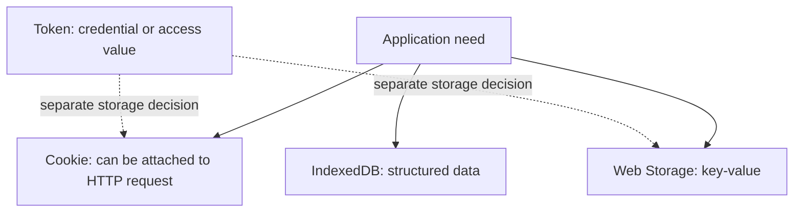

# Browser storage and tokens

The browser can preserve multiple types of data: cookies, key-value pairs, and structured local databases. A token, on the other hand, is not a storage location, but a value related to access or identification, which can be checked by the appropriate party. Mixing up the two concepts can lead to flawed decisions: a token can be stored in different places, but that doesn't make it the same as the storage space.

## Course page, draft, and access

The student chooses a language setting, leaves a local course planning draft half-finished, and logs into the system. The three pieces of data have different purposes. A small setting might appear in a cookie or local key-value store depending on the design. The draft might be structured, larger data, suited for IndexedDB. The session or access token related to login, however, is a sensitive identifier, whose handling is determined by security considerations.

The diagram does not suggest automatically storing a sensitive token in Web Storage. It only shows that the concept of a token and the location of storage are separate decisions. Specific protective solutions belong to the web security session.

## Web Storage and IndexedDB

`localStorage` is a simple, origin-bound key-value store that can remain available during later use of the browser. `sessionStorage` is a similar interface, but tied to the session of the given browser tab. IndexedDB can be used for more complex, structured data. The browser does not automatically attach these to every HTTP request like relevant cookies. The availability of stored data also depends on the browser's settings and deletion decisions.

Local storage is not a reliable server-side registry and not an automatic sync to the user's other devices. The official state of an accepted application must be managed by the server, it is not enough to store that it is "successful" in the browser.

## What is a token?

A token is a value passed and checked by a protocol for a specific purpose. An access token, for example, can represent access to an API resource. The server-side session identifier is also a bearer value, but it is linked to a different mechanism. Not every token is a JWT, and a JWT is not automatically secure or suitable for every task. Checking the format and validity is a separate question.

An access token can be an opaque string or have a specific structure. For the client, in many cases, the task is not reading the internal content of the token, but forwarding it appropriately to the authorized resource server. Unauthorized acquisition of the token can provide an opportunity for abuse, therefore the protection of storage, lifespan, and transmission is important. Detailed protection rules are the topic of the next session.

## Cookie, session, and token together

A website can send a server-side session identifier in a cookie. An API can accept an access token in the HTTP `Authorization` header. In OAuth 2.0 and OpenID Connect environments, several types of tokens can appear, for different purposes. "Cookie or token" is therefore a false, overly simple choice: a cookie is a transmission/storage mechanism, and a token can be a protocol value. The appropriate solution is determined by the client type, the access boundary, and the security model.

## Common misconceptions

| Statement | Clarification |
| --- | --- |
| "A token is the name of a browser storage space." | It is a value; its storage is a separate design decision. |
| "Every token is a JWT." | Multiple formats exist, including opaque tokens. |
| "Data in localStorage goes automatically to the server." | Unlike cookies, they are not automatically attached to requests. |
| "A successful application stored in the browser is the official result." | The application's server-side state is authoritative. |

## Concepts learned

- **Web Storage:** The collective name for the browser's origin-bound, simple key-value storage interfaces.
- **localStorage:** An interface managing key-value data that can be preserved in the browser for later use.
- **sessionStorage:** A key-value storage interface connected to the session of a browser tab.
- **Token:** A value issued and verifiable for a specific protocol purpose, for example, representing access to a resource.
- **Access token:** A token that a client can pass to the appropriate resource server to access a protected resource.
