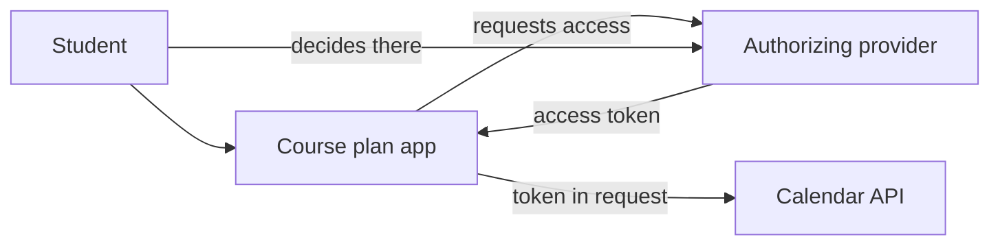
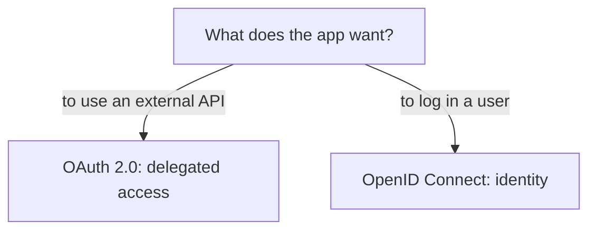

# OAuth 2.0 and OpenID Connect

A web application can access the data of another service with the user's permission, or can entrust login to an external provider. The two tasks might use similar redirects and tokens, but their goal is different. OAuth 2.0 is primarily a framework for delegated access; OpenID Connect is an identity protocol built on this, which also gives login information to the client.

## Calendar access without password transfer

The course planning application wants to save the student's timetable into an external calendar. It would be a bad solution to ask for the student's calendar provider password. In delegated access, the student logs in at the calendar provider and decides there on the requested access. The course planner can receive an access token representing the appropriate permission, with which it uses the calendar API. The password thus does not go to the course planner.

The diagram is conceptual, not a full protocol message sequence. The real process involves additional checks and redirect steps. The goal of OAuth 2.0 here is for a client to get limited access to a resource without getting the user's password.

## Actors and goal of OAuth 2.0

The user can be the owner of the resource; the course planner is the client; the authorizing provider can give an access token; the calendar API is the resource server. Separating roles helps to understand that the token is not a general "I am logged in everywhere" credential. An access token serves to access a specific resource, according to the given permission and validity conditions.

OAuth 2.0 itself is not a standard answer to "who is the user for the client application?". An access token should not be automatically interpreted as proof of identity. The format of the token is also not necessarily JWT; it can be an opaque value to the client. We do not learn the detailed security steps here, such as proper code exchange and protection against attacks, at the protocol level.

## OpenID Connect: identity for the client

**OpenID Connect**, abbreviated OIDC, is an authentication protocol built on the foundations of OAuth 2.0. It defines how a client can obtain verifiable information about a user's login and identifier. One of the tools for this is the ID token, which the client must check for its own purposes. The ID token does not replace the access token intended for the API.

If a student logs into the course planner with an external identity provider, the goal for the course planner is identifying the user. OIDC is suitable for this. If the same application separately wants access to the calendar, that's an issue of delegated API access. The two processes might be linked in one user experience, but conceptually they are different.

## Token types and false conclusions

> [!note] Access tokens and ID tokens have different purposes
> We send the access token to the protected resource server, and it represents the access intended for it. The ID token provides a verifiable claim to the client about the result of the authentication. The two are made for different audiences and purposes. If a client tries to figure out the user's identity from the access token, or sends an ID token for API access, it swaps the roles of the protocol.

The application's own session can also get a separate lifecycle from the external provider's login. After a successful external authentication, the local application must still decide what own resources it gives access to the recognized user. The external identification does not grant automatic authorization for all internal course operations.

## Common misconceptions

| Statement | Clarification |
| --- | --- |
| "OAuth 2.0 is a login protocol by itself." | Its primary goal is delegated access; OIDC provides a specific protocol for identity. |
| "The access token tells the client who the user is." | It represents access intended for the resource server, not a general identity claim. |
| "Any API can be called with the ID token." | The ID token is an authentication claim for the client, not an API access token. |
| "After external login, all local operations are allowed." | The local service's own authorization decision is still required. |

## Concepts learned

- **OAuth 2.0:** A framework used for delegated access, in which a client can get limited permission to use a protected resource.
- **OpenID Connect (OIDC):** An authentication protocol built on OAuth 2.0, which can give verifiable user identity information to the client.
- **Resource server:** A service offering protected API data or operations, which checks the appropriate access token.
- **ID token:** In OIDC, a token intended for the client expressing the result of authentication.
- **Delegated access:** An authorization in which an application gets limited access to another service's resource without learning the user's password.
