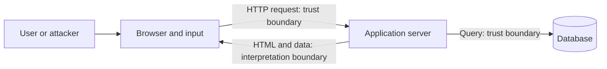

# Threat models and trust boundaries

The starting point of web security is not learning an attack name, but clarifying what we are protecting, from whom, and where data crosses a trust boundary. The same web application carries different risks when displaying a public article and when modifying a student registration.

## What are we trying to protect?

In a university course system, the protected values are the student's personal data, the correctness of the registrations, the logged-in session, and the availability of the service itself. The attacker can be an external visitor, another logged-in student, a malicious website, or a person using a stolen account. The security question is always linked to a specific capability: can the attacker read a response, can they force a browser to send a request, or can they reach a server-side operation.

The threat model is a brief description of what values, actors, possible attacker capabilities, and protection conditions are important. It is not a prediction of all future attacks. It helps prioritize the checks that the actual operation of the application requires.

## Crossing trust boundaries

User input does not become reliable just because it arrived from the application's own form. Code running in the browser and the network request can be modified, the API can also be called directly. Therefore, the server must verify the user, their authorization, and the input again for the modifying operation. A query sent to the database or text displayed to another user is also a new interpretation context.

A boundary does not mean that the other party is definitely malicious. It means that the receiving party cannot rely solely on the sender's previous statement. For example, the server cannot accept the `studentId` field in the request as proof that the student is modifying their own registration.

## Simple reasoning for an operation

Suppose the student applies for a course. First, we name the value: the correctness of the registrations. Then the operation: the server assigns a specific student to a course. The threat, for example, is that a request arrives in the name of another student, or the browser sends it with a logged-in cookie under the influence of an alien website. The protection consists of several separate decisions: authentication, per-operation authorization check, proper protection of the request's origin, and correct handling of the input and database operation.

A single protection does not replace the others. The encrypted connection does not decide whether the given user can register for the course. Logging in doesn't prove that the request originated from the student's intent, either.

## Common misunderstandings

| Claim | Clarification |
| --- | --- |
| "Only the login page is security-sensitive." | Reading personal data and state-changing operations are as well. |
| "Data coming from our own form is reliable." | The request can be arbitrarily modified by the client or another program. |
| "Security is a single switch." | Separate checks are required at multiple boundaries. |

## Learned concepts

- **Threat model:** An organized description of protected values, actors, attacker capabilities, and conditions.
- **Trust boundary:** A point where data or a request enters different trust conditions.
- **Protected value:** Data, operation, or service property whose impairment causes damage.
- **Layered defense:** Application of multiple complementary checks against different errors and attacks.
