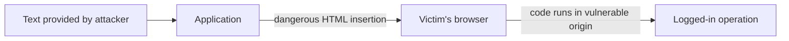
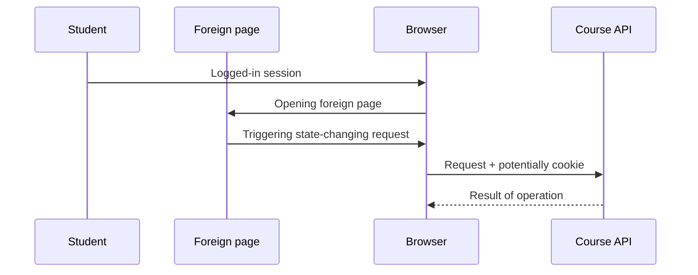
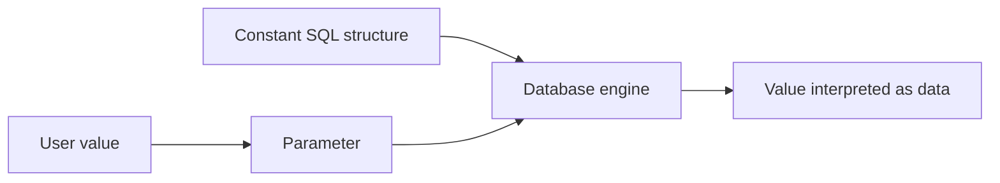

# XSS, CSRF and injection

Three common attack families violate three separate boundaries: XSS injects foreign content into a webpage as executable code; CSRF uses a logged-in browser for an unintended operation; and injection makes another system interpret data as an instruction. For protection, we first need to see who reinterprets the data and with what authorization.

## XSS: executable content from data

In a forum comment, a student can provide text. If the web application inserts the text into the page as HTML without checking, the browser might interpret the part provided by the attacker as code. The attacker's code runs in the origin of the vulnerable page, so it can read visible content or initiate an operation on behalf of the user. It cannot directly read a `HttpOnly` cookie, but it can still request sensitive operations in the name of the logged-in browser.

In stored XSS, the malicious content remains on the server and appears to others later. In reflected XSS, data taken from the request gets dangerously into the response. In DOM-based XSS, client-side code places data into a dangerous DOM environment. Their common cause is the loss of the **boundary between text and executable content**.

The basic protection is encoding appropriate to the output context and the use of a safe DOM API: insert user text as text, not as HTML. If it is genuinely necessary to accept formatted HTML, appropriate HTML sanitization is required. Content Security Policy can be a supplementary protection, but it does not replace proper data handling.

## CSRF: request triggered by another page

The student is logged into the course system, then visits a foreign website. The foreign page can initiate a request where the browser, under certain conditions, also attaches the course system's cookie. If the course system only checks the presence of the cookie, it might mistakenly consider a state-changing operation as the student's intent. To do this, the foreign page does not necessarily have to read the response; the side effect is the point.

For state-changing requests, an unpredictable CSRF token verified by the server can be used. The `SameSite` cookie setting, the proper checking of `Origin` or `Referer`, and the correct use of read-only `GET` are additional layers of protection. The exact protection depends on the application's request pattern. The read permissions of CORS do not replace CSRF protection. If the application is vulnerable to XSS, the attacker can bypass multiple CSRF protections within their own origin.

## Injection: instruction from data

Suppose the server puts the course identifier into an SQL query via string concatenation. If the input becomes part of the query's syntax, the attacker can change the query's meaning. The same principle can occur in other interpreters, for example in the case of a command interpreter or template engine. The strange character itself is not the problem, but the **mixing of code and data**.

> [!tip] Keep SQL instructions and values separate
> In a parameterized query, the SQL structure and the user value are passed separately. Validating the input might be necessary for business rules, but it does not in itself replace parameterization. The server's database permissions must also be restricted to the necessary operations.

## Comparison of the three attacks

| Attack | Where is the boundary lost? | First thought of defense |
| --- | --- | --- |
| XSS | User data becomes code running in the browser. | Context-dependent output encoding, safe DOM handling. |
| CSRF | A request triggered by a foreign page appears as own intent. | Verification of request intent, CSRF token, cookie rules. |
| SQL injection | Input becomes the structure of the database instruction. | Parameterized query. |

## Common misunderstandings

| Claim | Clarification |
| --- | --- |
| "`HttpOnly` prevents all XSS damage." | It restricts reading the cookie; code running on the compromised page might be capable of other operations. |
| "CORS prevents CSRF." | CORS mainly regulates reading the response in the browser. |
| "It's enough to delete every special character." | Correct handling depends on the interpretation context; SQL requires parameterization. |

## Learned concepts

- **XSS:** Appearance of untrusted content as an executable script on a webpage.
- **CSRF:** Unintended request of a logged-in browser triggered from another page.
- **Injection:** When an interpreter treats data as the syntax of an instruction.
- **Parameterized query:** Separate transmission of the query structure and user value to the database.
