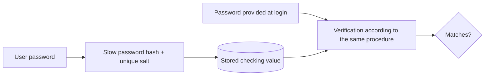

# Passwords, multi-factor authentication and session protection

Login security does not end with correctly verifying the password. Password storage, the second factor, session identifier management, and logout together determine how easy it is to take over an account.

## Password verification and storage

At login, the server compares the provided password with the previously stored checking value. The password must not be stored in readable form, because a database leak would immediately expose it. A fast, general-purpose hash, such as plain SHA-256, is also not an appropriate password storage solution: the attacker can perform many attempts quickly. An expensive procedure specifically designed for passwords is required, for example Argon2id, or bcrypt/PBKDF2 with proper settings. A unique salt helps ensure that the stored values of identical passwords differ.

For the user, a long, unique password and a password manager are useful. On the server side, handling too many attempts, detecting incidents, and a secure recovery process are also important. Password recovery can often be an account takeover path just like login.

## Multi-factor authentication

MFA combines at least two separate factor families: something we know (e.g., password), possess (e.g., authenticator device), or that connects to the person. Two passwords requested one after another are not two factors. MFA reduces the value of a stolen password, but does not make account takeover impossible: phishing, session theft, or poorly protected recovery remain a risk.

The one-time code of an authenticator app and a security key have different properties. Methods resistant to phishing and bound to an origin can provide stronger protection. From the perspective of the course, the point is that the factor is truly independent proof, and the recovery path cannot bypass the login protection more easily.

## Session as a post-login key

After successful authentication, the session identifier or access token proves in subsequent requests that the client is continuing an already logged-in process. Whoever obtains this value can use the session without knowing the password under given conditions. Therefore, the identifier must be hard to guess; it is justified to issue a new identifier at login and authorization state changes; expiration and server-side invalidation must be handled.

The cookie's `Secure` attribute binds sending to a protected connection; `HttpOnly` limits direct reading from JavaScript; `SameSite` influences the conditions for cross-site sending. These act against separate risks. `HttpOnly` does not stop every operation of a script running on a compromised page, and `SameSite` is not complete CSRF protection. Keeping authentication tokens in the browser's `localStorage` or `sessionStorage` accessible from JavaScript is risky, because in case of XSS, the script can access them; storage must be decided based on the threat model.

## Logout and time limits

> [!warning] Logout must invalidate the session
> Logout must also terminate the session accepted by the server. The "Logged out" text on the interface alone does not invalidate access. In sensitive systems, shorter idle time and re-authentication may be necessary for certain operations. A conscious balance is needed between limits and user usability.

## Common misunderstandings

| Claim | Clarification |
| --- | --- |
| "A password hashed with SHA-256 can be stored securely." | An expensive, purpose-built procedure and a unique salt are needed for passwords. |
| "After MFA, the session is no longer important." | A stolen session identifier can still be used. |
| "`HttpOnly` prevents all browser attacks." | It only restricts direct script access to the cookie. |
| "Logout is just a client-side state." | The server must also invalidate the accepted access. |

## Learned concepts

- **Password hash:** A value generated by an expensive procedure stored for password verification.
- **Salt:** A unique value used when generating the password hash.
- **MFA:** Authentication relying on independent factor families.
- **Session hijacking:** Unauthorized use of a valid session identifier.
- **Session invalidation:** Terminating the server-side access associated with the identifier.
