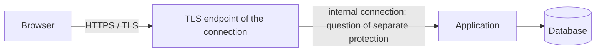

# The role and limits of HTTPS in web security

HTTPS protects the communication between the browser and the given network endpoint. It makes it difficult for a man-in-the-middle to read or modify the traffic, and makes the name associated with the server verifiable based on a certificate. However, HTTPS does not prove that an application's business logic, authorization management, or displayed content is secure.

## The same protection in a different question

In the fourth week, we looked at TLS in the full path of the request. Now we interpret the same mechanism as a security control. On a public network, the student's login request and the personal data of the response should not be easily readable or unnoticeably modifiable on the intermediate segment of the connection. The encryption and integrity protection of TLS target this segment. Verifying the certificate helps ensure that the browser connects to the expected hostname.

> [!warning] TLS protection has a boundary
> If a reverse proxy terminates TLS, the protection between the browser and the proxy does not automatically describe the segment between the proxy and the application server. The full path and the operational environment determine where communication must still be protected.

## What does the padlock icon not solve?

A page accessible with HTTPS can also be deceptive if the user navigates to the wrong address. TLS verifies that the browser is talking to the server associated with the given name; it doesn't decide whether the given service provider is trustworthy. A page delivered under HTTPS can contain an XSS vulnerability, faulty CORS configuration, or bad authorization management. It doesn't stop injection either: data provided by the attacker reaches the server even over an encrypted channel.

The meaning of a security signal is always tied to the protected boundary. The "protected connection" signal of HTTPS is not a "flawless application" certification. Ignoring the browser's warning or turning off certificate verification weakens the very essence of network protection.

## Mixed content and secure cookie

If an HTTPS page tries to load an unprotected HTTP resource, mixed content can be created. Browsers can restrict or block this according to the risk, because the unprotected part could be modifiable on the network. The `Secure` attribute of the session cookie ensures that the browser does not send it over a plain HTTP connection. These settings serve the consistent use of the protected channel.

## Common misunderstandings

| Claim | Clarification |
| --- | --- |
| "With HTTPS, the application is secure." | Protecting the network connection does not replace application controls. |
| "The padlock proves that the website is well-intentioned." | The certificate verifies the server belonging to the associated name, not the service's intent. |
| "TLS automatically protects all internal segments." | There can be a separate communication segment after the TLS endpoint. |

## Learned concepts

- **HTTPS:** HTTP traffic over a TLS-protected connection.
- **TLS endpoint:** The network location where the protected connection ends.
- **Mixed content:** A resource loaded over an unprotected HTTP connection by an HTTPS page.
- **Certificate verification:** Verifying the associated name and the server's proof.
