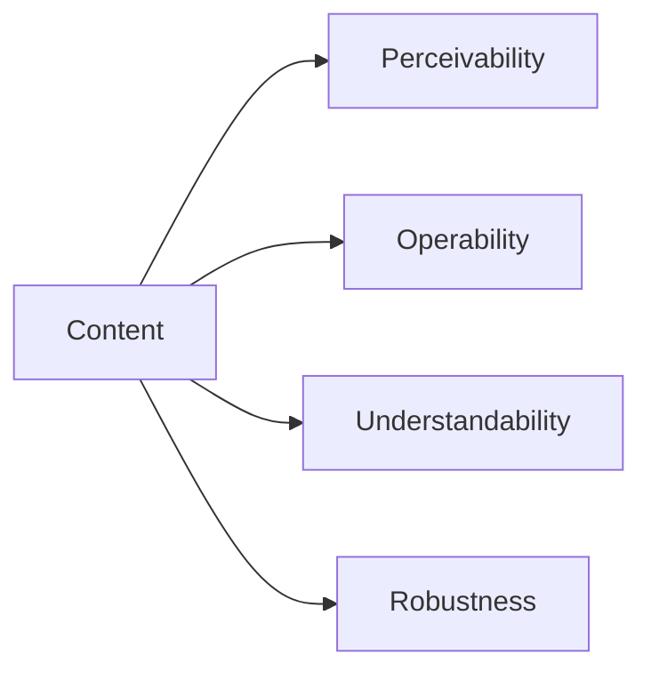

# Accessibility and inclusive design

A university service is truly usable when students with different abilities, devices, and situations can access the necessary information and operations. Accessibility does not mean a separate interface, but the conscious design of content, interaction, and technology.

## Why do we talk about this in a web course?

Imagine a university course registration page. The student doesn't see the error message highlighted in red because they are colorblind. Another student can only work with a keyboard for a few weeks due to a hand injury. Someone watches the video briefing on a noisy train, so they want subtitles. A fourth tries to read the page on a slow, old phone in bright sunshine. The problem is not that these people are using the system under "abnormal" conditions. The problem is if the system is designed only for an imagined user working with a mouse, having good vision, and sitting on a fast network.

The web's original promise was that information is accessible regardless of device and location. Accessibility makes this promise serious. There are legal, business, and ethical reasons too, but from a developer's perspective, the simplest reason is that a service only fulfills its task if the target audience can actually use it.

The term "inclusive design" emphasizes that we shouldn't try to fix the system for a narrow group at the very end. Let's ask during the design phase: who might be left out of this decision? For example, a well-chosen, real button is focusable and keyboard-activatable by default. Repairing a clickable `div` after the fact, on the other hand, brings many forgotten details with it.

## Obstacles: it's not just about disability

An obstacle can be permanent: a blind or visually impaired person might use a screen reader, a deaf user needs subtitles, and a person with limited mobility does not necessarily use a mouse. It can also be temporary: a broken arm, eye surgery, migraine, or a temporary hearing problem. And it can be situational: weak screen contrast in sunshine, the user is holding a baby, or they cannot turn on the video sound in a library.

That's why it's useful to think along a "spectrum of abilities." We don't have to know every user personally to make better decisions. Subtitles, for example, are indispensable for the deaf user, but they are also a help for many other people when learning a language or watching a video without sound. Proper heading structure is a navigation tool for those working with a screen reader, but it results in clearer content for everyone.

## The approach of WCAG: POUR

Web Content Accessibility Guidelines, WCAG for short, is a widely used guideline for web accessibility. It is not checklist magic, but a thinking framework. Its four principles can be memorized by the acronym POUR: perceivable, operable, understandable, robust.

**Perceivable:** the user can take in the information through some sensory or technical means. If a chart distinguishes data only by colors, it is not perceivable to everyone. If there is important text in an image, a textual equivalent is also needed. A video might need subtitles, audio material a transcript. This also includes readable font size and sufficient contrast.

**Operable:** all essential functions can be operated. Don't assume a mouse, touch, or quick reaction. Keyboard focus should be visible, navigation logical, and time limits justifiable or extendable. Automatically moving content can be an obstacle even if it's spectacular.

**Understandable:** the interface's language, behavior, and feedback should be consistent. For a form, the field's label tells what we're asking for, and the error message tells what went wrong and how it can be fixed. "Invalid data" is not a help; "The @ sign is missing from the email address" is.

**Robust:** the content should be interpretable in various browsers and with assistive technologies. The starting point for this is standard, semantic HTML. A screen reader does not read the spectacular CSS, but interprets the document's structure and accessibility information.

WCAG formulates compliance in levels A, AA, and AAA. In practice, level AA is a common goal, but the point is not to get the sticker. A formally compliant page can also be hard to use if we haven't tested the real user tasks.

## Contrast, color, and readability

A common design flaw is text that is too light grey, a state indicated only by color, or a label disappearing against a decorative background. Contrast expresses how much the text stands out from the background. As a general guideline, a contrast ratio of at least 4.5:1 for normal-sized text and at least 3:1 for large text is the frequently referenced WCAG AA goal. This is not a matter of taste: on a bad display, with tired eyes, or in weak light, even a user with good vision can lose the information.

> [!tip] Use more than color to convey meaning
> Color should be an additional signal, not the only one. It's wrong if a form field is marked only by a red border. It's better if, next to the border, a text message and a highly recognizable icon also appear. The same is true for charts: categories should also receive labels, patterns, or other distinguishing marks.

## Alternative text: describe the meaning of the image

The `alt` attribute is not meant to repeat the filename. `chart-final-v2.png` says nothing with a screen reader. The alternative text conveys the role the image fulfills in the given context.

In a product catalog, `alt="Blue backpack in front view"` is useful. For a chart in an article that genuinely complements the text, the `alt` can briefly summarize the main message: `alt="The number of registrations grows continuously from January to June"`. If the image is purely decoration, often an empty `alt=""` is correct: this way the screen reader skips it and doesn't burden the user with noise. For a complex diagram, short alternative text is not enough; the detailed data or explanation should also be given in the surrounding text.

## Walkthrough example: an improved event page

Suppose on a faculty lecture page, the time is listed next to a tiny calendar icon, the application is a colorful box labeled "Click here!", and the location is visible on an embedded map. In a more inclusive version, the page is divided with real headings; the time can also be read as text; the application is a real, clearly labeled button or link: "Application for the Sept 18 lecture"; and under the map, there is a textual address and route information.

We did not create a separate page "for the blind." We made the same page more understandable for everyone. This is a typical pattern of good accessibility decisions.

## How to get started in practice?

It's worth starting the improvement of an existing page with the most important user paths: can the information be found, can the main operation be initiated, and can the form be submitted successfully? After this can come a simple manual test: tab through the page, zoom in on the browser, turn off the sound on a video, and see if the interface remains understandable. Automated checkers are good companions here: they can quickly flag missing labels or insufficient contrast. Their findings, however, must always be interpreted with human judgment.

It is particularly important that accessibility is not a single testing day at the end of the project. When designing a new component, the team can immediately decide on its proper HTML element, focus state, error messages, and small-screen behavior. This way, far fewer retroactive fixes are needed.

## Common misunderstandings

**"Accessibility is only important for blind users."** No. Vision, hearing, mobility, attention, language, device, and environment can all influence usage.

**"An automated checking tool tells everything."** Tools are valuable, but they cannot judge whether an alternative text is truly meaningful, or if a process is understandable.

**"ARIA solves the problems."** ARIA can complement semantics, but used poorly, it misleads assistive technology. The first choice is the appropriate native HTML element.

**"Accessibility limits creativity."** It rather provides a framework: a design is good if it also remains clear, operable, and stable.

## Learned concepts

**Accessibility:** ensuring that content is usable with different abilities and assistive technologies.

**Inclusive design:** a design approach that considers the diversity of users right from the start.

**WCAG:** a system of guidelines regarding web content accessibility.

**Contrast ratio:** a measure of the difference in luminance between two colors; an important factor in readability.

**Alternative text (`alt`):** textual replacement conveying the role of an image.

**Assistive technology:** for example, a screen reader, magnifier, or alternative input device.
