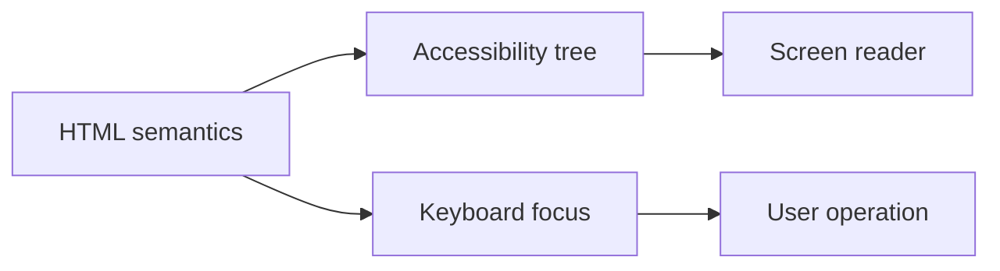

# Semantics, keyboard and screen readers

Semantic HTML also describes the role of the page elements, not just their appearance. For someone navigating with a keyboard or using a screen reader, it is particularly important that headings, links, buttons, forms, and feedback form an interpretable structure.

## Semantics: what does an element mean?

Let's look at two solutions for a navigation element. One is a `div` with a click handler added, the other is a real `button` or `a` element. On screen, both can be a blue, rounded rectangle. For the browser and assistive technology, however, they differ. A link navigates to another place or resource; a button initiates an operation, for example opening a dialog window or submitting a form.

Semantic HTML means choosing the element that fits the document's meaning. `header`, `nav`, `main`, `article`, `aside`, and `footer` provide landmarks. `h1`–`h6` headings express hierarchy. The `p` paragraph, the `ul` and `ol` list, the `table` for tabular data, and the `label` for a name belonging to a form field.

This structure is useful on multiple channels. A screen reader user can jump by headings. A search engine understands better what the main content is. The code will also be more readable for the browser and the future maintainer. Semantics is therefore not a decorative rule, but reusable meaning.

## Headings: not font sizes

A common mistake is that text intended as a title is just a larger, bold `div` or `span`. This makes it visually heading-like, but it won't be a heading in the document. It is the same mistake if `h1`–`h6` elements are chosen only for their size.

A page usually has one main heading, the `h1`, then its topics are structured by `h2`s, and their parts by `h3`s. Skipping numbers is not the most important rule, but rather a meaningful hierarchy. Imagine the page as a table of contents: if the train of thought is not understandable from it, the heading structure needs to be improved.

## The keyboard is not a secondary input method

Many people use the web with a mouse, but not everyone. Some navigate with a keyboard for physical reasons, others due to workflow or personal preference. The Tab key typically steps to the next focusable element, Shift+Tab goes backwards. With Enter, a link or button can be activated; Space often operates a button, checkbox, or toggle. The role of arrow keys might depend on the control type, for example in a radio button group or a menu.

> [!warning] Keep keyboard focus visible
> Focus indicates where the next keyboard action will arrive. This must be visible. In CSS, the outline is sometimes removed for aesthetic reasons, for example using `outline: none`. This is a severe error if there is no clear, high-contrast focus indicator instead. The user in this case doesn't know which button they are going to activate.

The focus order must follow the logical order of the content. If the fields of a form are under each other on the screen, we shouldn't jump to the footer with Tab and then back. The visual layout can be rearranged with CSS, but the HTML order still determines how the keyboard and screen reader progress.

## Skip link and repetitive navigation

A long menu repeating on every page can be comfortable with a mouse. With a keyboard, however, one would have to step through it at every page load before reaching the main content. This is what the "Skip to main content" link is for. It is usually visually hidden but becomes visible when it receives focus. Not a spectacular feature, yet it saves many repetitive actions.

## How does the screen reader "see"?

A screen reader is an assistive technology that conveys the digital interface via speech or a Braille display. It doesn't interpret the screen's pixels the way the human eye does, but rather the accessibility tree provided by the browser. This includes the element's role, name, state, and value.

For a good button, for instance, the user might hear "Open cart, button". For a faulty `div`, just "Open cart", or even nothing. For an input field, the `label` connects the field with its question: "Email address, edit field". A `placeholder` appearing only as filler does not replace this: it disappears while typing, its contrast can be weak, and it does not provide a reliable name in every situation.

A screen reader user does not necessarily read the page linearly. They can list headings, links, form fields, or landmarks. This is why many "More" and "Click here" links are particularly confusing: in a list, identical, meaningless labels appear one after another. The text of the link itself should tell its purpose: "Opening application deadlines".

## Forms and errors

In forms, besides the visible label, the connection should be formulated programmatically too. The `label`'s `for` attribute points to the `id` value of the field. This way, clicking on the label also activates the field, and assistive technology names it correctly.

In case of an error, we shouldn't use only red color. The error message should state which field is involved, what the problem is, and preferably the way to fix it. After submission, it's advisable to direct the focus to the summary of errors or the first faulty field, so the user doesn't have to search. For dynamically changing states, it's important that the screen reader is also notified of the change, but let's not flood them with unnecessary announcements.

## ARIA: an important tool, but not the first choice

ARIA attributes can give roles, names, and states to complex controls that lack a native HTML equivalent. For instance, in a custom-built, collapsible panel, `aria-expanded` can indicate whether the content is open. A button consisting of an icon can get a descriptive name using `aria-label`.

The basic principle: let's use native HTML first. A `button` is already a button; no need for `div role="button"`, and then supplementing keyboard functionality, focus, and disabled state with a separate program. ARIA does not automatically make an element operable, it only conveys information about it. If we provide a wrong role, we can mislead the screen reader. "ARIA only when justified" means we compensate for a real deficiency with it, we do not override the standard structure.

## Walkthrough example: a modal dialog

A "Login" button opens a dialog window. With a mouse this seems simple, but with a keyboard multiple questions arise. Upon opening, the focus must go to the first meaningful element of the dialog, for example the title or the email field. With Tab, the focus should remain within the opened window; it shouldn't wander to the background page's menu. It should be possible to close it with the Esc key, if this doesn't cause data loss. Upon closing, the focus should return to the "Login" button that opened it.

The dialog window needs a clear name, and the state change must also be understood by the assistive technology. It can be seen that this is not a "screen reader extra": good focus management makes the interface more predictable with both mouse and keyboard.

## Simple checking routine

Even during development, many errors can be discovered without special tools. Let's put the mouse aside, reload the page, and try to perform the main task using exclusively Tab, Shift+Tab, Enter, Space, and Esc. Is the focus visible at all times? Do we reach all essential controls? Aren't we stuck in an opened component, and aren't we accidentally able to step on content in the background?

It's worth looking at the accessibility tree with the browser's built-in developer tools too. Here it often immediately turns out if an icon button has no name, a field's label is not connected to it, or a label appearing as a heading is actually just formatted text. This doesn't replace testing with a screen reader, but it's quick feedback on the document's actual meaning.

## Common misunderstandings

**"If it's clickable, it's accessible."** Clickability does not mean it's an operable, focusable, and correctly announced control with a keyboard.

**"`tabindex` fixes the order."** Positive `tabindex` values often create an unpredictable order. The correct HTML order is the baseline solution.

**"The placeholder is the field's label."** It is not. It can be a short help, but it doesn't replace the permanent, programmatically identifiable label.

**"Everything needs ARIA."** Excessive or incorrect ARIA can actually make the situation worse. Semantic HTML solves many tasks by default.

## Learned concepts

**Semantic HTML:** the use of meaningful HTML elements that fit the content's role.

**Focus:** the element that is the next target for keyboard input.

**Focus order:** the sequence of traversing elements during keyboard navigation.

**Screen reader:** assistive technology conveying via speech or a Braille display.

**Landmark:** a structural element designating a larger page region, like `main` or `nav`.

**ARIA:** a set of attributes complementing the accessibility information of dynamic and complex web controls.
