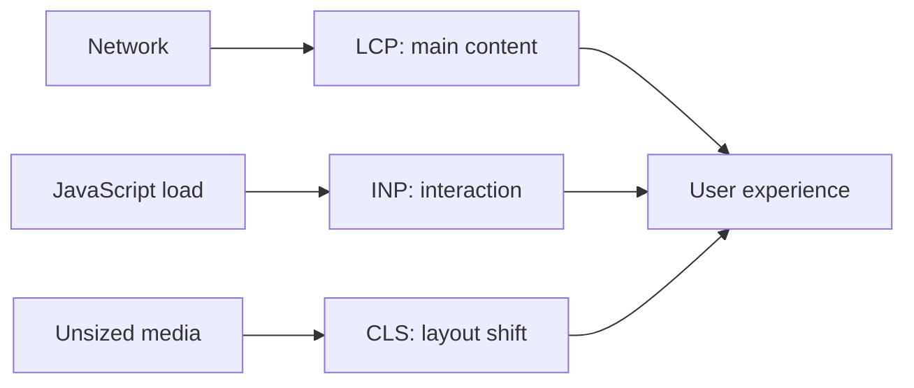

# User-perceived performance

Speed is not a single server response time. The user cares about when the important content appears, when the interface reacts, and how stable the layout remains. Due to different networks and devices, the exact same page can provide a very different experience.

## What does it mean to be "fast"?

Imagine two webshops. The first immediately renders a visually appealing but still seemingly empty interface: the text, the product images, and the cart button only arrive later. The second one does not show every decorative element instantly, but in a fraction of a second, the name and price of the searched product, and a working "Add to Cart" button appear. It is possible that the first page "finishes" loading in a shorter time according to some technical metric, yet the second one feels faster. The user does not experience a network log, but rather the completion of a task.

Therefore, it is important to distinguish between **measured performance** and **perceived performance**. Measured performance describes durations, sizes, CPU usage, or specific browser events. Perceived performance expresses when the visitor feels that: "the page is already usable", "it responded to my click", or "I don't have to worry about the button jumping away". The two are connected, but not the same.

A page's speed is shaped by multiple stages. The browser first has to find the server, establish a connection, request the document, and then can download additional images, stylesheets, fonts, and scripts. After this, the device has to process the received material: build the document, calculate the layout, paint the screen, and execute the necessary JavaScript. On a weak phone, the exact same JavaScript can take much longer than on a developer's high-performance laptop.

## Latency: not just file size matters

**Latency** is the time that elapses between initiating a request and the arrival of the response. This includes physical distance, network routing, server load, and waiting time along the way. Even a small response can be slow if the server takes a long time to start answering. Conversely: a larger image can arrive acceptably if served from nearby, on a fast network, and via a well-organized download.

It is useful to think separately about the first byte of the response and the full response. If a dynamic page waits on the database, the browser receives nothing for a long time: in this case, the visitor sees an empty screen. If the first, meaningful piece of HTML arrives quickly, the browser can start showing content even if elements further down the page are still loading. This is especially important on mobile networks where transmission and connection setup are less predictable.

However, the network is only half the story. A lot of large or poorly timed scripts running on a page can tie up the browser's main execution thread. In this case, files might have downloaded, but the interface does not yet react to scrolling, typing, or clicking. Therefore, in conversations about performance, it is dangerous to look exclusively at the "number of megabytes".

## Core Web Vitals: three perspectives on usability

Core Web Vitals are a widely used set of metrics that approach the user experience from the side of loading, interactivity, and visual stability. They are not complete qualifications: they do not tell whether the page is accessible, understandable, or legally handles data. However, they help notice some very common, frustrating problems.

### LCP – Largest Contentful Paint

**LCP** roughly measures when the largest content element visible to the user appears on screen. This is often the main headline, a product image, a hero image, or a large text block. The metric is useful because for the visitor, this is the moment when the page's main message genuinely starts to arrive.

On a news portal, for example, the main article's title and hero image might be the LCP element. If the hero image is too large, in the wrong format, only starts loading late, or the server sends the HTML slowly, the LCP can degrade. The right conclusion is not that "we must leave out all images", but rather that the image must be delivered in the right size, right format, and with the right priority. Optimizing a tiny, barely visible icon helps little if the most important product image is 8 MB.

### INP – Interaction to Next Paint

**INP** approximates the experience of how much time elapses between a user action – like a click, tap, or keystroke – and the next visible feedback. If nothing happens for a long time after clicking the "Checkout" button, the user might press it again, think they made a mistake, or leave the page.

INP is not exclusively a metric of network response time. In many cases, it is bad because the browser is currently processing a large amount of JavaScript. A long task can occupy the main thread, causing the click processing to wait. A good design principle is for the interface to give clear, immediate feedback first – such as a loading state or a disabled button – and distribute the expensive work into smaller chunks where possible.

### CLS – Cumulative Layout Shift

**CLS** describes unexpected layout shifts. Perhaps everyone has experienced about to tap a link when a late-loading ad or image pushes the content down, causing the click to fall on another element. This is not just inconvenient; it can be a serious error during checkout, form filling, or when using an accessibility aid.

A typical cause is that an image or embedded content has no pre-allocated space. When it arrives, the browser retrospectively rearranges the page. The correct solution is to specify the expected size of the content, or reserve a stable space for dynamic elements. Content intentionally appearing in response to a user action – like an expanded menu – can naturally change the layout; the problem is the unexpected shift.

## Images, JavaScript, and cache

Images often account for the bulk of the data downloaded by the page. The problem can be caused by unnecessarily high resolution, improper compression, or a mobile phone downloading the exact same giant image made for a wide desktop display. An image can not only be scaled down: modern browsers can be provided with multiple versions so the device can request the reasonable size for it. However, the context is important: the hero image should not be delayed in the same way as the gallery at the bottom of the page, which is not yet visible.

JavaScript can provide rich interaction, but its downloading, processing, and execution poses a load. An external tracking code, a chat window, an advertising system, or a superfluous UI library can all increase the cost. The question is not "are we allowed to use JavaScript", but whether every piece of code serves a real user goal, and when it is necessary to load it. If a feature is only needed by a small fraction of logged-in users, sending it to every visitor on startup might not be a good idea.

The **cache** is the reuse of previously downloaded, still valid resources. A stylesheet, logo, or font does not necessarily need to be requested from the network again on every page load. The cache can reduce waiting time and traffic, but requires care: rarely changing files can be stored for a long time, whereas personal or rapidly changing content must not accidentally end up in a shared cache. The cache is not "automatic magic", but an engineered behavior controlled by HTTP rules.

## What and how to measure?

> [!tip] Measure beyond your own device
> Measuring on a developer machine over a fast office network is useful, but not enough. In lab measurements, we get repeatable results in an identical, configured environment; this is good for comparing a change. However, real-world data collected from usage shows what happens on actual visitor devices and networks. The two perspectives are strong together: one helps find bugs, the other indicates the real-world impact.

The network tab in the browser's developer tools can show which request took how long, how large the response was, whether it came from cache, and what initiated it. The performance profile can show if a long JavaScript task is blocking the interface. We cannot interpret these screens in isolation: always ask which user task is compromised and which change would bring the biggest improvement.

## Example: the slow product page

Upon opening a product page, the visitor sees a white screen for a long time, then a giant photo, several external scripts, and an ad banner appear all at once. After the photo arrives, the "Add to Cart" button jumps lower. When the visitor clicks it, the button provides late feedback.

In this story, the late appearance of the main image likely ruins the LCP; the unreserved space for images and ads harms the CLS; and the many scripts running at startup impact the INP. A reasonable fix could be prioritizing the proper version of the main image, fixing the dimensions of images and embeds, and loading non-immediately necessary scripts later. The goal is not cosmetic improvement of metrics, but for the visitor to quickly find and safely use the shopping process.

## Common misconceptions

- **"Performance is purely the server's job."** The server is important, but images, browser-side code, fonts, and third-party elements are also decisive.
- **"On fast internet, every page is fast."** Connection speed does not fix a slow server response, too many requests, or blocking JavaScript.
- **"A good Core Web Vitals score equals a good website."** It only gives signals on a few important dimensions; it does not replace usability, accessibility, and content testing.
- **"Everything needs to be cached."** A faulty cache rule can serve old content, or even content meant for a different user.

## Learned concepts

- **Latency:** the waiting time between the request and the response.
- **LCP (Largest Contentful Paint):** a metric estimating the appearance time of the largest visible content element.
- **INP (Interaction to Next Paint):** a metric estimating the delay of the next visible feedback following user interaction.
- **CLS (Cumulative Layout Shift):** a metric summarizing unexpected visual layout shifts.
- **Main thread:** the execution path in the browser responsible for drawing the UI and running many JavaScript tasks, among other things.
- **Cache:** an intermediate storage that allows reusing previously downloaded resources.
