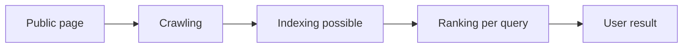

# Searchability and content quality

Public web content is findable and easily understandable if it is accessible, clearly structured, and accurate. Search engine optimization examines the relationship between crawling, indexing, and content useful to the user. Even alongside AI-based search interfaces, these fundamentals remain crucial; there is no guaranteed ranking or appearance.

## How does a page reach the search results?

When someone searches for "how does DNS work", the search engine must first know that a page answering this exists. The first step of the process is **crawling**: automated programs – often called bots or crawlers – follow links and visit known addresses to discover content. Well-accessible pages are linked from other pages, and the server allows the bot to fetch the public document.

The next step is **indexing**. The system processes the page's text, structure, language, links, and other signals, and then it can add it to a searchable database. Indexing is not the same as ranking. The fact that a page can enter the index does not mean it will appear at a high position, or at all, for any search. **Ranking** is the subsequent decision when the search engine tries to select relevant and useful results for a given query.

Separating these three concepts prevents misunderstanding. If the search engine cannot fetch the page, the content is not crawlable. If it cannot parse it or does not consider it eligible, it is not indexed. However, if it is indexable but there are better, more reliable, or closer results for the query, it will not necessarily achieve a high rank. Search engines' exact ranking rules are not public and can change over time; no one can honestly guarantee a first-place position.

## Crawlability: what we want found must be accessible

The basis of crawlability is that the server responds normally for the public page. An internal course material behind a password or a customer portal only accessible by login cannot, of course, be treated the same as a public article. The goal is always visibility aligned with intent: not every page needs to be searchable.

Internal links help both the visitor and the bot understand which pages are related. If an important page is only reached via a path created late by JavaScript and difficult to access, that is a risk. Traditional, meaningful links – with descriptive anchor text – strengthen navigation. Instead of "click here", "Detailed explanation of HTTP status codes" is both more usable and informative.

> [!warning] robots.txt is not access control
> `robots.txt` and robots meta instructions can govern certain crawling or indexing behaviors, but these are not security tools. You should not rely on this alone to hide a secret document; it requires proper access control. A sitemap can assist the search engine with a list of important public URLs, especially for large sites or pages with few internal links. However, it does not replace good navigation and useful content.

## Semantic content: make it clear for humans first

Semantic HTML means that markup doesn't just declare "how something should look", but also "what it is". A true main title is `h1`, a paragraph is `p`, navigation is `nav`, main content is `main`, an article is `article`, and a list is `ul`, `ol` or `dl`. This helps people using screen readers, maintainers, and machine processing alike.

A good article generally has a clear title, a logical subtitle hierarchy, a short introduction, and the actual answer to the question. It doesn't become good because a keyword appears thirty times. If someone asks, "What is the difference between cookie and localStorage?", a useful page first answers briefly, then details the properties, gives an example, and notes the limitations. Repeated, unnatural keywords ruin the reading experience rather than improve it.

Title hierarchy is not a visual sizing tool. It is not a good practice to choose a smaller `h3` simply because its font size looks nicer. CSS is responsible for appearance; headings are for the logical structuring of the document. A well-structured document is easier to overview for a listener, a screen reader, and an automated system as well.

## Metadata: short signals about the document

Metadata placed in the `head` section of an HTML document is not a replacement for the body text seen by the visitor, but rather a supplement to it. The `title` element can appear as a concise, accurate title on browser tabs, in bookmarks, and in search contexts. A good title distinguishes the page from other pages on the site: "Web programming" is less descriptive than "HTTP status codes – Web programming I".

The meta description (`meta name="description"`) can be a brief summary. Search engines may use this, but they are not obligated to display it exactly; they sometimes find another snippet from the page more relevant to the user's query. Because of this, the description should not be treated as a promise or a hidden pile of keywords. It should be written in human language and tell the reader what to expect.

The canonical link (`link rel="canonical"`) can help when the same or very similar content is available at multiple URLs, for instance due to filtering parameters. This signal suggests a preferred version, but does not replace thoughtful URL and content management. For language variants, proper language tags can help clarify which page is meant for which audience.

## Structured data: facts in machine-readable form

**Structured data** is standardized markup with which we can more explicitly describe certain facts on a page for machines. An event page, for example, can indicate the name, time, location, and organizer of the event; a recipe the preparation time and ingredients; a course page the subject name and instructor. JSON-LD format is often used for this, describing the information as separate data alongside the document.

Structured data does not grant automatic special search appearance. It is useful and responsible when the marked-up information is actually found on the page for the user, and is accurate and up-to-date. It is incorrect to write fictitious reviews, non-existent inventory, or misleading prices solely in the machine markup. The principle remains the same here: the information given to the machine should match the information given to the human.

## AIO: content in the age of AI assistants and answer engines

**AIO** (AI Optimization) here is not the name of a single official, unified standard, but the endeavor to make content well-understood and citeable for AI-based search engines, assistants, or answer engines. These systems may operate differently, and their access, selection, or citation rules can change. Therefore, it would be incorrect to promise that specific formatting will definitely secure inclusion in an AI-generated answer.

The core principles are surprisingly close to the principles of good documentation. A page should unambiguously answer what it claims to; use descriptive titles; separate facts, examples, and opinions; and indicate the author, date, and – where relevant – original source. The important statement should be findable in the actual page text, not just in an illustration image. A table can be useful for comparison, but it should also have a comprehensible header and introduction.

For instance, a university course page is well-interpreted if it clearly contains the course name, objective, prerequisites, schedule, current semester dates, and official contact channels. Both an AI system and a student will have a harder time processing a page where all this is only present on a scanned, low-quality PDF image or an outdated social media post.

AIO does not mean writing text for a machine. Natural, precise, well-structured professional content is the right goal. Artificially generated, shallow, sourceless text might look like a lot of pages in the short term, but it builds no trust and is hard to verify. Especially in health, financial, legal, or educational matters, authorial responsibility, timeliness, and the transparency of references are essential.

## Example: fixing a university lab page

Let's assume a page detailing a lab schedule and registration has the title "Information", and the actual time is listed on an uploaded poster image. There is no clear main heading, and the application deadline is found in two separate paragraphs with different dates. For a search engine, a student using a screen reader, and an AI assistant alike, it is uncertain what the authoritative information is.

The improved page could be titled "Web Programming I Lab – registration and schedule, Fall 2026". The body includes a short summary, well-marked sections, dates written as actual text, a descriptive registration link, and the date of the update. If justified, structured event data can also supplement it. This guarantees neither search ranking nor AI citation, but the content is much more reliably usable for all concerned parties.

## Common misconceptions

- **"SEO is repeating keywords as many times as possible."** Excessive repetition does not substitute for a relevant, clear answer.
- **"Indexing guarantees a first-place rank."** Entering the index and ranking are different steps.
- **"The meta description always appears exactly as written."** The search engine can choose to show a different text snippet.
- **"Structured data guarantees a rich snippet result."** It can aid understanding, but promises no appearance format or ranking.
- **"You have to generate AI text for AIO."** The goal is accurate, human-useful, verifiable content.

## Learned concepts

- **Crawling:** the automatic discovery and fetching of web pages.
- **Indexing:** adding processed content to a searchable system.
- **Ranking:** determining the order of results for a given query.
- **Semantic HTML:** HTML structure that conveys the meaning of the content.
- **Metadata:** information describing the document, typically found in the `head` section.
- **Structured data:** a set of facts provided in standard format, interpretable by machines.
- **AIO:** the practice of creating content that is also well-interpreted by AI-based search engines and assistants.
