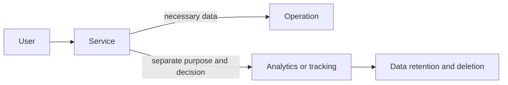

# Privacy, tracking, and digital ethics

During its operation, a web service may handle data about the user, their device, and their behavior. Technical capability does not answer what is justified to collect, for what purpose, for how long, and with what real choices. Privacy is both a design issue and a matter of user trust.

## What does data mean on the web?

Data can be a name, an e-mail address, or a date of birth, but seemingly insignificant details can also be linked to a person or device. This could be a login ID, a persistent advertising identifier, an IP address, exact location data, purchase history, or which articles someone read. A single piece of data is sometimes little on its own, but multiple data points together can form a detailed profile.

It is worth asking from three perspectives. **What data** is generated? **Who** receives it: only the operator, or analytics, advertising, embedded video, and social media providers as well? **For what purpose and for how long** is it kept? If there is no clear answer to these, the user cannot make a meaningful decision.

On an appointment booking site, for instance, an e-mail address might be reasonably necessary for notification. The browser's language can help in displaying the interface. Building an interest profile, however, is a different purpose: it does not automatically follow from the booking. Changing the purpose is an especially important design moment.

## Cookies: tiny files, big role

HTTP is fundamentally stateless: from two consecutive requests, the server cannot know for sure whether they came from the same browser. A cookie is a name–value pair that the server can send in the response, and the browser sends back for appropriate subsequent requests. This is how, for example, a logged-in session, shopping cart contents, or a chosen language can persist.

A cookie's attributes determine its behavior. `Secure` indicates it should only be sent over an encrypted connection; `HttpOnly` reduces the chance of browser-side JavaScript reading it; `SameSite` restricts its sending on cross-site requests. A session cookie created without an expiration date typically lives until the end of the browsing session, whereas a persistent cookie can remain during a later visit. These are security and operational properties, not automatic privacy exemptions.

Not every cookie is tracking, and not all tracking is a cookie. A first-party login cookie is often required for a feature requested by the user. At the same time, identification can happen via a value stored in `localStorage`, a URL parameter, a login, server-side logs, or by linking multiple browser characteristics. An example of the latter is device or browser fingerprinting: the combination of screen size, language, fonts, graphics capabilities, and other signals can probabilistically identify a returning device. This is often less visible than a cookie.

## First and third party; measurement and profiling

The **first party** is the website the user visited. A **third party** could be an analytics script, an advertising network, a map, a font, a chat module, or a social media embed loaded into the page. In the browser's network view, these can appear as separate requests. A convenient embed is therefore also a data flow decision.

There is a huge difference between aggregated, short-term retained visit statistics and a behavior profile of individuals built over a long time. For product development, it can be useful to know at which step of a form many people get stuck. This does not necessarily require tying every click to a name, or recognizing the same person across other websites. Measurement tailored to the purpose is often possible with far less data.

## Consent: real choice, not decoration

The cookie banner pops up on many pages. Ideally, this is not just an obstacle, but a brief and understandable decision point: what is necessary for operation, what is optional, for what purposes would data go, and how can the choice be changed later. The interface must not unreasonably hide or complicate rejection either. Next to a giant, colorful "Accept all" button, a tiny, multi-step rejection process is a bad user experience and potentially an ethically problematic dark pattern.

In practice, it is worth breaking down consent by purpose, e.g., necessary, preferences, measurement, and personalized advertising. The "necessary" category is not a magic word: it can only include techniques without which the explicitly requested service cannot reasonably function. The choice must remain just as accessible later as the acceptance. And an understandable privacy policy is not a substitute for the banner, but its detailed background.

## GDPR as a conceptual framework

The European data protection regulation, including the GDPR, emphasizes the rights of data subjects and the responsibilities of data controllers. From an educational perspective, particularly useful principles are purpose limitation, data minimization, transparency, accuracy, storage limitation, and appropriate security. These are not just documentation tasks. They are design questions: do we really need the phone number? Why are we keeping the event log? Who has access? How do we inform the person?

In general, a person may have rights related to information, access, rectification, erasure, objection, or portability. Exactly how these apply in a concrete case depends on the purpose and circumstances of data processing. That is why it is incorrect to pass a definitive legal judgment in a course setting on whether a real-world page is "GDPR compliant". The developer's responsibility is rather to recognize data flows in time, ask questions, and not treat protection as an afterthought.

## Digital ethics: what the rule doesn't yet settle

Something can be considered technically permissible yet still unfair. Dark patterns are a good example: pre-checked options, misleading wording, a rejection button designed to induce shame, or a flow that coerces the user into giving up more data. Algorithmic personalization is a similar question: if a system knows vulnerable moments and exploits them to try and extract more time or money, "it increases conversion" is not a sufficient excuse.

The designer of an ethical system does not merely ask if the data can be obtained. They also ask if the user understands the consequence, if the benefit is proportionate to the intrusion, and who bears the risk in case of error or abuse. Data minimization is often also a security benefit: what isn't collected cannot be leaked in the same way.

## Walkthrough example: newsletter and visit measurement

Imagine a university event page. It asks for an e-mail address for a newsletter, measures visit numbers on the event page, and displays an embedded video. The first step is mapping the data flow. The e-mail goes to the subscription manager; the tracking code sends events; the video load might connect to an external provider. The second step is separating the purposes: managing the newsletter, operating the service, and optional analytics are not the same.

> [!tip] Reduce unnecessary exposure
> The designer can then reduce exposure. The video should only load upon click, so the provider does not immediately receive a request. The measurement can be made with less detailed data, stored for a shorter time. For the subscription, it should be clear what kind of e-mails are expected and how to unsubscribe. The consent interface should be keyboard-navigable, and rejection should be unambiguous. The result is not "zero data", but considered data handling.

## Common misconceptions

**"Every cookie is banned until a click happens."** It is not the name or technical form of the cookie alone that decides the issue. There is storage linked to the functioning of requested features; the exact assessment is context-dependent.

**"Incognito mode is completely anonymous."** Incognito mode primarily handles local browsing traces differently. Network providers and visited websites can still see data.

**"If we don't ask for a name, there's no personal data."** A persistent identifier or multiple signals together can still be linked to a person or device.

**"The privacy policy solves the ethical problem."** A long, incomprehensible policy text does not make a manipulative or disproportionate practice fair.

## Learned concepts

**Data minimization:** processing only data necessary for the purpose.  
**Cookie:** small data stored by the browser that can be attached to requests.  
**First party / third party:** the operator of the visited page, vs. the embedded external provider.  
**Consent:** the user's informed, voluntary decision regarding a specific purpose.  
**Tracking:** recognizing and linking behavior or a device repeatedly.  
**Dark pattern:** deceptive or disproportionate UI solution that manipulates the decision.  
**Fingerprinting:** an identification signal generated from multiple browser and device characteristics.
