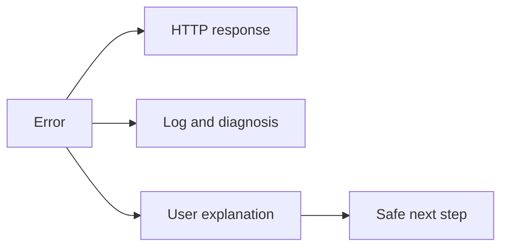

# Error handling and user communication

In the event of an error, a web application must clearly indicate what happened, what definitely did not happen, and how the task can be continued. The HTTP status, the server log, and the message for the user serve different perspectives.

## An error as a multi-perspective event

In a web system, an "error" can mean several things. It could be a connection error between the browser and the server, invalid user input, a server-side exception, or a temporary outage of an external service – like a map, payment, or authentication. The exact same phenomenon looks different to the user and to the system's developer. The user might only perceive: "the order didn't go through". From the system's side, this could be a timeout, a rejected payment, a database error, or a network interruption.

Therefore, error handling brings two tasks together. On the one hand, the system must detect that the normal flow was interrupted, and it should get into a safe state if possible. On the other hand, it must communicate with the user. The first is the technical side, the second is the human side; neither replaces the other. A detailed log entry is no help to someone who currently cannot submit their registration, and a polite message does not substitute for actually handling the faulty operation.

## HTTP statuses: signals between machines and clients

The status code of an HTTP response is a concise signal on how the client should interpret the response. The 2xx codes indicate successful processing; 3xx codes indicate a redirect; in the 4xx range, the request cannot be fulfilled due to some reason on the client's side; the 5xx group indicates an error with the server or a backend service.

404 Not Found, for example, means the requested resource cannot be found. This is not necessarily a system error: the visitor might have typoed an address, or clicked an old link. 401 Unauthorized indicates that authentication is required or failed; with 403 Forbidden, the server understands the request but refuses to authorize it. 400 Bad Request can point to a malformed request, and 429 Too Many Requests indicates the client has sent too many requests in a short time. 500 Internal Server Error is a generic server-side error, 502 Bad Gateway and 503 Service Unavailable often indicate that another component behind the server or the service itself is temporarily unusable.

The status code is primarily a standard signal meant for software actors. The browser, a mobile app, or another server can use this to decide, for instance, on retrying or requesting login. The user needs more than this: understandable context and a next step. It's not enough to display "Error 500", because while true, it does not answer the most important questions.

## What is a good error message like?

A good message answers four questions: what failed; what is the consequence; what can the user do now; and was their work saved. The tone should be calm and precise. "Something went wrong" is better than complete silence, but insufficient on its own. "Failed to save registration. Data entered so far has been saved. Please check your internet connection, then try again. If the error persists, use error code: ABC-123" already helps manage the situation.

It is important that the message doesn't blame the user. Instead of "You entered bad data!", one could say: "The ZIP code consists of five digits." Specific feedback attached to a field can be fixed faster than a general warning at the top of the page. At the same time, security is also a boundary: it is not advisable to display database names, file paths, internal IP addresses, or detailed tracebacks of program bugs on the public page. These can also provide assistance to an attacker.

The message must be truthful. If a payment provider's response is uncertain, it is harmful to write "your order definitely failed", because the amount might have been deducted after all. In such cases, proper communication is rather: "We are still checking the payment status. Do not start another payment; we will notify you shortly via email." An error message is not a decorative element, but a part of the system's business and human behavior.

## Recovery and retrying

Not every error has the same answer. If the user typoed their email address, the system must show them the opportunity to fix it. If a brief network disruption occurred, retrying can be sensible. However, if the status of a financial transaction is uncertain, automatic or repeated resubmission can lead to a duplicated action. This is why "try again" is not a universal solution.

A good system tries to preserve the user's work. With a long form, it is especially frustrating if all filled fields disappear after a temporary error. In such cases, periodic saving, retaining content locally, or saving a server-side draft vastly improves the experience. Conceptually, what is worth seeing here is that fault tolerance doesn't just mean multiplying servers: it also means protecting the user's work.

## Status page: public status, not an ad space

A **status page** is a separate interface where the provider informs interested parties about the current state of important components, planned maintenance, and known outages. It is especially valuable when the main application is broken: if the status page runs on the very same broken system, it becomes unavailable exactly when it's most needed.

A good status page doesn't just repeat that "everything is fine", but breaks it down by components, showing the status of login, API, file upload, or payment, for instance. With timestamped, short updates it can describe: we detected the error; we are investigating; we identified the cause; we are applying a fix; recovered; we are monitoring the result. Not every internal detail needs to be made public, but a vague, unchanged "we are working on it" for hours destroys trust.

A status page does not replace personal notification for those directly affected by an error. In an exam registration system, for example, an in-app message, email, or institutional channel might also be appropriate. The right communication channel depends on the scale of impact, the urgency of the situation, and who needs to take action.

## Example: connection dropping during payment

A user clicks the "Pay" button, and then the browser's connection drops. The screen cannot know for sure whether the charge went through. It's a bad solution to immediately display: "Payment failed", and then let the user back in to pay again. Automatically resending the transaction can be equally bad.

A responsible response builds on clarifying the state: the system identifies the attempt, checks the payment provider's response, and communicates the temporary uncertainty. The message tells the user not to retry immediately, and when and through what channel they will receive a result. During the process, the application can internally record which request the event belongs to, but it only shows the necessary information to the visitor. This simultaneously protects the financial process and reduces uncertainty.

## Common misconceptions

**"A detailed technical error message is always useful."** It might be useful to the developer, but often isn't for the user, and can pose a security risk. Internal details belong in the log; an actionable summary belongs on the interface.

**"Every 4xx error is the user's fault."** 4xx indicates a problem with the request, but a bad interface, an outdated client, or ambiguous documentation can also cause an invalid request.

**"A status page is only needed for big companies."** It's not justified for every system, but for any critical service affecting many users, it can be a valuable tool for trust.

**"Retrying is harmless."** For certain actions, like payment or booking, it can cause repeated execution.

## Learned concepts

- **Error handling:** recognizing the abnormal situation, handling it safely, and communicating it.
- **HTTP status code:** a standard numeric code indicating the processing result of the response.
- **Timeout:** the expected response does not arrive within a specified time.
- **Retry:** initiating a seemingly failed action again.
- **Status page:** an informational page communicating service status and outages.
- **Partial outage:** when only certain features of the service are not working.
