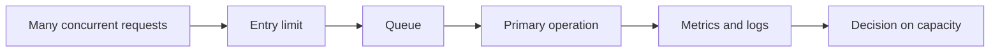

# Peak load and observability

During peak traffic, the service must recognize its limits and prioritize the most important operations. Queues, traffic limiting, gradual service degradation, and observability are various tools to protect users and the system.

## Load is not a single number

A webshop handles a few dozen requests per second on a normal weekday. However, at the start of a sale or a ticket release for a popular concert, thousands might try to perform the exact same action in a few minutes. Not only does the number of page loads increase: many are refreshing, logging in, adding to cart, and initiating payment. Different parts of the system react differently to this.

**Load** can mean incoming request count, active users, messages to process, database operations, or network traffic. **Capacity** is the volume a system can handle while maintaining expected quality. Near the limit, response time usually does not degrade linearly: components queue up waiting for each other, a slow database causes more occupied connections, and new requests have to wait even longer. Because of this, even a small excess can trigger a spectacular collapse.

There is an important difference between average and bad experience. The average response time might be 300 ms, while a few percent of users wait for ten seconds. That is why percentiles are frequently monitored: p95 shows within what time 95% of requests were completed. The quality of a service often reveals itself in the slow tail, not in the average.

## Peak traffic: why does the error worsen itself?

A user often clicks again or refreshes a slow page. A client can automatically retry a failed request. This is an understandable behavior, but it further burdens an already overloaded system. If the backend service is slow, the application server keeps more open requests alive, consumes more memory, and eventually other, still working features also slow down.

> [!tip] Find the bottleneck before adding servers
> Therefore, in a load situation, it is not enough to "start more servers". First, the bottleneck must be understood. If the problem is a single database lock or the slowdown of an external payment provider, increasing the number of web servers can generate even more work arriving at the same place. Caching, queuing, rate limiting, and throttling features all serve to prevent the system from overloading itself.

## Rate limit: fair and defensible access

**Rate limiting** is the regulation of how many requests a client, user, IP address, or access token can send in a given time. This is not only needed due to attacks. A poorly programmed client can call an API a thousand times a minute; and during a popular opening moment, the same person constantly refreshing can ruin others' chances.

A limit can be simple, for example, "max 60 requests per minute", but conceptually it's worth separating two questions: who are we identifying, and what are we protecting. The login endpoint often has stricter rules because credential stuffing is risky. For a public image, the system can be more permissive. The proper response is also important: the client must receive a clear signal, like a `429 Too Many Requests` status, and preferably info on when they can try again.

A rate limit is not a punishment. It's the organization of using a shared resource. However, if poorly designed, it can be unfair: many students of an institution's network might appear behind the same external IP address. Therefore, the designer must understand the consequence of the limit, not just flip a switch.

## Queues: not every task has to be finished now

For some operations, the user expects an immediate response: logging in, adding a product to the cart, or confirming a payment. Others can be delayed: sending an invoice via email, processing a large image, sending notifications, updating a search index. A **queue** separates these latter tasks from the immediate request. The web application quickly accepts the task, and a background process processes it later, at its own pace.

For an uploaded video, for instance, it would be a bad experience if the browser waited until every resolution version was created. The system can instead reply: "Upload successful, processing is underway." This improves responsiveness and smooths out the load. In exchange, you must design for the delay, possible failed processing, and ensure that a task running twice doesn't cause a duplicated effect.

## Graceful degradation

**Graceful degradation** means that in the event of an error or overload, the system doesn't become unusable in a single moment. First, it limits less important features, provides a simpler view, or offers later processing. It tries to preserve the most important tasks.

For a ticket sales system, for example, the personalized recommendation system could be temporarily disabled, the page might load fewer images, and predefined categories might appear instead of search. The fundamental goal – selecting and purchasing tickets correctly – takes precedence. If inventory info cannot be guaranteed, the system must communicate honestly, and must not take payment on a false promise.

This is not abandoning quality, but making priorities conscious. During design, one must ask: what is the minimum acceptable operation of the service? Which data must be accurate? What can wait? What can be temporarily hidden? The answer is a business, user, and ethical question as well.

## Observability: how do we know what's happening?

The state of a complex web system is not directly visible. The user only says: "the page is slow" or "payment failed". **Observability** is the establishment of signals, data, and correlations from which we can infer the system's internal state. It's not a single graph, but complementary perspectives.

A **log** is a chronological record of specific events. For example: when a given request arrived, which user or ID it belonged to, what error occurred. Logs are detailed, but hard to grasp in large volumes. Personal data or passwords must not be logged irresponsibly; utility and privacy are a balance here too.

A **metric** is an aggregated, regularly collected value. Such are requests per minute, error rate, p95 response time, queue length, or available memory. Metrics are excellent for spotting trends and anomalies. If the error rate jumps from 0.1% to 8%, it stands out even if we don't yet know which user's request had the error.

A **trace** follows the path of a single request across multiple components. For an order, it can show how much time was spent in the web application, at the database, at the inventory manager, and at the payment provider. In a distributed system, this is especially valuable because the user experiences a process traversing multiple services as a single action.

## Alerting: not every graph demands attention

An alert must trigger an action. If a team receives dozens of insignificant messages per minute, they get used to it and ignore them – this is called alert fatigue. A good alert therefore doesn't merely say that a machine's CPU is high, but is tied to a user impact: for example, the ratio of failed payments is persistently rising, or the p95 response time of logins exceeds a threshold.

An alert is often justified by multiple signals together. A brief traffic spike might be normal; rising latency, error rate, and queue length together are already a strong warning. Thresholds are not eternal values: they must be reviewed as the system and user expectations change.

## Walkthrough example: course registration opening

At nine o'clock, course registration opens. Static elements of the homepage arrive from a CDN, so they don't burden the application. Login uses a rate limit so mass password guessing and aggressive retrying don't block everyone. The course list and seat count are critical, however, so the system handles these precisely; if waiting is needed, it does so with clear notification.

Email confirmations are put into a queue: the student first sees the successful action on the screen, the email arrives later. In case of overload, non-essential recommendations and statistics can be disabled. Monitoring measures error rate, response time, number of database connections, and queue length; the path of a problematic request can be examined in a trace, details can be searched in a log. Thus, the system doesn't just react, but is also diagnosable.

## Common misconceptions

**"If we have monitoring, we will definitely notice the error."** You can only notice what you measure, and only if the signal is interpretable and someone reacts to it.

**"More servers will solve any overload."** No, if a database, an external API, or a shared lock is the bottleneck.

**"Rate limiting only affects malicious attackers."** It can also affect a well-intentioned but buggy or overly eager client; therefore, the message and the fairness of the rule matter.

**"Graceful degradation means the system can operate incorrectly."** On the contrary: it means pre-defined, safe limitations instead of an uncontrolled error.

## Learned concepts

- **Load:** processing demand arriving at the system, for example, the volume of requests or background tasks.
- **Capacity:** the load level the system can handle while maintaining expected quality.
- **p95 response time:** the time within which 95% of requests are fulfilled.
- **Rate limit:** conscious limitation of request frequency for a client or identifier.
- **Queue:** a buffered sequence of tasks that can be processed later.
- **Graceful degradation:** controlled limitation of less important features to preserve essential operation.
- **Log:** a detailed, event-level record entry.
- **Metric:** an aggregated metric trackable over time.
- **Trace:** the interconnected trail of a request's entire path across multiple components.
- **Alert fatigue:** loss of attention due to too many or poorly targeted alerts.
