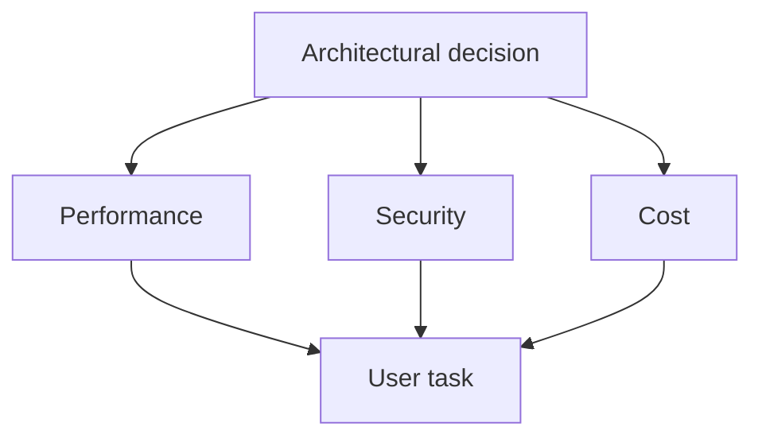

# Performance, security, and cost

Fast, reliable, and secure operation requires resources, but not every speed-up or capacity increase is worth it. A good decision considers the specific service's important tasks, risks, and load all at once.

## Three goals, one system

Let's imagine a simple online appointment booking system. The user opens the page, selects a service, logs in, and books an appointment. At first glance, it's easy to state that the page should be fast, secure, and cheap. However, these three words do not mean the same thing, and in practice, they don't always reinforce each other.

**Performance** from the user's perspective mostly means that the page appears quickly, reacts rapidly to button presses, and the important action – like submitting the booking – doesn't delay uncertainly. On a system level, this also includes that response times shouldn't degrade unacceptably even with many concurrent requests. Speed is often measured in milliseconds, but the user doesn't sense milliseconds: they sense that "the page is immediately usable", "I have to wait", or "I don't know if anything happened".

**Security** means the system allows the right person the right data and action, while resisting errors, attacks, and misuse. An appointment booking page might contain less sensitive data, but login credentials, personal contact info, and possibly health or payment information can also be present. Here, the "we'll fix it later" attitude can have serious consequences.

**Cost** doesn't just mean the monthly cloud bill. This includes developers' time, maintaining the system's complexity, monitoring, support, incident handling, fees for external services, and the business or social damage of errors. A service launched cheaply but hard to maintain can later be more expensive than a more thoroughly planned solution from the start.

## Why do we have to choose?

Not every decision forces a real choice. Compressing unnecessary images, for example, often speeds up the page while also reducing costs, because less data has to be paid for in transit and storage. In many situations, however, improving one goal demands resources from another.

Take **login**. For the user, typing a password and a second verification step is more inconvenient than an immediate login. Yet, with multi-factor authentication, it is significantly harder to breach an account with a stolen password. We accept some friction here for a security gain. And if someone limits the number of login attempts or requires human verification, brute-force password guessing slows down, but a genuine user might also experience waiting.

A similar tension appears with **caching**. If a server returns a previously rendered page or API response instead of recalculating it, it will be faster and use fewer computing resources. This benefits performance and cost. But what happens if the stored response contains another user's personal data, or is already stale? In this case, a misconfigured cache can cause a privacy or business error. A cache is not a "speed boost switch", but a decision circumscribed by rules: what, for whom, and for how long is it allowed to be reused?

The **geographic placement of data** is also such an issue. A Content Delivery Network (CDN) close to users can provide lower latency and better withstand a load peak. At the same time, the service can become more expensive and contractually complex; for sensitive data, it must be understood which party handles what, in which region, and on what legal basis. The question isn't whether a CDN is "good", but whether it's justified for the service's static public images, videos, or software files, and what data must not be served through it.

## Four perspectives of a decision

It is useful to ask the exact same four questions for a design issue.

1. **What is the user impact?** How much waiting or extra steps are acceptable? To whom does an error cause especially large harm?
2. **What is the asset to protect and the threat?** Is it personal data, money, exam results, authorization, or public content? Who and how could abuse it?
3. **What is the load and operational situation?** Do we need to prepare for constant or seasonal traffic? Is there a predictable peak, like course registration or ticket sales?
4. **How much does the whole lifecycle cost?** Not just launch, but also monitoring, fixing, observing, and later modification.

This thinking helps avoid catchy but empty answers: "let's put everything in the cloud", "let's make it microservices", "let's encrypt everything", or "it should be very fast". These sentences only make sense if we state: exactly what, why, against what threat, with what user expectation, and at what cost.

## Example: product list and payment

A webshop's product list is typically identical or nearly identical information for many people: product name, image, short description, category. Elements of such a page are usually highly cacheable and can be served via a CDN. Fast loading reduces server load, so the performance and cost goals might even improve together.

The checkout process, however, is of a different nature. It features a user-bound cart, address, payment status, and order. An old response or one linked to the wrong person would be a very serious error. It is unacceptable, for example, for an "order successful" page to be served merely from a previously stored response. At checkout, it can be more important that every request runs validated, loggable, and with a definitive result, even if this means multiple database operations and slightly longer response times.

Good design, therefore, does not choose a single performance or security level for the entire webshop. It distinguishes by feature: public, rarely changing content can be cached more aggressively; personal and irreversible operations receive stricter verification. A key to system-level thinking is recognizing boundaries.

## Security that is not merely slowing down

It is a common misconception that security necessarily makes the system "slow". It indeed has a cost: establishing an encrypted connection, validating input data, determining authorization, and logging all mean work. These, however, are often negligible compared to what a data breach, unauthorized transaction, or recovery consumes.

Moreover, secure design sometimes tidies up performance too. Well-defined authorization boundaries and data minimization, for example, can reduce how much data needs to be sent in a response. Properly sized rate limiting can protect the service from faulty or malicious traffic, thus actually improving availability for real users. The goal is not dropping protection for speed, but protection that fits the risk.

## Cost: cheap is not always economical

For a small university project, a continuously multi-region, auto-scaling infrastructure might be overkill. It would cost a lot of money, learning, and maintenance, while the site is used by a few dozen people daily. A simpler, reliably backed-up and monitored service is often a better choice in such cases.

In the reverse situation, when an exam registration attracts thousands of students at a specific time, the cheapness of an undersized system is only apparent. Downtime can result in support load, loss of trust, equity issues, and emergency work. Cost estimation must therefore also include the price of undelivered service.

It is also worth thinking about the value of **simplicity**. Every new component – a separate database, message queue, cache layer, external identity provider – can solve a problem, but also brings a new potential point of failure, dependency, and knowledge requirement. The goal is not to have few technologies, but for every technology to have a clear reason and owner.

## How is a defensible decision born?

A short decision note can be worth a lot. For example: "We cache the responses of the public event list for five minutes because the data is not personal, rarely changes, and peak traffic is expected when registration opens. We do not serve booking and account pages from a shared cache because they contain personal, rapidly changing data." This sentence names the decision, the goal, the risk, and the boundary.

> [!tip] Turn goals into measurements
> Decisions must be followed by measurement. "Fast" is not a measurable goal on its own. Instead, we ask: how long does it take for the key page to become usable for most users? What is the error rate during peak hours? How many failed login attempts occur? How much does an average and a peak traffic month cost? When interpreting metrics, it's also worth noting human consequences: is an error message understandable, does a slowdown affect everyone or only those on a certain network?

## Common misconceptions

**"The fastest solution is always the best."** Not necessarily. A fast, but faulty, poorly protected, or expensive solution is not a good service. For important operations, a correct, verifiable result can be worth more than a few tenths of a second.

**"Security is the security team's job."** No. Authorizations, data transfer, user interface, and defaults are already decided in design and development decisions.

**"The cloud automatically solves the load."** The cloud can provide elastic capacity, but it doesn't fix a faulty database query, a bad cache rule, or infinite retries by itself. Furthermore, increasing capacity incurs cost.

**"A cache is just performance optimization."** A cache is a data handling rule. Its expiration, invalidation, and sharing scope can also affect correctness and privacy.

**"A trade-off means we abandon one of the goals."** Not necessarily. It often means that protection or performance is applied in the right place, rather than appearing with equal force everywhere.

## Learned concepts

**Trade-off:** a conscious decision in which, to improve one goal, we accept a limitation or cost related to another goal.

**Latency:** the time required for data or a request to travel from one point to another, and for the response to be generated.

**Cache:** temporary storage of previously generated data or responses so they don't have to be generated again later.

**CDN:** a geographically distributed server network that can serve public content closer to the user.

**Rate limiting:** regulating how many requests a user, IP address, or client can initiate in a given time.

**Data minimization:** collecting, storing, and transmitting only the necessary personal or business data.

**Total lifecycle cost:** beyond launch, the total cost of development, operations, monitoring, fixing, and modification.
