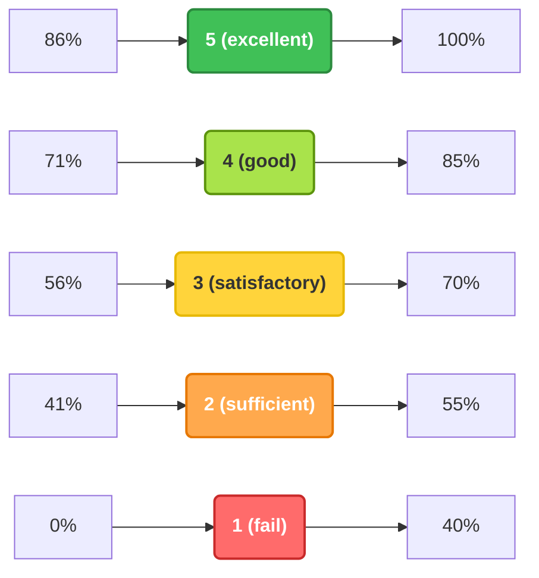

# Assessment and Grading System

The basic requirements for obtaining a final grade are class attendance and taking the final written exam (ZH).

#### 1. Attendance Requirements

Participation is mandatory for at least 70% of the contact classes. Attendance at the announced consultation hours is recommended but not mandatory.

#### 2. Written Exam (ZH)

At the end of the study period, a written exam must be taken.

- **Date of the exam:** The penultimate week of the study period.
- **Date of the retake exam (Pót-ZH):** The last week of the study period.

**Absence and retake:** If a student is unable to attend both the regular exam and the retake exam, they may only be granted a third retake opportunity if they present a **medical certificate covering both dates** (the regular and the retake exam).

A student automatically fails the course (grade 1) if they do not take the exam (or the retake exam, if eligible), or if their score is insufficient (1).

#### 3. Grading and Oral Exam

The final grade is determined as follows, provided the written exam is at least sufficient (2):

- **Offered grade:** By default, if the written exam result is good (4) or excellent (5), the student may receive this grade as their offered final grade. **It is important to emphasize that granting an offered grade is always at the instructor's discretion.** During this decision, in addition to the exam result, the instructor also takes into account the student's class activity throughout the semester.
- **Oral exam:** If the written exam result is sufficient (2) or satisfactory (3) – or if the student does not receive an offered grade – they must take an oral exam during the examination period. The oral exam is not based on a pre-issued list of topics: it requires a comprehensive knowledge of the entire semester's material.

#### 4. Grading Scale (for both the written and oral exams)

Percentage performances are converted into grades based on the following thresholds:

| Grade | Performance |
| ----------------- | ------------ |
| **Excellent (5)** | 86% – 100% |
| **Good (4)** | 71% – 85% |
| **Satisfactory (3)** | 56% – 70% |
| **Sufficient (2)** | 41% – 55% |
| **Fail (1)** | 0% – 40% |

