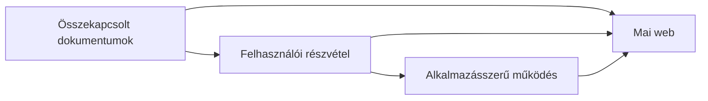

# 01.02. A web fejlődése: dokumentumwebtől alkalmazásszerű webig

A web eredetileg dokumentumok összekapcsolására szolgált. Ma ugyanazon szabványokra építve interaktív, személyre szabott, valós idejű és sok esetben telepített alkalmazásokkal versengő szolgáltatásokat nyújt.

Érdemes ezt a változást nem egyszerű technológiai versenyként elképzelni. Amikor egy korai honlapon egy szervezet bemutatkozó szövegét olvastuk, a böngésző elsősorban egy digitális újság vagy könyv szerepét töltötte be. Amikor ma egy térképen útvonalat tervezünk, közösen szerkesztünk egy dokumentumot vagy online intézzük a tanulmányainkat, ugyanaz a böngésző inkább egy alkalmazásablakhoz hasonlít. A kétféle használat között nincs éles határ, és mindkettőnek megvan a helye.

## Szükséges előismeretek

- Internet és World Wide Web — alapvető elméleti különbség.
- Webes dokumentum és böngésző — alapvető használati ismeret.
## A kezdet: összekapcsolt dokumentumok

A World Wide Web eredeti célja az volt, hogy kutatók egyszerűen hivatkozhassanak egymás dokumentumaira. A hipertext lényege, hogy egy dokumentumon belüli hivatkozás egy másik dokumentumhoz vagy erőforráshoz vezet. Ez a mai web alapvető működési elve is.

Az első weboldalak jellemzően egyszerű, ritkán változó szöveges oldalak voltak. A szerző elkészítette a tartalmat, a látogató pedig elolvasta azt. Az interakció kevés volt, a felhasználó elsősorban fogyasztója, nem létrehozója volt a tartalomnak.

## Dokumentumweb és „Web 1.0”

A „Web 1.0” elnevezés utólagos gyűjtőfogalom. Általában a statikus, kevés interakciót kínáló, dokumentumközpontú webre utal. Tipikus példája egy cég bemutatkozó oldala, egy online enciklopédia korai változata vagy egy személyes honlap.

Jellemzői:

- a tartalom elsősorban a szolgáltató által előállított;
- ritkább tartalomfrissítés;
- kevés felhasználói hozzájárulás;
- több különálló oldal és teljes oldalú navigáció;
- a böngésző főként dokumentummegjelenítő.

## Részvételi web és „Web 2.0”

A „Web 2.0” nem egy új protokoll vagy a web második verziója. Inkább olyan szolgáltatási és üzleti szemléletet jelöl, amelyben a felhasználók tartalmat hoznak létre, egymással kommunikálnak, és a szolgáltatások adatokra, közösségekre, valamint folyamatos frissítésre épülnek.

Ide kapcsolódnak például a közösségi oldalak, blogplatformok, videómegosztók, közösségi enciklopédiák és felhőalapú együttműködési eszközök. A felhasználó egyszerre olvasó, szerző, értékelő és adatforrás.

Jellemző változások:

- felhasználók által létrehozott tartalom;
- személyre szabott felületek;
- adatbázisokra és API-kra épülő szolgáltatások;
- gyors, részleges oldalfrissítések;
- közösségi és hálózati hatások.

## Az alkalmazásszerű web

A mai webes szolgáltatások sokszor nem „oldalak” sorozataként, hanem alkalmazásként működnek. Egy online levelező, térképszolgáltatás, tanulmányi rendszer vagy szövegszerkesztő folyamatosan reagál a felhasználó műveleteire, adatot tölt be és ment, értesítéseket küldhet, valamint több eszköz között szinkronizálhat.

Ezt teszik lehetővé többek között:

- a böngészőben futó programkód;
- aszinkron adatkommunikáció webes API-kon keresztül;
- böngészőoldali adattárolás;
- valós idejű kommunikáció;
- reszponzív és mobilra optimalizált felületek;
- offline működést támogató technológiák.

Fontos, hogy a fejlődés nem jelenti a régebbi modell eltűnését. Egy dokumentumközpontú, gyors és egyszerű statikus oldal ma is kiváló választás lehet például egy tanszéki tájékoztató vagy eseményoldal esetében.

Az ábra fejlődési irányt mutat, nem egymást leváltó korszakokat: mindhárom forma jelen van a mai weben.

## A fejlődés ára

Az összetettebb webes alkalmazások több lehetőséget adnak, de új problémákat is felvetnek:

- nagyobb lehet a betöltendő adatmennyiség;
- több személyes adat keletkezik és kezelődik;
- nehezebb az akadálymentes használat biztosítása;
- több biztonsági kockázat jelenik meg;
- erősebb függőség alakulhat ki egyes platformoktól.

> [!tip] A feladathoz válassz technológiát
> Ezért a „modernebb” megoldás nem automatikusan jobb. A technológiai döntést mindig a felhasználói cél, a tartalom, a kockázat és a rendelkezésre álló erőforrások alapján kell értékelni.

## Példák

| Szolgáltatás | Jellemző megközelítés | Indoklás |
| --- | --- | --- |
| Egyetemi szabályzat oldala | Dokumentumközpontú web | Elsősorban olvasásra szolgál, ritkán változik. |
| Hírportál | Tartalomalapú, részben dinamikus web | Gyakori frissítés, keresés és személyre szabás. |
| Online levelező | Alkalmazásszerű web | Folyamatos interakció, adatkezelés és szinkronizálás. |
| Közösségi oldal | Részvételi platformweb | A felhasználók hozzák létre a tartalom jelentős részét. |

## Gyakori félreértések

| Állítás | Pontosítás |
| --- | --- |
| „A Web 2.0 egy új internet.” | A kifejezés szolgáltatási és használati szemléletet jelöl. |
| „A statikus weboldal elavult.” | Sok esetben gyorsabb, olcsóbb és biztonságosabb megoldás. |
| „Minden modern weboldal egy SPA.” | Sok korszerű szolgáltatás más renderelési és navigációs modellt használ. |

## Megismert fogalmak

- **Hipertext:** Olyan dokumentumszervezési elv, amelyben hivatkozások vezetnek más dokumentumokhoz vagy dokumentumrészekhez. A webes navigáció egyik alapja.
- **Statikus weboldal:** Olyan oldal, amelynek kiszolgált tartalma előre elkészíthető, és nem kell minden kérésnél egyedileg előállítani. Ez nem jelenti azt, hogy a böngészőben ne lehetne interaktív.
- **Dinamikus weboldal:** Olyan oldal, amelynek tartalma kérés, felhasználói állapot vagy más adat alapján változhat. Az előállítás történhet szerveroldalon vagy a böngészőben is.
- **Platformweb:** Olyan webes szolgáltatási modell, amely felhasználókat, tartalmakat és gyakran más szolgáltatásokat kapcsol össze. Értékének egy része a résztvevők közötti kapcsolatokból származik.
- **Webalkalmazás:** Böngészőből használható, feladatvégzést támogató interaktív szoftver. A felület és a háttérrendszer webes szabványok útján kommunikálhat.
