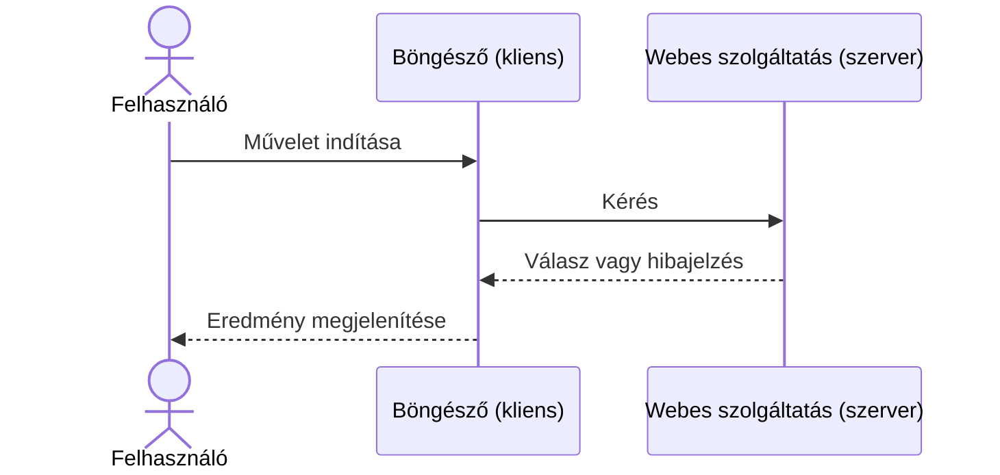
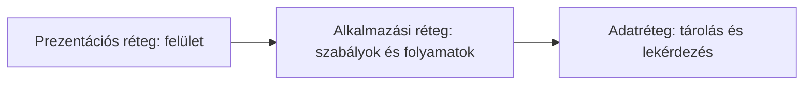

# 01.04. Kliens–szerver modell és többrétegű rendszerek

A webes rendszerekben a kliens szolgáltatást kér, a szerver pedig válaszol. A nagyobb rendszerek a feladatokat logikai rétegekre bontják, hogy a felület, az üzleti szabályok és az adatok kezelése elkülönülhessen.

Amikor egy hallgató rákattint a „Kurzus felvétele” gombra, a képernyőn egyetlen műveletet lát. A rendszer számára ez azonban kérdések sorozata: ki kezdeményezte a műveletet, jogosult-e rá, van-e még férőhely, teljesülnek-e az előfeltételek, és hogyan kell tartósan rögzíteni az eredményt? A kliens–szerver modell és a rétegezés azt segíti megérteni, hogyan lesz ebből az egyetlen kattintásból biztonságosan és ellenőrizhetően végrehajtott folyamat.

## Szükséges előismeretek

- Böngésző és webszerver — alapvető szerepük ismerete.
## Kliens és szerver

A **kliens** olyan program vagy eszköz, amely szolgáltatást kér. A weben ez tipikusan a böngésző. A **szerver** olyan rendszer, amely a kérést fogadja, feldolgozza, és választ küld. A szerepek a kommunikációban értelmezhetők: ugyanaz a számítógép bizonyos helyzetekben kliens, más helyzetekben szerver is lehet.

Például amikor a böngésző egy termékoldalt kér le, kliensként viselkedik. A webáruház kiszolgálója szerverként válaszol. A webáruház alkalmazása közben egy fizetési szolgáltató API-ját is meghívhatja; ebben a kapcsolatban a webáruház alkalmazása kliens, a fizetési szolgáltató pedig szerver.

## Kérés és válasz

A web alapvető kommunikációs mintája a kérés–válasz modell. A kliens megfogalmazza, milyen erőforrást vagy műveletet kér, a szerver pedig státusszal, fejlécekkel és szükség esetén adattal válaszol.

Egyszerűsített folyamat:

1. A felhasználó megnyit egy URL-t.
2. A böngésző kérést küld a szervernek.
3. A szerver ellenőrizheti a jogosultságot, adatot kérhet le, vagy feldolgozhat egy műveletet.
4. A szerver választ küld.
5. A böngésző értelmezi és megjeleníti a választ.

A kérés nem mindig egy teljes weboldalt kér. Lehet egy kép, egy JSON-adat, egy keresési eredmény, egy bejelentkezési művelet vagy egy fájl feltöltése is.

Az üzenetek időrendje egyszerű esetben így néz ki:

## Miért bontjuk rétegekre a rendszereket?

Kis rendszernél minden feladat egyetlen alkalmazásban is elférhet. Ahogy a rendszer nő, előnyös elkülöníteni az eltérő felelősségeket. A klasszikus háromrétegű modell a következő:

| Réteg | Fő feladat | Példa egy tanulmányi rendszerben |
| --- | --- | --- |
| Prezentációs réteg | A felhasználóval való kapcsolat és megjelenítés | Böngészős felület, űrlapok, táblázatok |
| Alkalmazási vagy üzleti réteg | Szabályok, folyamatok, jogosultságok | Tárgyfelvétel feltételeinek ellenőrzése |
| Adatréteg | Adatok tárolása és lekérdezése | Hallgatók, tárgyak, jelentkezések adatai |

A rétegezés segít abban, hogy egy változás ne érintse szükségszerűen az egész rendszert. Például az adatbázis tárolási módjának módosítása ideális esetben nem teszi szükségessé a teljes felhasználói felület újratervezését.

Az ábrán a nyilak a logikai együttműködést jelölik, nem azt, hogy a rétegek külön gépeken futnak:

## Logikai és fizikai elkülönítés

> [!note] Logikai rétegek és fizikai gépek
> Fontos különbség van a logikai és a fizikai szétválasztás között. Logikailag három rétegről beszélhetünk akkor is, ha minden egyetlen gépen fut. Nagyobb rendszerben azonban ezek a feladatok több kiszolgálóra vagy szolgáltatásra is eloszthatók.

| Megoldás | Előny | Korlát |
| --- | --- | --- |
| Egyetlen alkalmazás, egy gépen | Egyszerű üzemeltetés és fejlesztés | Korlátozott bővíthetőség, egy hiba több funkciót érinthet |
| Logikailag rétegzett rendszer | Átlátható felelősségi körök | Több tervezési fegyelmet igényel |
| Fizikailag is elkülönített rétegek | Jobb skálázhatóság és védelmi lehetőségek | Összetettebb kommunikáció és üzemeltetés |

Nem cél mindig a legtöbb réteg vagy a legtöbb kiszolgáló használata. A jó architektúra a rendszer valódi igényeihez illeszkedik.

## Példa: kurzusfelvétel

Amikor a hallgató egy böngészős tanulmányi rendszerben felvesz egy kurzust:

1. A böngésző elküldi a hallgató kérését.
2. Az alkalmazási réteg ellenőrzi, hogy a hallgató be van-e jelentkezve, teljesítette-e az előfeltételeket, és van-e szabad hely.
3. Az adatréteg lekérdezi, majd módosítja a megfelelő adatokat.
4. Az alkalmazási réteg elkészíti az eredményt.
5. A böngésző megjeleníti a sikeres vagy sikertelen műveletről szóló választ.

Ebben a példában jól látszik, hogy a böngésző nem közvetlenül „írja át az adatbázist”; a művelethez szabályok és ellenőrzések tartoznak.

## Gyakori félreértések

| Állítás | Pontosítás |
| --- | --- |
| „A kliens mindig egy felhasználó számítógépe.” | A kliens lehet egy másik szerveroldali alkalmazás is. |
| „A szerver egyetlen gép.” | A szerver szerep, amelyet több gép vagy szolgáltatás is betölthet. |
| „A három rétegnek három külön gépen kell futnia.” | A rétegek elsősorban logikai felelősségi körök. |
| „A böngésző közvetlenül az adatbázishoz kapcsolódik.” | Általában az alkalmazási réteg közvetít és érvényesíti a szabályokat. |

## Megismert fogalmak

- **Kliens:** Egy kommunikációs kapcsolatban szolgáltatást vagy erőforrást kérő program. Ugyanaz a rendszer egy másik kapcsolatban szerverként is működhet.
- **Szerver:** A kliens kérését fogadó és arra választ adó program vagy rendszer. A szerep logikai, nem feltétlenül egy fizikai géphez kötött.
- **Kérés:** A kliens által küldött üzenet, amely erőforrást vagy műveletet jelöl meg. A weben a HTTP-kérés módszert, címet, fejléceket és esetenként törzset tartalmazhat.
- **Válasz:** A szervernek egy kérésre adott üzenete. Eredményt, állapotjelzést és szükség szerint adatot tartalmaz.
- **Prezentációs réteg:** A rendszer felhasználói interakcióért és megjelenítésért felelős logikai része. Nem azonos a prezentációs diasorral; weben gyakran a böngészős felület alkotja.
- **Üzleti réteg:** A rendszer szabályait és folyamatait megvalósító logikai rész. Ellenőrizheti például egy művelet jogosultságát és feltételeit.
- **Adatréteg:** Az adatok tárolását, lekérdezését és módosítását kezelő logikai rész. Az alkalmazás többi rétegétől elkülöníti az adattárolás részleteit.
