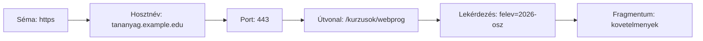

# 02.01. Webcímek és erőforrások

Egy webcím nem egyszerűen „link”, hanem több részből álló útmutató a böngésző számára. Megadja, milyen webes elérési módot használjon, melyik szolgáltatáshoz forduljon, és azon belül melyik erőforrást kérje. A részek megkülönböztetése segít akkor is, amikor egy cím működését vagy hibáját vizsgáljuk.

## Szükséges előismeretek

- [Böngésző és webes szolgáltatás](../01/01-03-web-actors.md) — a kliens és a szolgáltatás alapvető szerepe.

## Egy kurzusoldal címe

Képzeljük el, hogy egy hallgató a következő, szemléltetésre használt címet nyitja meg:

```text
https://tananyag.example.edu:443/kurzusok/webprog?felev=2026-osz#kovetelmenyek
```

A cím balról jobbra egyre pontosabban azonosítja a célt. A `https` séma a webes elérés módját jelzi. A `tananyag.example.edu` a hosztnév: azt a szolgáltatást nevezi meg, amelyhez a böngésző fordul. A `443` portot itt csak azért írtuk ki, hogy látható legyen; HTTPS-nél ez az alapértelmezett port, ezért a mindennapi címekből többnyire hiányzik. A `/kurzusok/webprog` útvonalat az adott webes szolgáltatás értelmezi. A `?felev=2026-osz` lekérdezési rész további adatot ad a kéréshez. A `#kovetelmenyek` fragmentum rendszerint a megjelenített dokumentum egy részére utal, és a böngésző kezeli.



Az ábra a cím részeinek sorrendjét mutatja, nem azt, hogy a böngésző ezeket külön hálózati állomásokként keresné fel.

## Hosztnév, domain és port

A domainnév ember számára megjegyezhető név. Nem maga a szerver, és nem feltétlenül egyetlen gépet jelöl: egy név mögött több kiszolgáló is állhat. A hosztnév és az IP-cím közötti kapcsolatot a DNS segítségével lehet megtalálni; ennek működése a negyedik hét témája. Most annyit kell tudnunk, hogy a név nem azonos a hálózati címmel.

A port azt segít megjelölni, melyik hálózati szolgáltatáshoz fordulunk egy végponton belül. HTTP esetén a 80, HTTPS esetén a 443 az ismert alapértelmezés, de más port is használható. Fejlesztéskor gyakori például a `http://localhost:3000/`: itt a `localhost` a saját gépre utal, a `3000` pedig egy helyben futó szolgáltatás portja. A port nem a weboldal sorszáma és nem az útvonal része.

## Útvonal, lekérdezés és fragmentum

Az útvonal egy erőforrást jelöl a szolgáltatáson belül. Nem kell valódi fájlnak vagy mappának megfelelnie. Egy `/kurzusok/webprog` cím mögött alkalmazáskód is állhat, amely adatbázisból állítja elő a választ. A lekérdezési rész – például `?felev=2026-osz` – módosíthatja a kiválasztást vagy a szűrést. A szerver a kért útvonalat és a lekérdezési paramétereket együtt értelmezheti.

A fragmentumot a `#` vezeti be. A `#kovetelmenyek` tipikusan azt jelenti, hogy a böngésző a már megkapott oldalon a megfelelő részhez ugrik. A fragmentum általában nem része a szervernek küldött HTTP-kérés céljának. Ez azonban nem jelenti azt, hogy titkos: a teljes címet látó ember, a böngésző és egy megosztott link címzettje is láthatja.

> [!warning] Ne írj titkokat az URL-be
> Az URL-ben szereplő lekérdezési adatok sem tekinthetők bizalmasnak. Címek megjelenhetnek előzményekben, naplókban vagy megosztáskor. Jelszót és más titkot ezért nem helyes pusztán az URL paraméterébe írni.

## URL és erőforrás

Az URL egy erőforrás azonosítója és elérési útmutatója, nem maga az erőforrás. Ugyanaz a cím különböző időpontokban eltérő választ adhat: például egy kurzusoldalon megváltozhat a jelentkezők száma. Az erőforrás lehet HTML-dokumentum, kép, adat vagy egy alkalmazási művelet eredménye. Egyetlen látható oldal több URL-ről lekért részből is összeállhat.

Az URI tágabb azonosítófogalom, az URL ennek a weben gyakran használt, elérési módot is kifejező formája. A mindennapi webes munkában többnyire URL-t mondunk; a különbség részletes szabványelmélete ezen az órán nem szükséges.

## Gyakori félreértések

| Állítás | Pontosítás |
| --- | --- |
| „A domainnév maga a szerver.” | A név szolgáltatást azonosít; több hálózati végponthoz is vezethet. |
| „Az útvonal biztosan egy mappa a szerveren.” | Az alkalmazás tetszőleges logikai erőforrásként értelmezheti. |
| „A fragmentum titkos, mert nem jut el a szerverhez.” | A címben továbbra is látható és megosztható. |
| „A port csak helyi fejlesztéskor létezik.” | A hálózati kapcsolatnak éles szolgáltatásnál is van portja. |

## Megismert fogalmak

- **Erőforrás:** Weben azonosítható tartalom vagy alkalmazási célpont. Lehet dokumentum, kép, strukturált adat vagy egy művelethez kapcsolódó cím.
- **URL:** Erőforrás elérését leíró cím. Tartalmazhat sémát, hosztnevet, portot, útvonalat, lekérdezési részt és fragmentumot.
- **Séma:** Az URL elején álló jelölés, amely az elérés módját határozza meg. A webes példákban gyakori a `http` és a `https`.
- **Hosztnév:** A szolgáltatás név szerinti azonosítója az URL-ben. Nem azonos egy fizikai szerverrel vagy egy IP-címmel.
- **Port:** Számozott hálózati végpont egy szolgáltatás eléréséhez. Az alapértelmezett port az URL-ben gyakran nincs külön feltüntetve.
- **Útvonal:** A szolgáltatáson belüli erőforrást megjelölő URL-rész. Értelmezése az alkalmazástól függ.
- **Lekérdezési rész:** A `?` után álló, gyakran név–érték párokból álló URL-rész. További információt adhat a kiválasztáshoz vagy szűréshez.
- **Fragmentum:** A `#` utáni URL-rész, amelyet webes navigációban rendszerint a böngésző kezel. Jellemzően nem kerül a HTTP-kérés céljába.
