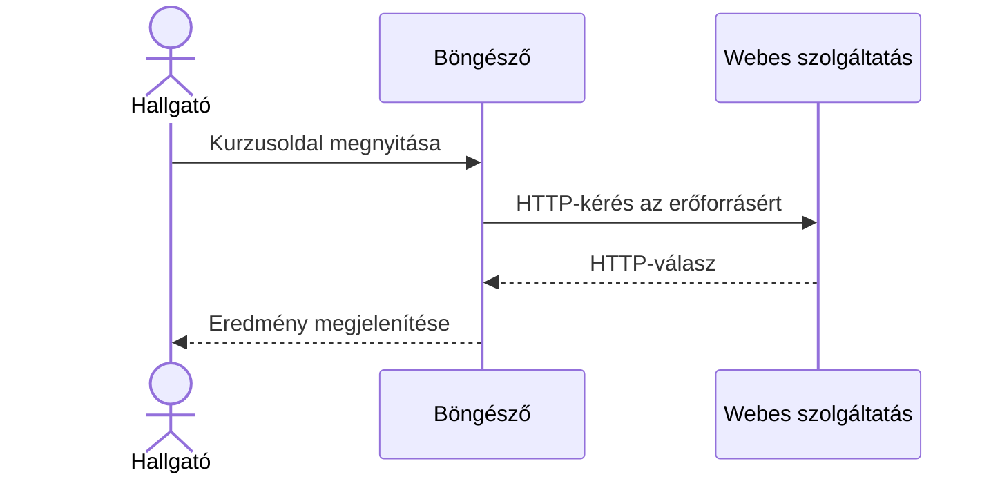
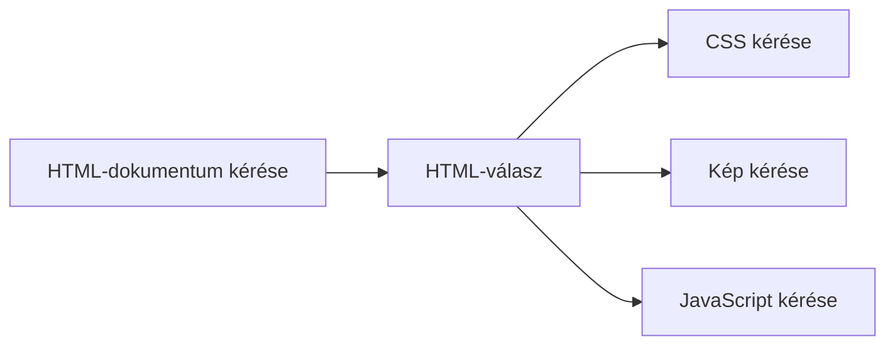

# 02.02. A HTTP-kérés és -válasz

A HTTP a webes kliens és szerver közötti üzenetváltás közös szabályrendszere. A böngésző egy erőforrást vagy műveletet kér, a szerver pedig választ ad. A válasz lehet sikeres tartalom, átirányítás vagy hibajelzés is. Ennek a párbeszédnek az értelmezése alapja a későbbi böngésző-, API- és biztonsági témáknak.

## Szükséges előismeretek

- [Webcímek és erőforrások](02-01-web-addresses-and-resources.md) — URL, útvonal és erőforrás.
- [Kliens és szerver](../01/01-04-client-server-and-multitier.md) — a két kommunikációs szerep.

## Egy oldal megnyitása

A hallgató megnyitja a `https://tananyag.example.edu/kurzusok/webprog` címet. A böngésző kliensként kérést küld a szervernek. A szerver a kért erőforrás alapján választ állít elő. Ha HTML-dokumentumot kapunk, a böngésző ezt dolgozza fel a megjelenítéshez. A kapcsolat hálózati felépítésének részleteit a negyedik hét tárgyalja; itt az alkalmazási üzenetekre figyelünk.



A HTTP-t nem csak böngésző használja. Mobilalkalmazás, parancssori kliens vagy másik szerver is küldhet HTTP-kérést. A kliens és a szerver szerepe a konkrét üzenetváltásban értelmezhető.

## A kérés részei

Egy egyszerű, oktatási célra rövidített HTTP/1.1 kérés így nézhet ki:

```http
GET /kurzusok/webprog?felev=2026-osz HTTP/1.1
Host: tananyag.example.edu
Accept: text/html
```

Az első sor tartalmazza a metódust (`GET`), a cél útvonalát és lekérdezési részét, valamint a HTTP-verziót. A `Host` fejléc megmondja, melyik hoszthoz fordul a kliens. Az `Accept` a kívánt válaszformátumot jelzi. A fejlécek után üres sor következik; a kérésnek ezután törzse is lehet, de egy szokásos GET-kérésnek nincs.

> [!note] A HTTP egyszerűsített ábrázolása
> A hálózaton továbbított tényleges forma a HTTP-verziótól függ. A fenti szöveges alak a fogalmak megértését segíti; nem állítja, hogy minden modern HTTP-kérés pontosan így jelenik meg a hálózaton.

## A válasz részei

A szerver válasza hasonlóan tagolható:

```http
HTTP/1.1 200 OK
Content-Type: text/html; charset=utf-8

<h1>Webprogramozás I</h1>
```

Az első sor a státuszkódot és annak rövid leírását adja. A `200` sikeres HTTP-választ jelent. A `Content-Type` fejléc a törzs értelmezéséhez ad információt; itt HTML-ről van szó. Az üres sor utáni tartalom a válasz törzse. Más esetben a törzs JSON-adat, kép vagy más erőforrás is lehet.

A `200` nem azt jelenti, hogy az oldal minden üzleti vagy felhasználói szempontból hibátlan. Csak azt, hogy a HTTP-kérés a protokoll szintjén sikeres választ kapott. A szerver küldhet `404` választ is, ha a kért erőforrás nem található, vagy `503`-at, ha a szolgáltatás átmenetileg nem elérhető. A kódok részleteit külön fejezet rendezi el.

## Egy oldalhoz több kérés tartozhat

A felhasználó egyetlen oldalt lát, de a kezdeti HTML további erőforrásokra hivatkozhat: stíluslapokra, képekre, betűkészletekre vagy programokra. Ezekhez a böngésző újabb HTTP-kéréseket indíthat. Az, hogy pontosan hogyan áll össze a képernyőn látható oldal, a harmadik hét témája. Most az a fontos, hogy az „egy oldal megnyitása” nem feltétlenül egyetlen HTTP-párbeszéd.



A külön kérések azonos vagy eltérő szolgáltatásokhoz is irányulhatnak. A böngésző Network paneljén ezért gyakran több sor jelenik meg akkor is, ha a felhasználó csak egyszer nyitott meg egy címet.

## HTTP és HTTPS ezen a héten

A címben a `http://` vagy `https://` jelzi az elérés módját. A HTTPS védett kapcsolatban továbbított HTTP-kommunikáció. Ettől a kérés–válasz alapmintája nem változik: a kliens továbbra is kér, a szerver válaszol. A kapcsolat védelmének módját, a TLS és a tanúsítványok szerepét a negyedik héten vizsgáljuk meg. A HTTPS megléte önmagában nem bizonyítja, hogy az oldal tartalma igaz vagy a szolgáltató megbízható.

## Gyakori félreértések

| Állítás | Pontosítás |
| --- | --- |
| „A HTTP csak HTML-oldalakhoz kell.” | Képek, adatok és más erőforrások is továbbíthatók vele. |
| „Egy oldal megnyitása egyetlen kérés.” | A dokumentum további erőforráskéréseket indíthat. |
| „A 200 azt jelenti, hogy minden rendben van.” | Csak a HTTP-szintű sikeres választ jelzi. |
| „A HTTPS másik kérés–válasz modell.” | Ugyanazt a HTTP-modellt védett kapcsolaton használja. |

## Megismert fogalmak

- **HTTP:** A webes kliens és szerver közötti alkalmazási kommunikáció szabályrendszere. Meghatározza a kérések és válaszok jelentését.
- **HTTP-kérés:** A kliens által küldött üzenet, amely erőforrást vagy műveletet céloz. Metódust, célt, fejléceket és esetenként törzset tartalmaz.
- **HTTP-válasz:** A szerver által küldött üzenet a kérés eredményéről. Státuszkódot, fejléceket és szükség esetén törzset tartalmaz.
- **Metódus:** A kérés célzott műveletének jelentését jelző HTTP-elem. A GET tipikusan lekérésre, a POST feldolgozásra küldött adat vagy művelet kezdeményezésére szolgál.
- **Fejléc:** A HTTP-üzenet értelmezéséhez kapcsolódó név–érték információ. Például a `Content-Type` a továbbított tartalom típusát jelzi.
- **Törzs:** A HTTP-üzenet fejlécek utáni tartalmi része. Nem minden kérésnek vagy válasznak van törzse.
- **Státuszkód:** A válasz háromjegyű eredményjelzése. A kliens ebből tudhatja meg a kérés HTTP-szintű kimenetelét.
