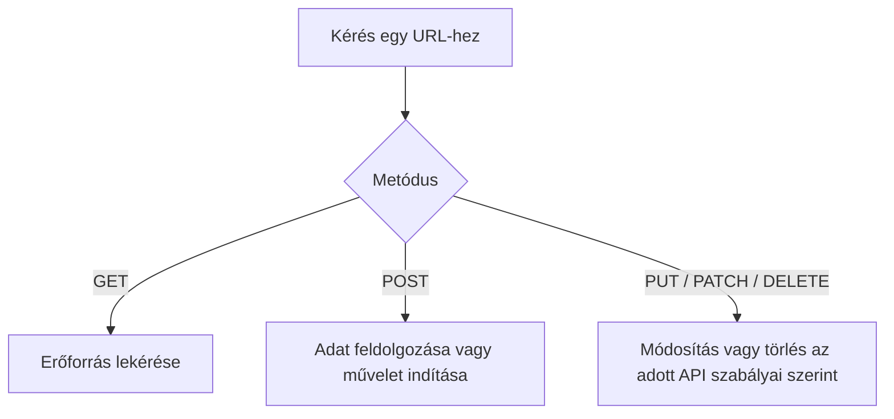

# 02.03. HTTP-metódusok és a kérés szándéka

Az URL azt jelöli, melyik erőforrással kapcsolatban fordulunk a szerverhez. A HTTP-metódus azt jelzi, milyen szándékkal tesszük ezt. Ugyanaz a cím ezért többféle művelet célpontja lehet. A metódus helyes megválasztása nem díszlet: a kliens, a szerver és a közvetítők viselkedését is befolyásolhatja.

## Szükséges előismeretek

- [Webcímek és erőforrások](02-01-web-addresses-and-resources.md) — útvonal és erőforrás.
- [HTTP-kérés és -válasz](02-02-http-request-and-response.md) — a kérés első sorának szerepe.

## Ugyanaz a cím, eltérő művelet

Egy kurzuslista címét például lekérhetjük, míg a jelentkezések gyűjteményéhez új jelentkezést küldhetünk:

```http
GET /kurzusok/webprog HTTP/1.1
Host: tananyag.example.edu
```

```http
POST /jelentkezesek HTTP/1.1
Host: tananyag.example.edu
Content-Type: application/json

{"kurzus":"webprog"}
```

Az első kérés célja egy erőforrás megismerése. A második adatot küld feldolgozásra; a szerver ennek alapján új jelentkezést hozhat létre, ha a feltételek teljesülnek. A metódus önmagában nem hajtja végre a műveletet: a szervernek értelmeznie és ellenőriznie kell a kérést.



## GET: lekérdezés

A GET erőforrás lekérésére szolgál. Rendeltetése szerint nem okoz üzleti állapotváltozást: egy kurzusoldal megnyitása ne vegyen fel automatikusan egy kurzust. A szerver ettől még naplózhatja a kérést, vagy frissíthet technikai mérőszámokat. A lényeg az, hogy a felhasználó által kért alkalmazási állapot ne változzon pusztán a lekéréstől.

A GET-cím gyakran megosztható vagy könyvjelzőzhető, és bizonyos feltételekkel gyorsítótárazható. Ezért veszélyes, ha például a `/jelentkezes-torles?id=42` cím GET-kérése törlést indít: egy előnézetkészítő vagy keresőrobot is megnyithatja. Az URL lekérdezési részébe bizalmas adatot sem célszerű tenni, mert a cím előzményekbe és naplókba kerülhet.

## POST: feldolgozásra küldött adat

A POST adatot küldhet a szervernek, új erőforrást hozhat létre vagy műveletet indíthat. A fenti jelentkezési példában a kérés törzse tartalmazza a kurzus azonosítóját. A szerver ellenőrzi a jogosultságot, a határidőt és a férőhelyet; csak ezután rögzíthet jelentkezést.

> [!warning] A POST nem teszi titkossá az adatot
> A POST nem „biztonságosabb” pusztán azért, mert az adat a törzsben van. A kapcsolat védelme, a jogosultság ellenőrzése és a bemenet értelmezése továbbra is szükséges. Az ismételt POST két műveletet is indíthat, ha a szerver nem kezeli az ismétlést. Emiatt a felhasználói felület visszajelzése és a szerver szabályai különösen fontosak.

## További metódusok helye

| Metódus | Alapvető jelentés | Példa |
| --- | --- | --- |
| HEAD | A GET-hez hasonló lekérés válaszbeli törzs nélkül | Erőforrás jellemzőinek ellenőrzése |
| PUT | Egy erőforrás teljes reprezentációjának cseréje | Profiladatok teljes frissítése egy API-ban |
| PATCH | Egy erőforrás részleges módosítása | Egyetlen mező frissítése |
| DELETE | Erőforrás törlési szándéka | Jelentkezés törlése, ha megengedett |

Ezeket ezen a héten szerepük szerint kell felismerni. A pontos szerveroldali jelentés az API szabályaitól is függ; a webes adatok és API-k későbbi hetében mélyítjük el. Az OPTIONS például egy erőforráshoz tartozó kommunikációs lehetőségekről kérdezhet; böngészős biztonsági helyzetekben is előkerül majd.

## Biztonságos és idempotens nem ugyanaz

A HTTP-ben a „biztonságos” metódus azt jelenti, hogy a kérés rendeltetése nem a szerver üzleti állapotának megváltoztatása. Ez nem titkosítást jelent. A GET biztonságos ebben az értelemben. Az „idempotens” művelet ismétlése a szerver kívánt üzleti állapota szempontjából ugyanarra az eredményre vezet, mint egyszeri végrehajtása. A GET mellett a PUT és a DELETE is idempotens szándékú; a POST általában nem garantáltan az.

Például egy erőforrás törlése után a második DELETE-kérés más státuszkóddal válaszolhat, de a célzott erőforrás állapota továbbra is törölt. Egy jelentkezést létrehozó POST kétszeri végrehajtása viszont két külön rekordhoz vezethet, ha a szolgáltatás nem védekezik ellene. A fogalmak a későbbi API-tervezésnél válnak különösen fontossá.

## Gyakori félreértések

| Állítás | Pontosítás |
| --- | --- |
| „A GET nem változtathat semmit a szerveren.” | Technikai naplózás történhet; az üzleti állapot megváltoztatása nem a GET rendeltetése. |
| „A POST miatt az adat titkos.” | A metódus nem helyettesíti a HTTPS-t és a jogosultságellenőrzést. |
| „Az URL önmagában megmondja a műveletet.” | A metódus is a kérés jelentésének része. |
| „Az idempotens mindig ugyanazt a választ adja.” | A kívánt szerverállapot lehet azonos eltérő válaszkód mellett is. |

## Megismert fogalmak

- **HTTP-metódus:** A kérés szándékát jelző szabványos elem. A szerver a célzott erőforrással együtt értelmezi.
- **GET:** Erőforrás lekérésére szolgáló, rendeltetése szerint üzleti állapotot nem módosító HTTP-metódus. Gyakori böngészős navigációnál.
- **POST:** Adat feldolgozására vagy művelet indítására használt HTTP-metódus. Ismétlése nem feltétlenül vezet ugyanahhoz az üzleti állapothoz.
- **Biztonságos metódus:** Olyan metódus, amelynek rendeltetése nem a szerver alkalmazási állapotának módosítása. A fogalom nem a kapcsolat titkosítottságát jelenti.
- **Idempotencia:** Olyan műveleti tulajdonság, amelynél az ismételt végrehajtás a kívánt szerverállapot szempontjából ugyanarra az eredményre vezet, mint az egyszeri végrehajtás.
