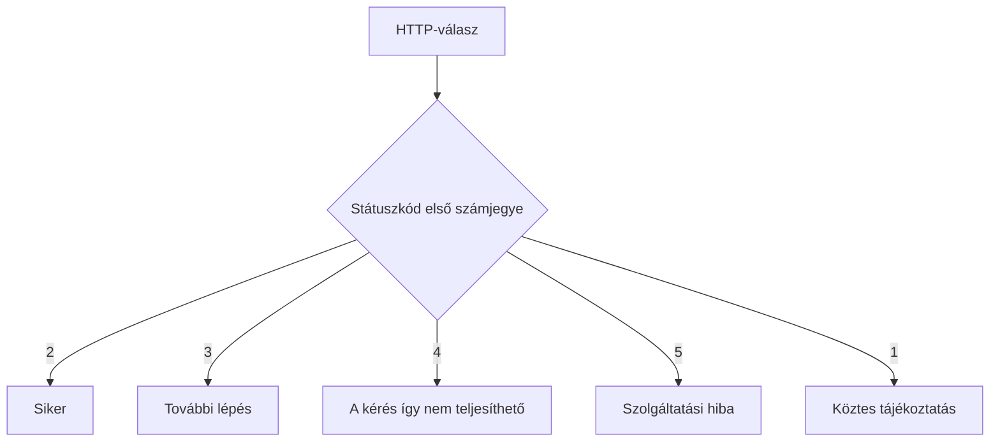

# 02.04. HTTP-státuszkódok: mi lett a kérés eredménye?

A szerver válaszának státuszkódja rövid, géppel értelmezhető jelzés a kérés HTTP-szintű eredményéről. Nem teljes emberi magyarázat, de segít a böngészőnek, más klienseknek és a fejlesztőnek eldönteni, mi történt, és mi lehet a következő lépés. A kódot mindig a kérés és a válasz többi részével együtt kell értelmezni.

## Szükséges előismeretek

- [HTTP-kérés és -válasz](02-02-http-request-and-response.md) — a válasz első sorának szerepe.
- [HTTP-metódusok](02-03-http-methods.md) — a kérés szándéka.

## Egy hiányzó kurzusoldal

Tegyük fel, hogy a hallgató régi hivatkozásból egy már nem létező kurzusoldalt nyit meg. A szerver elérhető, és válaszol, de nem találja a kért erőforrást:

```http
HTTP/1.1 404 Not Found
Content-Type: text/html; charset=utf-8

<h1>A kurzusoldal nem található</h1>
```

A `404` nem azt jelenti, hogy „nincs internet”. Éppen ellenkezőleg: a kérés eljutott egy válaszoló szerverig. A szerver csak a célzott erőforrást nem tudta a megadott címen kiszolgálni. A böngésző a kódot és a törzsben érkező emberi magyarázatot is felhasználhatja.

## A kódcsaládok

A státuszkód első számjegye tág kategóriát jelöl:

| Család | Alapjelentés | Jellemző helyzet |
| --- | --- | --- |
| 1xx | Köztes tájékoztatás | A feldolgozás még tart |
| 2xx | Siker | A kérés HTTP-szinten teljesült |
| 3xx | További lépés | Másik cím vagy gyorsítótári példány használata |
| 4xx | A kérés így nem teljesíthető | Hiányzó erőforrás, nem megfelelő jogosultság |
| 5xx | A szolgáltatás nem tudta teljesíteni | Belső hiba vagy átmeneti elérhetetlenség |



A 4xx nem erkölcsi ítélet a felhasználóról, az 5xx pedig nem feltétlenül egyetlen szerver hibája. A kódcsalád csak az első támpont.

## Siker: 200, 201 és 204

A `200 OK` gyakori sikeres válasz egy oldal vagy adat lekérésekor. A `201 Created` azt jelzi, hogy új erőforrás jött létre, például sikeres jelentkezés. A `204 No Content` sikeres műveletet jelez válaszbeli törzs nélkül. Nem célszerű minden sikeres helyzetre automatikusan `200`-at használni, mert a pontosabb kód fontos információt adhat a kliensnek.

> [!note] HTTP-siker és üzleti siker
> A sikeres HTTP-válasz nem feltétlenül jelent sikeres üzleti műveletet. Ha egy szerver `200`-as választ ad egy olyan HTML-oldallal, amely azt írja, hogy „a kurzus betelt”, a HTTP-kérés sikerült, de a jelentkezés nem történt meg. Egy API-ban különösen fontos, hogy a kód és a válasz tartalma ne mondjon ellent egymásnak.

## Átirányítás: 301 és 302

A `301 Moved Permanently` tartós költözésre utalhat, a `302 Found` pedig általános átirányítási helyzetekben fordul elő. A `Location` fejlécben szerepelhet az új cím. A böngésző ezután új kérést indíthat az új helyre. Ezért egy oldal megnyitásakor a Network panelben több, egymás után következő kérés is látható.

A 3xx családba tartozó `304 Not Modified` más természetű: gyorsítótári ellenőrzésnél jelzi, hogy a korábban eltárolt tartalom továbbra is használható. Ennek részletes működése későbbi téma; most csak azt jegyezzük meg, hogy nem minden 3xx kód egyszerű „új címre menj” utasítás.

## A kérés nem teljesíthető: 400, 401, 403 és 404

A `400 Bad Request` arra utalhat, hogy a kérés hibás vagy nem értelmezhető. A `401 Unauthorized` neve félrevezető: jellemzően hiányzó vagy nem megfelelő hitelesítést jelent. A `403 Forbidden` esetén a szerver elutasítja a műveletet, például mert a bejelentkezett hallgató nem férhet hozzá egy adminisztrátori oldalhoz. A `404 Not Found` hiányzó erőforrást jelez a megadott címen.

A különbség a felhasználói következő lépés szempontjából is fontos. A 401 esetén a bejelentkezés lehet releváns. A 403-nál önmagában az új bejelentkezés nem biztos, hogy segít. A 404-nél lehet, hogy a cím vagy a hivatkozás elavult. A szerver válaszának emberi szövege segíthet ezt közölni, de a státuszkódot nem helyettesíti.

## Szolgáltatási hiba: 500 és 503

Az `500 Internal Server Error` általános belső hibát jelöl. A `503 Service Unavailable` átmeneti elérhetetlenséget, például karbantartást vagy túlterhelést jelezhet. Egy kurzusfelvételi időszak csúcsán a két helyzet felhasználói hatása hasonló lehet, de a műszaki jelentésük eltér. A státuszkód önmagában még nem teljes diagnózis; az időzítés, a válasz és a szerveroldali megfigyelések is számítanak.

## Gyakori félreértések

| Állítás | Pontosítás |
| --- | --- |
| „A 404 bizonyítja, hogy nincs kapcsolat.” | A szerver válaszolt, csak a kért erőforrás hiányzik. |
| „A 200 minden szempontból siker.” | A HTTP-szintű eredményt jelzi, nem az üzleti cél teljesülését. |
| „A 401 és 403 ugyanaz.” | A hitelesítés hiánya és a tiltott művelet külön eset. |
| „A 3xx mindig hiba.” | Többnyire további lépést vagy gyorsítótári döntést jelez. |

## Megismert fogalmak

- **HTTP-státuszkód:** A szerver válaszában szereplő háromjegyű eredményjelzés. Első számjegye tág kódcsaládot határoz meg.
- **Sikeres válasz:** A 2xx családba tartozó HTTP-válasz, amely a kérés protokollszintű teljesítését jelzi. Nem garantálja, hogy a felhasználó minden üzleti célja megvalósult.
- **Átirányítás:** Olyan válasz, amely további kérésre vezethet egy másik cím felé. Az új címet jellemzően a `Location` fejléc adja meg.
- **Hitelesítés:** Annak ellenőrzése, ki a kérést indító fél. Hiánya vagy hibája gyakran 401-es választ eredményez.
- **Jogosultság:** Annak meghatározása, hogy egy azonosított fél milyen műveletet végezhet. Tiltás esetén 403-as válasz fordulhat elő.
- **Szolgáltatási hiba:** Olyan szerveroldali vagy háttérbeli probléma, amely miatt a kérés nem teljesíthető megfelelően. A HTTP-ben jellemzően 5xx kód jelzi.
