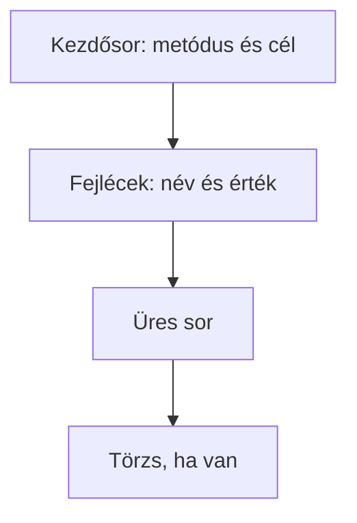

# 02.05. Fejlécek, törzs és tartalomtípusok

A HTTP-üzenet nem csak egy címből és egy állapotkódból áll. A fejlécek kiegészítő információt adnak a kérésről vagy a válaszról; a törzs pedig – ha van – magát az adatot hordozza. A kettő megkülönböztetése segít megérteni, miért jelenik meg ugyanaz a szerverválasz weboldalként, szövegként vagy feldolgozható adatként.

## Szükséges előismeretek

- [HTTP-kérés és -válasz](02-02-http-request-and-response.md) — az üzenetek alapvető szerkezete.
- [HTTP-státuszkódok](02-04-http-status-codes.md) — a válasz eredményjelzése.

## A fejlécek helye az üzenetben

A következő példa szöveges HTTP/1.1 alakot mutat:

```http
GET /kurzusok/webprog HTTP/1.1
Host: tananyag.example.edu
Accept: text/html

```

Az első sor után név–érték formájú fejlécek következnek. A `Host` a cél hosztnevet adja meg, az `Accept` azt jelzi, milyen válaszformátumot tud fogadni a kliens. Az üres sor a fejlécrész végét jelöli. Ebben a GET-kérésben nincs törzs. A tényleges hálózati kódolás a HTTP-verziótól függ; ez a forma az üzenetrészek megértését szolgálja.



## A törzs: a továbbított tartalom

A törzs egy kérésben lehet például egy űrlap adata vagy JSON-dokumentum. Válaszban lehet HTML, JSON, kép vagy más adattípus. Nem minden üzenetnek van törzse: a szokásos GET-kérésben nincs, és egy `204 No Content` válaszban sem lehet tartalmi törzs.

Egy jelentkezési kérés oktatási példája:

```http
POST /jelentkezesek HTTP/1.1
Host: tananyag.example.edu
Content-Type: application/json

{"kurzus":"webprog"}
```

Itt a `Content-Type` a küldött törzs formátumát jelöli. A JSON-ban a mezőnevek és értékek strukturált adatot alkotnak. A szervernek ettől még ellenőriznie kell, hogy a kérés értelmes és megengedett-e. A `Content-Type` leíró információ, nem jogosultság vagy garancia a tartalom helyességére.

## Content-Type és Accept

A `Content-Type` azt mondja meg, milyen formátumú az adott üzenet törzse. Válaszban a `text/html` webes dokumentumot, az `application/json` strukturált adatot jelölhet. A `text/plain` egyszerű szöveg. A típus befolyásolja, hogy a kliens hogyan értelmezi a kapott bájtokat.

> [!note] Az Accept és a Content-Type szerepe eltér
> Az `Accept` más kérdésre válaszol: a kliens ezzel jelezheti, milyen formátumú választ tud vagy szeretne fogadni. A kliens kérése nem garantálja, hogy a szerver pontosan olyan választ ad; a szerver lehetőségei és szabályai is számítanak. A két fejléc tehát nem felcserélhető: az egyik a tényleges tartalmat, a másik a kívánt választ írja le.

| Fejléc | Ki küldheti? | Mit fejez ki? |
| --- | --- | --- |
| `Content-Type` | Kliens vagy szerver | A küldött törzs formátuma |
| `Accept` | Kliens | A kívánt vagy elfogadható válaszformátum |
| `Location` | Szerver | Új vagy átirányított erőforrás címe |

## Nem minden fejléc ugyanarról szól

Egyes fejlécek a tartalom típusát, mások az irányítást vagy a gyorsítótárazást befolyásolják. Átirányításnál a `Location` új URL-t jelöl. Gyorsítótárazásnál a `Cache-Control` segíthet szabályozni, hogy egy válasz meddig használható újabb szerverkapcsolat nélkül. A gyorsítótárazás teljes működését később vizsgáljuk; itt elég felismerni, hogy a fejlécek a tartalmon túl a további viselkedést is irányíthatják.

A fejlécek között később találkozunk hitelesítéshez, cookie-hoz és böngészőbiztonsághoz kötődő adatokkal is. Ezeket csak a megfelelő későbbi témákban értelmezzük részletesen. Egyelőre az a fontos, hogy a fejlécek nem a látható oldal „díszletei”: a webes működés gépileg olvasható részei.

## Embernek szánt oldal és gépnek szánt adat

Ugyanaz a webes szolgáltatás adhat vissza HTML-oldalt egy böngészős felülethez és JSON-adatot egy másik programnak. A felhasználó számára a HTML közvetlenül olvasható felületté válhat. A JSON rendszerint egy program által feldolgozott adat. Mindkettő HTTP-válasz törzse, de a tartalomtípusuk és a további felhasználásuk különbözik.

A különbség a Network panelben láthatóvá válik: a kéréshez tartozó válaszfejlécek mutatják a formátumot, a válasz tartalma pedig a törzsben jelenik meg. A következő fejezet ezt a megfigyelést vezeti végig.

## Gyakori félreértések

| Állítás | Pontosítás |
| --- | --- |
| „A fejléc az oldal tetején látható szöveg.” | A HTTP-fejléc az üzenet része, nem a dokumentum vizuális fejléce. |
| „A Content-Type létrehozza a formátumot.” | A küldő jelzi vele a törzs formátumát; a tartalomnak ténylegesen meg kell felelnie ennek. |
| „Minden kérésben van törzs.” | A szokásos GET-kérésnek nincs törzse. |
| „Az Accept és a Content-Type ugyanaz.” | Az előbbi a kívánt választ, az utóbbi a küldött törzset írja le. |

## Megismert fogalmak

- **HTTP-fejléc:** A kérés vagy válasz értelmezését segítő név–érték információ. A kezdősor után, a törzs előtt helyezkedik el.
- **Üzenettörzs:** A HTTP-üzenet opcionális tartalmi része. Kérésben elküldött adatot, válaszban az eredmény tartalmát hordozhatja.
- **Médiatípus:** A továbbított tartalom formátumát jelölő azonosító, például `text/html` vagy `application/json`. A fogadó fél ennek alapján választhat feldolgozási módot.
- **Content-Type:** A küldött üzenettörzs médiatípusát jelző fejléc. Kérésben és válaszban is előfordulhat.
- **Accept:** A kliens által kívánt vagy elfogadható válaszformátumokat jelző kérésfejléc. Nem azonos a ténylegesen kapott tartalom típusával.
- **Cache-Control:** A gyorsítótárazásra vonatkozó utasításokat hordozó fejléc. Hatása a válasz és a gyorsítótár teljes működésének kontextusában értelmezhető.
