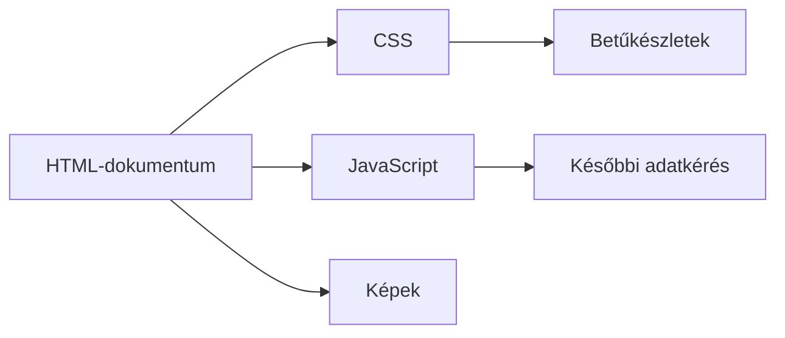

# 03.04. Webes erőforrások betöltése

Egy oldal megnyitása rendszerint több HTTP-kérésből áll. A HTML további képekre, stíluslapokra, programfájlokra és betűkészletekre hivatkozhat. A böngésző ezeket a megjelenítéshez vagy működéshez kéri le, miközben mérlegeli, melyikre mikor van szükség. A kérések számát és sorrendjét ezért a felhasználó által látott oldalhoz kell kapcsolni.

## Szükséges előismeretek

- [Egy oldal több HTTP-kérése](../02/02-02-http-request-and-response.md) — a dokumentum és további erőforrások kapcsolata.
- [HTML, CSS és JavaScript](03-01-html-css-and-javascript.md) — az erőforrások eltérő szerepe.
- [Renderelés](03-03-browser-rendering.md) — miért számíthat a betöltés ideje.

## A fő dokumentum csak a kezdet

A hallgató egy kurzusoldal címét írja be. A böngésző először a dokumentumot kéri le. A HTML-ben azonban lehet hivatkozás külső stíluslapra, logóra, oktatói fényképre, betűkészletre és JavaScript-fájlra. A böngésző ezekhez további kéréseket indíthat. Az erőforrások azonos szolgáltatásról vagy különböző helyekről is érkezhetnek.



Az ábra függőségeket mutat, nem merev időrendet. A böngésző a letöltések egy részét párhuzamosan végezheti; konkrét viselkedése a dokumentumtól, az erőforrásoktól és a környezettől függ.

## Hivatkozások a HTML-ben

Egy rövid dokumentum több erőforrást is megnevezhet:

```html
<link rel="stylesheet" href="/assets/site.css">
<script src="/assets/course.js" defer></script>

```

A `link` stíluslapot, a `script` programfájlt, az `img` képet jelöl. Az útvonalak külön URL-ekké oldódnak fel a dokumentum címének környezetében. A kép `width` és `height` méretei segíthetnek helyet fenntartani még a tényleges betöltés előtt; az `alt` szöveges alternatívát ad a képnek. A `defer` azt jelzi, hogy a külső klasszikus szkript ne akadályozza a HTML elemzését ugyanúgy, mint egy szokásos, azonnal futó szkript. A pontos szkriptbetöltési részletek későbbi technikai elmélyítés tárgyai lehetnek.

## Kritikus és később szükséges erőforrások

Nem minden fájl ugyanolyan fontos az első használható nézethez. Egy szükséges stíluslap nélkül az oldal rendezetlenül jelenhet meg. Egy nagy, a lap alján lévő fénykép később is betöltődhet anélkül, hogy a kezdő szöveg olvasását akadályozná. A böngésző prioritásokkal próbálja kezelni ezt, de a fejlesztő döntései is számítanak.

A `loading="lazy"` attribútum például jelezheti, hogy egy kép betöltése elhalasztható, amíg közelebb nem kerül a megjelenő területhez. Ez a lap alján lévő galériánál hasznos lehet. Az első képernyőn azonnal fontos képnél viszont rossz döntés lehet, ha feleslegesen halasztjuk. A technika célja nem minden kérés későbbre tolása, hanem a fontos tartalom előnyben részesítése.

## Az erőforrás mérete és eredete

Egyetlen nagy kép, betűkészlet vagy JavaScript-csomag is lassíthatja a felületet. A fájl mérete mellett az is számít, mikor fedezi fel a böngésző, milyen más erőforrásra vár, és melyik szolgáltatásról érkezik. A külső szolgáltatástól betöltött tartalom működési és adatvédelmi függést is jelenthet. Egy térképes modul például kényelmes, de ha a szolgáltatás nem elérhető, az oldalnak érdemes továbbra is közölnie a helyszín szöveges címét.

A Network panelben az erőforrások külön sorban láthatók. A dokumentumhoz képest azonosítható, melyik kérés kép, stíluslap vagy program. Ha egy CSS-fájl 404-et kap, a HTML akkor is megérkezhet, de a megjelenés eltérhet. Ha a kép hiányzik, a szöveges tartalom még olvasható lehet. A részhibák tehát eltérő felhasználói tüneteket okoznak.

## Betöltés és végső megjelenítés

A letöltés és a renderelés nem azonos folyamat. Egy fájl megérkezhet gyorsan, de feldolgozása munkát ad a böngészőnek. Egy későn érkező betűtípus újratördelést okozhat, a JavaScript pedig később új tartalmat kérhet. A böngésző ezért a letöltések befejezése után is változtathatja a felületet.

A tervezésnél hasznos kérdés, hogy melyik erőforrás hiánya akadályozza az alapfeladatot. A kurzusleírás szövege alapvető, a díszítő háttérkép nem az. Ha a jelentkezési gomb kizárólag egy nagy, későn érkező programfájl után válik használhatóvá, az a felhasználó számára jelentős késés lehet. A szükséges és kényelmi elemek elkülönítése segít a helyes prioritásban.

## Gyakori félreértések

| Állítás | Pontosítás |
| --- | --- |
| „Egy oldal egyetlen HTTP-kérés.” | A dokumentum több további erőforrásra hivatkozhat. |
| „A kevesebb kérés mindig gyorsabb oldalt jelent.” | Az erőforrás mérete, időzítése és feldolgozása is számít. |
| „Minden képet érdemes késleltetni.” | Az első nézet fontos képeit időben kell betölteni. |
| „Ha minden fájl letöltődött, a felület kész.” | A böngésző feldolgozás és későbbi adatkérés miatt tovább változhat. |

## Megismert fogalmak

- **Webes erőforrás:** A böngésző által külön címen lekérhető dokumentum, kép, stíluslap, programfájl, betűkészlet vagy adat. Több erőforrás együtt alkothat egy oldalt.
- **Erőforrásfüggőség:** Olyan kapcsolat, amelyben egy dokumentum vagy más erőforrás további tartalomra hivatkozik. A függőség új kérést válthat ki.
- **Kritikus erőforrás:** Az első használható vagy lényeges megjelenítéshez szükséges erőforrás. Késése közvetlenül befolyásolhatja a felhasználói élményt.
- **Lusta betöltés:** Bizonyos erőforrások letöltésének elhalasztása addig, amíg várhatóan szükség lesz rájuk. Csak megfelelő helyzetben javítja a felhasználói élményt.
- **Részhiba:** Olyan helyzet, amikor az oldal egyes kérései sikerülnek, mások nem. A felület ettől részben még használható maradhat.
