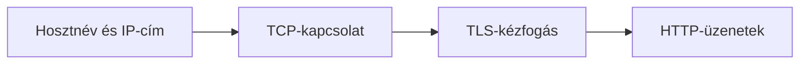

# 04.02. Kapcsolatfelépítés, TCP és TLS

Az IP-cím ismerete még nem jelenti, hogy a böngésző már HTTP-kérést küldhet. A hagyományos HTTPS-kapcsolatban a TCP megbízható adatfolyamot ad, a TLS pedig védi a kommunikációt és segíti a szerver azonosítását. A rétegek eltérő problémát oldanak meg, ezért egy oldal elérhetetlenségét is másként értelmezzük, ha a kapcsolat vagy a védelem felépítésénél akad el.

## Szükséges előismeretek

- [DNS és IP-cím](04-01-dns-and-ip-addresses.md) — hogyan jutunk el a domainnévtől a hálózati címig.
- [HTTP-kérés és -válasz](../02/02-02-http-request-and-response.md) — milyen alkalmazási üzenetet fog továbbítani a kapcsolat.

## Mi történik a névfeloldás után?

A hallgató a könyvtár hálózatából megnyitja a tananyagoldalt. A DNS-válasz már ismert, de a böngészőnek a megfelelő szolgáltatási végponttal adatcserét kell kezdeményeznie. Hagyományos HTTPS-nél ez jellemzően TCP-kapcsolatot és rajta TLS-kapcsolatot jelent. Az URL sémája és portja a kapcsolat célját is befolyásolja: HTTPS-nél az alapértelmezett port 443, ha a cím másikat nem ad meg.

> [!note] A TCP-modell korlátai
> Ez a TCP-re épülő HTTPS egyszerűsített útja. Nem minden mai HTTP-kapcsolat használ TCP-t: a HTTP/3 QUIC-ra épül, amely UDP-t használ. A tananyag fő modellje segít a rétegek szerepét megérteni, de nem állítja, hogy a TCP az egyetlen lehetséges szállítási megoldás.

## TCP: rendezett adatfolyam

A hálózat az adatot kisebb egységekben továbbítja; ezek késhetnek vagy elveszhetnek. A TCP kapcsolatot hoz létre a végpontok között, és megbízható, sorrendezett bájtfolyamot biztosít a fölötte működő réteg számára. Ennek érdekében sorszámozást, visszajelzést és szükség esetén újraküldést használ. A böngészőnek így nem kell a HTML-dokumentum hiányzó vagy felcserélődött darabjait maga összevadásznia.

A TCP nem értelmezi a webes útvonalat, a HTTP-státuszkódot vagy a HTML-t. Az adat szállításának problémáját kezeli. Sikeres TCP-kapcsolat esetén is hibázhat a TLS-kézfogás vagy maga a webalkalmazás. A rétegek elválasztása ezért diagnosztikai eszköz: más a „nem tudok kapcsolódni” és más a „404-es választ kaptam”.

## TLS: védett kommunikáció

A TCP rendezett átvitelt ad, de önmagában nem titkosít és nem hitelesíti a webes szolgáltatást. A TLS titkosságot és sértetlenséget ad az átvitt adatoknak, valamint lehetővé teszi, hogy a böngésző ellenőrizze a szerver azonosságát. A kapcsolat elején a felek egyeztetik a védett kommunikáció paramétereit. A szerver tanúsítványt mutat, amely a hozzá tartozó kulcsot a megnevezett domainhez köti; a böngésző a tanúsítvány érvényességét és megbízhatóságát ellenőrzi.

A tanúsítvány nem azonos a felhasználó bejelentkezésével. Itt a böngésző azt ellenőrzi, hogy a megfelelő nevű szolgáltatáshoz épít-e védett kapcsolatot. A felhasználó személyazonosságának igazolása későbbi, alkalmazásszintű kérdés. A tanúsítványhiba komoly jelzés: a böngésző a HTTP-válasz megjelenése előtt megállíthatja a folyamatot.

## Költség és kapcsolat-újrahasználat

A DNS-lekérdezés, a kapcsolatfelépítés és a TLS-kézfogás időt vehet igénybe. Ez nem jelenti, hogy minden egyes képhez feltétlenül elölről kezdődik a teljes sor. A böngésző és a szerver a megfelelő feltételek mellett meglévő kapcsolatot is újrahasználhat több HTTP-kéréshez. A gyorsítótár és az újrahasználat miatt egy konkrét böngészés idővonala eltérhet a teljes, tanulási célú ábrától.

Ha a kapcsolat létrejött, a HTTP szabályai szerint kérés és válasz halad rajta. A hálózati réteg, a biztonsági réteg és az alkalmazási üzenet így egymásra épül, de nem cserélhető fel. A következő fejezet a HTTPS ígéreteinek és korlátainak pontos határát vizsgálja.

## Gyakori félreértések

| Állítás | Pontosítás |
| --- | --- |
| „A TCP titkosít.” | A TCP a megbízható szállítást szolgálja; a TLS adja a kapcsolat védelmét. |
| „A DNS-válasz után azonnal megjelenik az oldal.” | Kapcsolat, HTTP-válasz és böngészős feldolgozás is szükséges lehet. |
| „A tanúsítvány a felhasználó bejelentkezését igazolja.” | A szokásos webes esetben a szerver azonosítását segíti. |
| „Minden HTTPS-kapcsolat TCP-t használ.” | A HTTP/3 QUIC-ra épül, amely más szállítási utat használ. |

## Megismert fogalmak

- **TCP:** Kapcsolatorientált szállítási protokoll, amely megbízható, sorrendezett bájtfolyamot nyújt a végpontok között.
- **TLS:** A kommunikáció titkosságát, sértetlenségét és a másik fél hitelesítését támogató protokoll.
- **TLS-kézfogás:** A védett kapcsolat kezdeti egyeztetése, amelyben a felek többek között a szerver tanúsítványát és a titkosítás feltételeit kezelik.
- **Tanúsítvány:** Digitálisan igazolt adat, amely a weben a szerver kulcsát a megnevezett domainhez köti.
- **HTTP/3:** A HTTP egyik változata, amely QUIC-on keresztül működik, ezért nem a klasszikus TCP-re épülő útvonalat követi.
