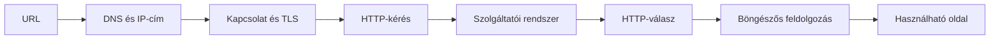

# 04.05. Egy webes kérés teljes útja

Az URL, a DNS, a kapcsolat, a HTTP és a böngésző feldolgozása külön fejezetekben könnyebben érthető, de a felhasználó mindebből egyetlen műveletet érzékel: megnyit egy oldalt. Ez a fejezet a részeket egy folyamatba illeszti, és megmutatja, melyik lépés mit ad hozzá a látható eredményhez.

## Szükséges előismeretek

- [Webcímek](../02/02-01-web-addresses-and-resources.md) és [HTTP-kérés, -válasz](../02/02-02-http-request-and-response.md) — az URL és az üzenet alapfogalmai.
- [DOM](../03/03-02-document-structure-and-dom.md) és [renderelés](../03/03-03-browser-rendering.md) — a dokumentum böngészős feldolgozása.
- [DNS, kapcsolat és közvetítők](04-01-dns-and-ip-addresses.md) — a névfeloldás és a szolgáltatás felé vezető út szereplői.

## Egy hallgató megnyit egy kurzusoldalt

A hallgató beírja a `https://tananyag.example.edu/kurzusok` címet. A böngésző felbontja az URL-t: a séma HTTPS-t kér, a hosztnév a szolgáltatást nevezi meg, az útvonal a kért erőforrást azonosítja a szolgáltatáson belül. A böngészőnek ezután meg kell találnia, hová kapcsolódjon; a névhez a DNS segítségével IP-címet kaphat. A korábban tárolt adatok miatt egyes lépések a tényleges megnyitáskor kimaradhatnak vagy más sorrendben történhetnek.

> [!note] Az ábra tanulási modell
> Az ábra egy tanulási célú teljes út. Nem írja elő, hogy minden esetben külön TCP-kapcsolat és új DNS-lekérdezés történjen; a kapcsolat-újrahasználat és a gyorsítótár változtathat a konkrét folyamaton. A lépések fogalmi szerepe azonban akkor is elkülöníthető.

## Név, kapcsolat, védelem

A DNS-válasz a hosztnévhez hálózati címet ad. Hagyományos HTTPS esetén a böngésző TCP-kapcsolatot épít, majd a TLS-kézfogás során ellenőrzi a szerver tanúsítványát és létrehozza a védett kommunikáció feltételeit. Más technikai úton, például HTTP/3 esetén a szállítás eltér, de továbbra is külön kell választani a névfeloldás, a kapcsolatvédelem és a HTTP-üzenet feladatát.

A TLS érvényessége nem azt jelzi, hogy a kurzusoldal tartalma helyes, csak azt, hogy a kapcsolat megfelelő védelemmel a megnevezett végponthoz épült fel. Ha a tanúsítvány ellenőrzése elakad, még nem kaptunk HTTP-státuszkódot az adott oldaltól.

## Kérés, közvetítők és szerver

A böngésző egy `GET` kérést indíthat a `/kurzusok` útvonalra. A HTTP-üzenetben a metódus, a cél, a fejlécek és adott esetben törzs külön szerepet töltenek be. A kéréshez kapcsolódó domain és útvonal alapján a szolgáltatói belépési pont eldöntheti, melyik belső rendszer kapja meg a feladatot. Közben CDN vagy reverse proxy is adhat választ, ha az adott tartalomra ez megfelelő.

Az alkalmazás a kérésre HTML-dokumentumot állíthat elő, vagy egy tárolt fájlt küldhet vissza. A válasz státuszkódot, fejléceket és esetleg törzset tartalmaz. Egy sikeres HTML-válasz `Content-Type` fejléce segít a böngészőnek felismerni a tartalom jellegét. Átirányítás vagy hiba esetén a böngésző más útvonalat követhet, illetve hibaállapotot jeleníthet meg.

## Válaszból oldal

A HTML megérkezése után a böngésző dokumentumfát épít, további erőforrásokat fedezhet fel, stílusokat alkalmaz, elrendezést számol és kirajzolja az oldalt. A `link`, `script`, `img` és más hivatkozások újabb kéréseket indíthatnak, amelyek egy része ugyanahhoz a szolgáltatáshoz, más része külső végponthoz vezet. A felhasználó által látott oldal ezért nem feltétlenül egyetlen válasz eredménye.

A kurzuslista akkor valóban használható, ha a fontos tartalom érthető, a navigáció működik, és a szükséges művelet elérhető. Az első HTML-válasz `200` státusza ehhez szükséges lehet, de nem elégséges bizonyíték: hiányozhat a stíluslap, hibázhat egy program vagy késhet egy fontos adatlekérés.

## A folyamat különböző megfigyelési pontjai

A címsor az URL-t mutatja. A Network panel a böngésző által indított kéréseket és kapott válaszokat teszi vizsgálhatóvá. Az Elements/Inspector az aktuális DOM-ról és stílusokról ad képet. A felhasználói próba pedig megmutatja, hogy a cél valóban teljesíthető-e. Ezek együtt erősebb bizonyítékot adnak, mint egyetlen HTTP-státuszkód vagy képernyőkép.

## Gyakori félreértések

| Állítás | Pontosítás |
| --- | --- |
| „Az URL közvetlenül az alkalmazásszerver IP-címe.” | Az URL nevet és erőforráscélt ad; a név feloldása és a belső út külön lépés. |
| „A DNS után már HTTP-kérés következik.” | Kapcsolat- és védelmi lépésekre is szükség lehet. |
| „A 200-as HTML-válasz kész oldalt jelent.” | A böngészőnek további erőforrásokra és feldolgozásra is szüksége lehet. |
| „Minden megnyitás ugyanazt a teljes láncot ismétli.” | Gyorsítótár és kapcsolat-újrahasználat lépéseket hagyhat ki. |

## Megismert fogalmak

- **Webes kérés életciklusa:** Az URL értelmezésétől a kapcsolat és HTTP-üzeneteken át a böngészőben használható eredményig tartó folyamat.
- **Szolgáltatói belépési pont:** A nyilvános kérés első szolgáltatóoldali végpontja, amely közvetítőként vagy alkalmazásként tovább dolgozhat.
- **Erőforráslánc:** A fő dokumentum és az általa közvetlenül vagy közvetve igényelt további erőforrások kapcsolata.
- **Megfigyelési pont:** A rendszer működésének egy adott rétegét láthatóvá tevő nézet vagy adat, például Network-válasz vagy aktuális DOM.
