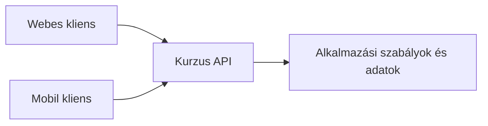

# 05.01. Mi a webes API?

Egy webes felület nem feltétlenül kész HTML-t kér a szervertől. A böngészőben futó program, egy mobilalkalmazás vagy egy másik szerver adatot és műveletet is kérhet. A webes API meghatározott szabályok szerint elérhető programozott kapcsolódási pont: megmondja, milyen kérést fogad a szolgáltatás, és milyen választ adhat. Ezt érdemes a programok közötti szerződésként értelmezni.

## Szükséges előismeretek

- [HTTP-kérés és -válasz](../02/02-02-http-request-and-response.md) — a metódus, az URL, a státuszkód és a válasz alapjai.
- [A teljes kérés útja](../04/04-05-complete-web-request.md) — hogyan ér el a kliens egy webes szolgáltatást.

## A kurzuslista két fogyasztója

Egy egyetemi szolgáltatás a kurzusokat weboldalon és mobilalkalmazásban is megmutatja. A két felület eltérő, de ugyanazokra a kurzusadatokra épülhet. A szerver egy API-n keresztül például egy kurzus listáját vagy részleteit adja vissza, a kliens pedig a saját felületéhez illő módon jeleníti meg. Ettől a szerver nem válik „puszta adatbázissá”: az API mögött ellenőrzés, jogosultság, üzleti szabály és más belső munka is lehet.

Az ábra közös kapcsolódási pontot mutat. Nem írja elő, hogy minden kliensnek pontosan ugyanazt a képernyőt kell megjelenítenie, és nem jelenti azt, hogy az API belső adatbázistáblákat változtatás nélkül tesz közzé.

## Mit jelent a „szerződés”?

Az API szerződése leírhatja a műveleteket, útvonalakat, HTTP-metódusokat, a kérés megengedett adatait, a válasz szerkezetét, státuszkódjait és hibáit. Például a `GET /api/kurzusok/42` egy adott kurzus adatait kérheti; a válasz JSON formátumban tartalmazhat címet és oktatót. A kliens erre a megállapodásra épít. Ha a szerver váratlanul más mezőnevet küld, a felület elromolhat akkor is, ha maga a hálózati kapcsolat működik.

Az API szerződése nem feltétlenül formalizált gépi leírás, de a dokumentáció fontos része. A kliensnek tudnia kell, milyen adat kötelező, mi hiányozhat, hogyan jelez a szerver hibát, és melyik verzióra számíthat. A pontos szerződés a csapatok között is csökkenti a félreértéseket.

## Adat és megjelenítés elválasztása

Ha a szerver HTML-oldalt küld, annak megjelenítése részben már a válaszban szerepel. Egy adat-API ezzel szemben rendszerint strukturált adatot ad, amelyből a kliens építi fel a felületet vagy egy további feldolgozást. Ugyanaz a HTTP hordozhat HTML-t, JSON-t, képet vagy más tartalmat; a válasz `Content-Type` fejléce jelzi a formátumot. Az API tehát nem külön hálózati protokoll a HTTP helyett.

A szétválasztás rugalmasságot ad, de új felelősségeket is teremt. A böngészőoldali programnak kezelnie kell a betöltési állapotot, hibát és hiányzó adatot. A szervernek stabil, érthető szerződést kell kínálnia. A következő fejezet az adat formáját, az azután következők pedig a műveletek szervezését vizsgálják.

## Nyilvános és belső API

> [!warning] Az API is igényel hozzáférés-ellenőrzést
> Az API lehet nyilvános, partnernek szánt vagy kizárólag egy szervezet belső rendszerei számára hozzáférhető. A „programból elérhető” nem jelenti azt, hogy bárki jogosult minden műveletére. Azonosítás és jogosultságkezelés későbbi részletes téma; ezen a héten elég felismerni, hogy az API határfelület, amelyhez hozzáférési szabályok is kapcsolódhatnak.

## Gyakori félreértések

| Állítás | Pontosítás |
| --- | --- |
| „Az API egy adatbázis közvetlen internetes megnyitása.” | A szolgáltatás a saját szabályai szerint ad adatot és műveletet. |
| „Az API a HTTP helyett működik.” | A webes API gyakran HTTP-üzeneteket használ. |
| „Az API csak mobilalkalmazásokhoz kell.” | Böngészős, szerveroldali és más kliensek is használhatják. |
| „Ha a válasz 200, a kliens biztosan érti.” | A válasz adatstruktúrájának is meg kell felelnie a szerződésnek. |

## Megismert fogalmak

- **API:** Programok közötti kapcsolódási felület, amely meghatározott műveleteket és adatformákat tesz elérhetővé.
- **Webes API:** Hálózaton, jellemzően HTTP-n elérhető API, amelyhez kliensprogramok kéréseket küldenek.
- **API-szerződés:** A kérések, válaszok, hibák és feltételek dokumentált megállapodása a szolgáltatás és kliensei között.
- **Kliens:** Az API-t használó program, például böngészős felület, mobilalkalmazás vagy másik szerver.
